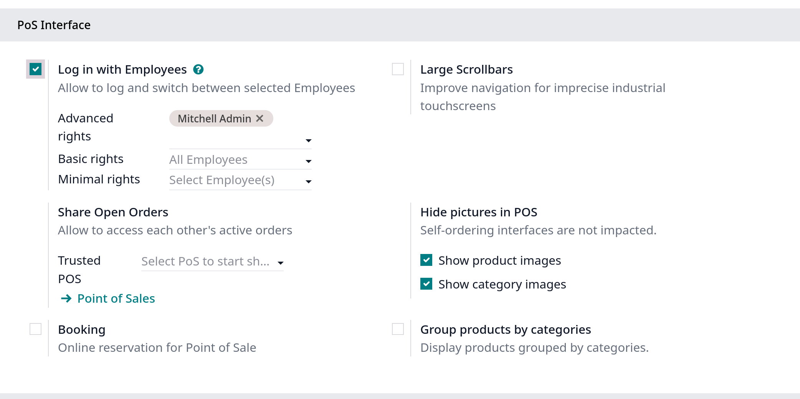

# Multi-employee management

- Odoo POS cho phép nhiều user cùng login vào một POS session

## Configuration

- Truy cập cài đặt multi-employee trong POS interface ở `Point of Sale -> Configuration -> Settings`, sau đó:
  1. Active **Log in with Employees**
  2. Thêm employees vào **basic POS functionalities** access ở **Basic rights** field
  3. Thêm employees vào **extended POS functionalities** access ở **Advanced rights** field
  4. Thêm employees vào **minimal POS functionalities** access ở **Minimal rights** field

  

- **Ghi chú**: Để **Minimal rights** và **Basic rights** trống để cho phép tất cả employees login vào.

- Giải thích các access rights trong POS multi-employees:
  1. _Minimals right_: employees với Minimal rights có thể thực hiện được các action sau đây
  - _Session management_: khóa/mở khóa một POS session; tải lại dữ liệu
  - _Sales transactions_: xử lý giao dịch bán hàng tiêu chuẩn; cài đặt khách hàng; thêm ghi chú vào đơn hàng
  - _Pricing and discounts_: nhập mã khuyến mãi/giảm giá
  2. _Basic rights_: với Basic rights, employees có thể:
  - _Session management_: đóng mở session; hực hiện các quy trình cash-in cash-out
  - _Sales transactions_: tạo customers; xử lý hoàn tiền; truy cập và xử lý đơn hàng; truy cập lịch sử của đơn hàng cũ hoặc hiện tại; hủy đơn hàng
  - _Pricing and discounts_: đặt bảng giá thủ công; áp mã giảm giá thủ công; thay đổi giá sản phẩm thủ công; trao thưởng chương trình loyalty; chuyển đổi thuế
  3. _Advanced righs_: với Advanced rights, employees có thể:
  - _tạo sản phẩm_
  - _truy cập Odoo backend interface của POS_
  - _đóng POS session hiện tại_

## Usage guidelines

### Logging in

- Sau khi active **Login with Employees**, employees có thể login vào POS session và truy cập POS interface bằng cách scan employee badge của họ
  bằng cách click vào user icon, hoặc nhập mã users PIN

- Để chuyển đổi giữa các users trong một session đang hoạt động, click vào employees name đang login hiện tại ở góc phải màn hình POS và chọn user để login vào

### Loggin in with badges

- Employee có thể login vào POS session bằng huy hiệu, để tạo huy hiệu, vào trong app `Employees`:
  1. Vào `Employees`
  2. Mở form view của một employee cụ thể
  3. Vào tab **Setttings**
  4. Tại **Attendance/Point of Sale/Manufacturing** có 2 options:
  - Nhập thủ công vào **Badge ID** field
  - Tự động sinh badge ID bằng cách click vào **Generate**
  5. In bagde ID bằng cách click vào **Print Bagde**

- Để chuyển qua users trong POS session bằng Badge, đầu tiên cần lock session trước bằng cách click vào icon khóa để trở ra màn hình login
  Sau đó user khác có thể scan badge của họ để đăng nhập

### Adding a PIN code

- Để nâng cao bảo mật, employees có thể bị buộc phải nhập PIN code mỗi lần login vào POS session
  1. Vào `Employees`
  2. Mở form view của employee cụ thể
  3. Vào tab **Settings**
  4. Nhập mã PIN mong muốn vào field **PIN Code** ở **Attendance/Point of Sale/Manufacturing**

- **Lưu ý**: mã PIN chỉ là số.
