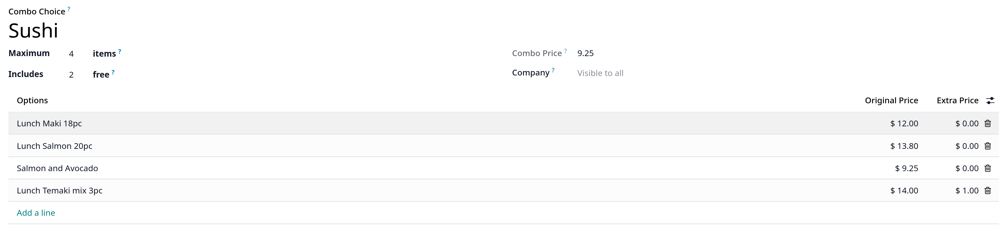
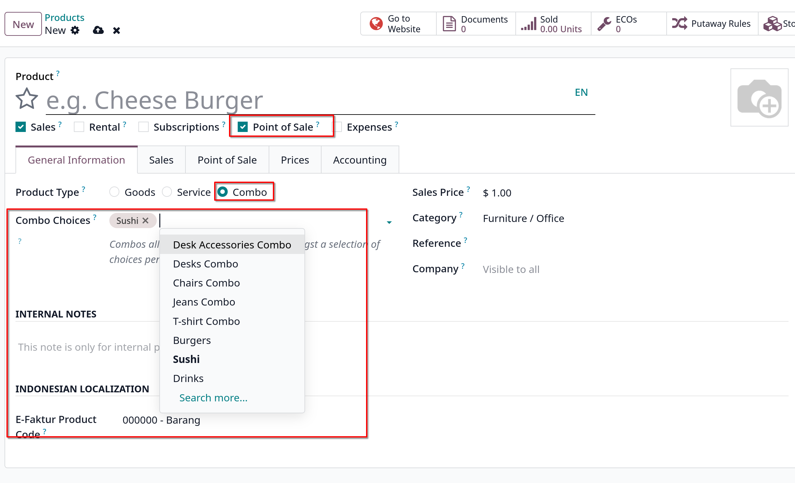
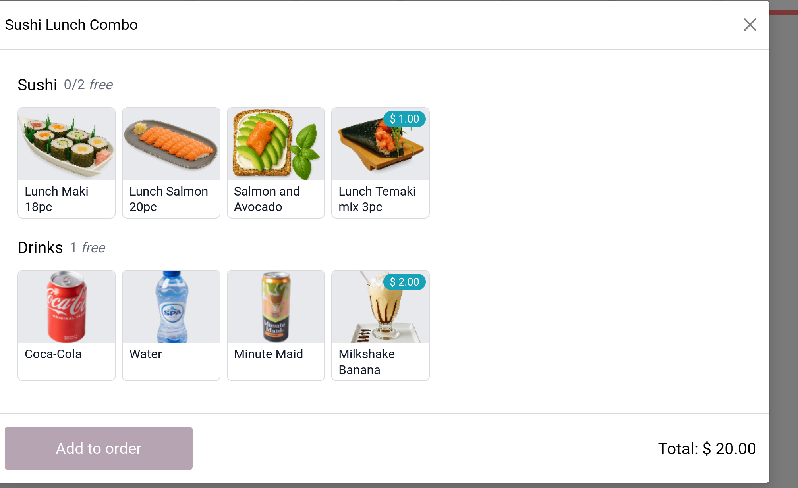

# Product combos

- Tính năng này cho phép users định nghĩa và quản lý các tùy chọn kết hợp cho một sản phẩm đơn.
- Trong bối cảnh là nhà hàng, tính năng này cho phép người dùng tạo thực đơn multiple-choice. Ví dụ, một user có thể chỉ định một món chính và nhiều món ăn kèm khác,
  đồ uống hoặc món tráng miệng mà khách có thể kết hợp với món chính.

- Trong bán lẻ, tính năng này cho phép tạo một bộ nhiều sản phẩm để lựa chọn và kết hợp

## Configuration

Đầu tiên, cần tạo combos:

1. Vào `Point of Sale -> Products -> Product Combos`, chọn `New`
2. Đặt tên cho combo, sau đó thêm sản phẩm vào combo bằng click vào **Add a line**. Cũng có thể bao gồm nhiều giá cho mỗi sản phẩm ở cột **Extra Price**
   

Sau đó, cần tạo một sản phẩm cụ thể để thu thập các combo choices:

1. Vào `Point of Sale -> Products -> Products`, chọn `New`
2. Đặt **Product Type** vào **Combo** và điền vào các fields trong **General Infomation** tab

- **Ghi chú**: Giá sản phẩm combo là cố định và không thay đổi theo giá các sản phẩm đi kèm hoặc số lượng sản phẩm trong combo.
  Giá sản phẩm combo chỉ ảnh hưởng bởi tùy chọn extra price của sản phẩm hoặc nếu một biến thể của một trong các sản phẩm xác định extra price.

3. Vào **Combo Choices** tab, chọn combo đã tạo trước đó, hoặc tạo mới

## Practical application

- Mở một POS session, chọn combo product. Chọn **Add to order**, extra price sẽ xuất hiện dưới sản phẩm liên quan trong combo (nếu có)
  
