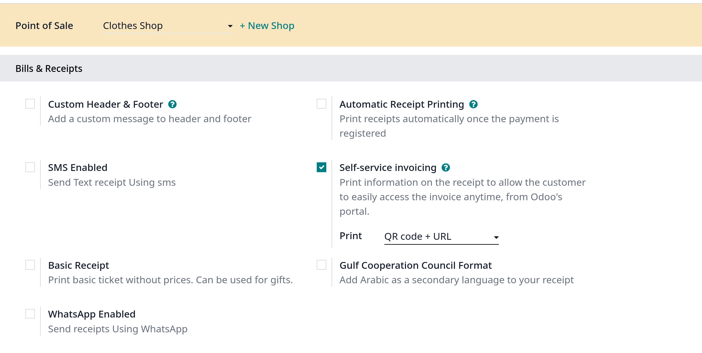
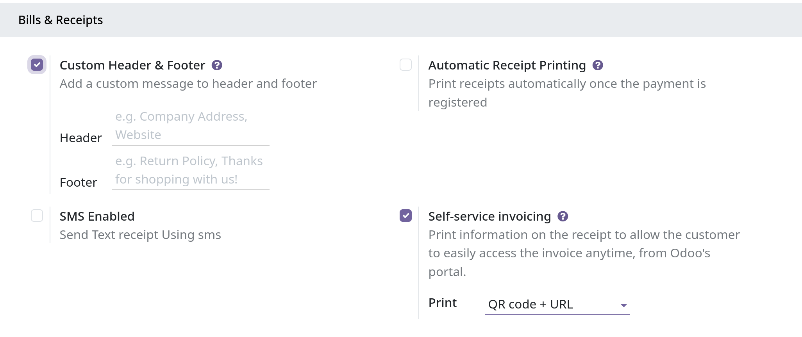
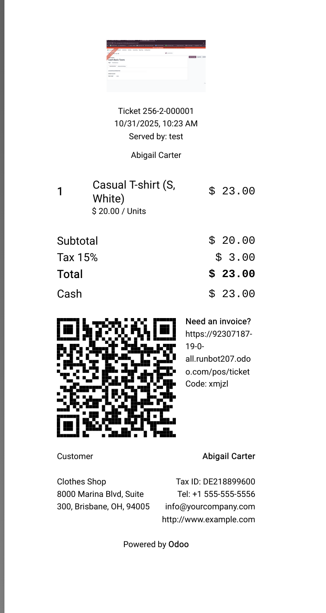
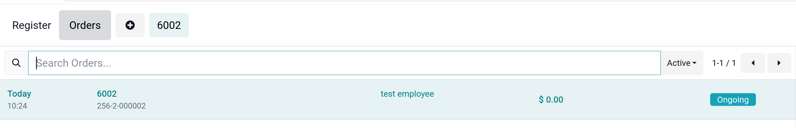
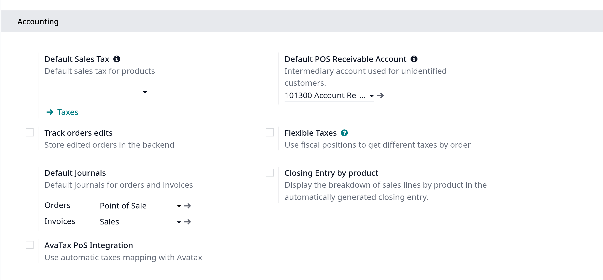
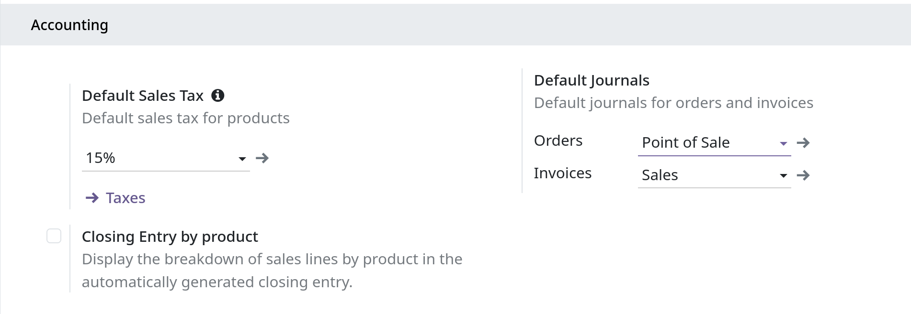
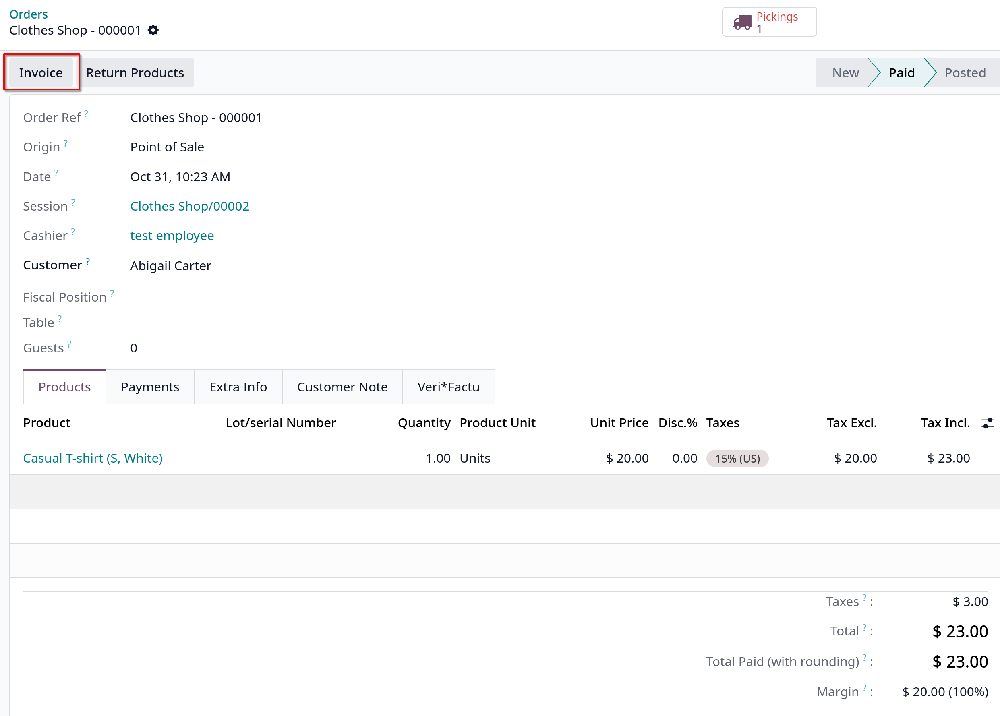

# Receipts and invoices

## Receipts

- Vào `Point of Sale -> Configuration -> Settings`, chọn POS và kéo xuống **Bills & Receipts**
  
  

- Để custom headers, footers, tick chọn vào **Custom Header & Footer**
- Để tự động in receipts khi thanh toán, click chọn vào **Automatic Receipt Printing**
  

## Reprint Receipts

- Ở giao diện POS, click vào **Orders** button để show danh sách các đơn hàng
  

## Invoices

- POS cũng cho phép tạo và in hóa đơn cho khách hàng đã đăng ký thanh toán và truy xuất tất cả các đơn hàng đã được lập hóa đơn trước đây

- **Lưu ý**: một hóa đơn được tạo trong POS sẽ tạo một journal entry nhập tương ứng vào **accounting journal**

## Configuration

- Để xác định journals nào sẽ được sử dụng cho một POS cụ thể, vào POS settings, kéo xuống accounting. Sau đó ta có thể xác định accounting journals được sử dụng mặc định cho đơn hàng và hóa đơn trong
  **Default Journals** section
  
  

## Invoice a customer

- Sau khi xử lý thanh toán, click **Invoice** bên dưới customer name để xuất hóa đơn cho khách hàng.
- Chọn payment method và clik **Validate**, hóa đơn sẽ tự động được xuất và sẵn sàng để tải xuống hoặc in

- **Lưu ý**: để xuất hóa đơn khi khách hàng cần được chọn

## Retrieve invoices

- Để truy xuất hóa đơn từ POS dashboard
  1. Vào `Point of Sale -> Orders -> Orders`
  2. Truy cập hóa đơn của đơn hàng, mở form đơn hàng, click **Invoice**
     

## QR codes to generate invoices

- Khách hàng có thể yêu cầu xuất hóa đơn bằng cách quét mã QR được in trên biên nhận. Sau khi quét, họ phải điền vào mẫu thông tin thanh toán của mình và click
  **Get my invoice**. Một mặt, làm vậy sẽ tạo hóa đơn để tải xuống, mặc khác, trạng thái đơn hàng được chuyển từ **Paid** hoặc **Posted** tới **Invoiced**

- Để dùng tính năng này, vào `Point of Sale -> Configuration -> Settings`, chọn **Use QR code on ticket** ở **Bills & Receipts** sau khi chọn POS
