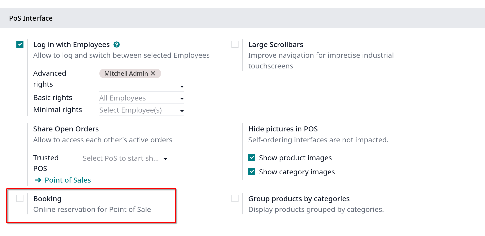

# Restaurant features

- POS cung cấp nhiều tính năng đa dạng cho nhà hàng hay bar:
  - Tổ chức các tầng và các bàn
  - Quản lý đơn đặt hàng
  - Thông báo tới nhà bếp hoặc quầy bar thông qua POS
  - In và chia hóa đơn
  - Thu thập tips
  - Đặt các loại thuế khác nhau cho các đơn đặt hàng

- Có 3 nút chính trong POS interface cho phép điều hướng giữa các bàn, sổ đăng ký và đơn hàng:
  - **Tables**: truy cập **Floor plan** để quản lý sức chứa bàn
  - **Register**: truy cập POS register để xử lý đơn hàng
  - **Orders**: truy cập tất cả các đơn hàng

- Để dùng tính năng này, phải check vào option **Is a Bar/Restaurant** trong POS settings sau khi chọn POS.

- Bản enterprise sẽ có tính năng **Booking** trong POS interface settings
  

## Default start screen

- Vào POS settings, kéo xuống **PoS interface**, ở **Default Screen** set thành **Tables** hoặc **Register**
  

## Floors and tables

- Floor plan view cho phép quản lý các tầng của nhà hàng và các bàn trong đó, quan sát trạng thái của các bàn real time (sức chứa, phục vụ và nhà bếp)
  - **New Order**: tạo trực tiếp đơn bán hàng không liên kết với bất kỳ bàn nào, nhận đơn hàng, click **Set Table** để gán vào một bàn, hoặc click **Set Tab** để ghi lại tên của đơn hàng đang mở
  - Các nút để điều hướng giữa các tầng đã config trước (Main Floor/Patio)
  - #(Table Selector): nhập số bàn và click **Jump** để truy cập

- **Ghi chú**: chọn một bàn trong **Floor plan** view hoặc truy cập thông qua **Table Selector** tự động confirm chỗ ngồi của bàn
  Để đặt một mã QR vật lý phù hợp với Floor plan, cần kích hoạt cài đặt [QR menu](./self-ordering.md), sau đó click vào **Get QR Codes** trong **Floor plan** view
  

  Giải thích các thông số thường thấy trong tables
  

### Configuration

#### From POS backend

- Vào `Point of Sale -> Configuration -> Floor Plans` click `New`
  1. Nhập Floor name
  2. Chọn POS liên quan
  3. Tùy chọn thêm hình ảnh background cho layout của nhà hàng
  4. Add a line tạo một bàn: Nhập chỗ ngồi mỗi bàn (Seats) và dạng bàn (Shape)

  5. Điều chỉnh các tùy chọn bổ sung như Height, Width, Color, Active ở settings icon
  6. Lưu

#### From POS frontend

- Mở POS register, click Menu ở góc phải **Floor plan** view, chọn **Edit plan**
  1. Click **Add Floor** để thêm 1 tầng
  2. Nhập tên
  3. Đổi background của tầng, click vào button hình ảnh
  4. Có thể Rename, Copy và Delete
  5. Click + Table để thêm bàn, trong đó có thể:
  - Nhập Seats
  - Chọn Square hay Round
  - Đổi màu của bàn
  - Đổi tên
  - Clone
  - Xóa
  6. Lưu

#### Booking

- Booking settings cho phép tạo và quản lý đặt chỗ cho một POS được chỉ định trực tiếp từ POS interface

- Booking tự enable khi cài app `Appointments`

##### Booking configuration

1. Vào POS settings, xuống **PoS Interface** enable **Booking**
2. Nhập tên trong **Appointment type**, click **Create and edit**
3. Cấu hình **Appointment type** form và **Save**
4. **Save** POS settings

##### Booking management

- Để quản lý bookings bàn từ POS interface, click **Booking**
  - Click **New** để tạo mới một booking. Thêm tên, thời gian và số khách, số điện thoại, khoảng thời gian, thêm resource, sau đó **Save**
  - Click một booking đã để **Edit** hoặc **Delete**, click một stage name (Booked, Checked-In, No Show) hoặc kéo thả booking card

### Order management

- POS interface cho phép xử lý và chuyển đổi đơn đặt hàng, xác định các presets, quản lý tài nguyên

#### Order process

Quá trình xử lý đơn đặt hàng theo các bước sau:

1. Click vào sản phẩm để thêm vào giỏ hàng
2. Xác định đơn hàng được xử lý như thế nào

- Click **Set Table** để link đơn đặt hàng tới bàn. Nhập số bàn và nhấn **Assign**

- Click **Set Tab** để nhập tên đơn hàng và click **Apply**
  

3. Click **Order** để validate đơn hàng

**Ghi chú**: click vào **Order** POS sẽ điều hướng về **Floor plan**

#### Order transfer

Để chuyển một đơn hàng sang một bàn khác từ POS register, click vào **Action** icon, chọn **Transfer/Merge** chọn bàn đích trong **Floor view**

- Chọn một bàn hợp lệ để chuyển khách hàng và đơn hàng của họ tới đó
- Chọn một bàn đã có người để hợp nhất khách hàng và đơn hàng của họ

##### Presets

Presets được sử dụng các cài đặt được cấu hình trước để đặt hàng và xác định xem đơn hàng đó dùng tại chỗ (Dine In) hay mang đi (Takeout), hay giao hàng (Delivery)
Họ cũng có thể kiểm soát xem có cần thông tin liên hệ của khách hàng hay không áp dụng và giới hạn công suất dựa trên giờ mở cửa và số lượng đặt hàng.

Để sử dụng preconfigured presets, vào POS settings và enable **Take out/Delivery/Members**. Đặt **Default** field thành presets mong muốn, và lưu.
Từ register (sổ đăng ký), chọn preset liên quan và xử lý đơn hàng:

- **Dine In**: gán một bàn hoặc mở một tab
- **Takeout**: nhập tên đơn hàng và **Apply**, chọn ngày và khung giờ
- **Delivery**: chọn một khách hàng đã có, hoặc **Create** để thêm mới. Sau đó chọn khung thời gian

##### Courses

Course button (nút món ăn) giúp chia đơn hàng thành nhiều món, gửi từng món vào bếp một cách tuần tự
Để chia đơn hàng thành các món, từ sổ đăng ký, click **Courses** và thêm món. Lặp lại hành động này, sau đó click **Order** để gửi đơn hàng xuống bếp

Khi đã sẵn món thứ 2, truy xuất đơn hàng từ chế độ **Floor view** hoặc **Orders** view, click **Fire Course 2**, lặp lại hành động này

#### Order printing

Để cho phép gửi đơn hàng tới nhà bếp hoặc quầy bar, kết nối máy in với POS, vào POS settings, theo các bước sau:

1. Kéo xuống **Preparation** kích hoạt **Preparation Printers**
2. Nhập tên máy in tại **Printers** field, click **Create and edit**
3. Trên màn hình setup, chọn **Printer Type**:

- Nếu printer được kết nối tới một hệ thống IoT, chọn **Use a printer connected to the IoT**, chọn thiết bị liên quan
- Nếu sử dụng máy in Epson không yêu cầu kết nối IoT, chọn **Use an Epson printer**, nhập **Epson Printer IP Address**

4. Xác định category sản phẩm sẽ được in bằng click vào **Add a line** trong **Printed Product Categories** field và chọn category mong muốn
5. Save
6. Trong POS settings, chọn Save

### Bills and payment

#### Bill spliting

Vào `Point of Sale -> Configuration -> Settings` enable **Allow Bill Spliting** ở dưới phần **Point of Sale**
Để chia bill từ sổ đăng ký POS:

1. Click vào Action icon, chọn Edit
2. Chọn ít nhất một sản phẩm và thực hiện một trong các hành động sau:

- **Payment**: xử lý trực tiếp thanh toán cho sản phẩm được chọn
- **Split Order**: tạo đơn hàng con
- **Transfer**: chuyển một hay tất cả sản phẩm tới bàn khác

3. Xử lý thanh toán
4. Click **Continue** để lặp lại cả quá trình cho tất cả các khách

**Ghi chú**: chia bill yêu cầu ít nhất 2 sản phẩm và tạo đơn đặt hàng con và phải được thanh toán trước khi trở về đơn hàng chính

#### Order payment

Để xử lý đơn hàng từ POS register, theo các bước sau:

1. Click **Payment**
2. Chọn một phương thức thanh toán
3. Tùy chọn chọn một khách hàng và gửi hóa đơn tới cho họ:

- Click **Customer** chọn một khách hàng hoặc tạo mới nếu khách hàng chưa có tài khoản
- Enable **Invoice** cho phép gửi một hóa đơn tới khách hàng

4. Click **Validate**

#### Receipt printing

Vào `Point of Sale -> Configuration -> Settings` enable **Early Receipt Printing** dưới **Point of Sale** để kích hoạt tính năng

Sau khi đơn hàng được thanh toán, click **Print Full Receipt** để in bill.

### Tips

#### Configuration

Vào POS settings, kéo xuống **Payment**, enable **Tips** và lưu

#### Tip and payment

Để xử lý một tip trong quá trình thanh toán, theo các bước sau:

1. Click **Tip**, thêm số và **OK**
2. Chọn phương thức thanh toán
3. Click **Validate**

#### Tip after payment (Chỉ ở Mỹ)

Vào POS settings thêm **Add tip after payment** enable đối với các POS ở Mỹ, quy trình như sau:

1. Tại màn hình thanh toán, chọn phương thức thanh toán **Card** được liên kết với máy quẹt thẻ **Stripe** hay **Adyen**
2. Click **Close Tab**, chọn tùy chọn lien quan ở **Add a tip**:

- 15%, 20%, 25%: % tip dựa trên tổng bill
- No tip
- Tip Amount: nhập số muốn tip

3. Click **Settle** để validate
