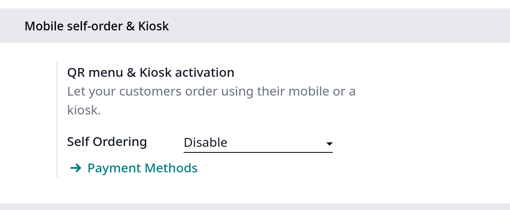
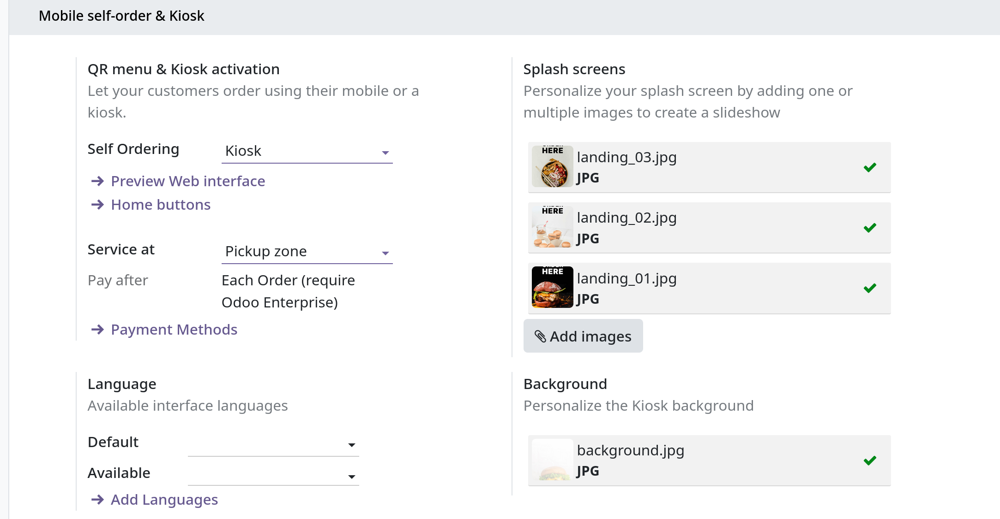
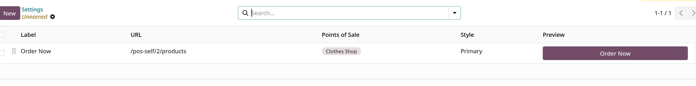
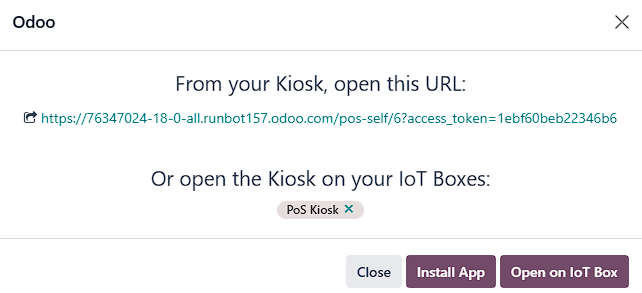

# Self-ordering

- Tính năng này cho phép khách hàng duyệt menu hoặc product catalog, đặt một đơn hàng, hoàn tất thanh toán trên thiết bị di động của họhoặc kiosk tự đặt hàng

## Configuration

### Feature activation

- Vào `Point of Sale -> Configuration -> Settings`, chọn kiểu **Self Ordering**
  
  

- Chọn **QR menu** hoặc **QR menu + Ordering** để khách hàng truy cập menu/product catalog bằng việc quét QR trên điện thoại của họ
  Option **QR menu + Ordering** cho phép họ đặt hàng và tạo thanh toán.
  - Click **Print QR Codes** để lấy 1 file .pdf chứa mã QR được sinh ra
  - Click **Download QR Codes** để tải về 1 file nén chứa mã QR

  - **Lưu ý**: trong nhà hàng, việc in hoặc tải xuống mã QR sẽ tạo ra lượng mã QR bằng số bàn có sẵn, còn đối với shop, nó chỉ sinh ra một mã QR chung.

- Chọn **Kiosk** khách hàng có thể truy cập menu/product catalog và thanh toán từ kiosk đặt hàng.

### Additional settings

- **Home buttons**: hiển thị trên giao diện kiosk hoặc thiết bị di động của khách hàng khi khách tự đặt hàng, để cài đặt click Home buttons
  1. Chọn **New** để tạo mới
  2. Set **Label**
  3. Nhập **URL** bắt đầu bằng https:// để điều hướng khách hàng về 1 URL xác định
  4. Trong **URL** trên, nhập /products để tạo nút điều hướng khách hàng về product catalog
  5. Chọn POS để đảm bảo button xuất hiện ở giao diện POS tự đặt hàng.
  6. Chọn **Style**
  - **Ghi chú**: để field _Point of Sale_ trống để áp dụng các nút cho tất cả POS; cột **Preview** tự động update.
    

- **Sevice location and payment options**:
  1. Chọn **Table** hoặc **Pickup zone** dưới field Service
  2. Định nghĩa cách khách hàng sẽ thanh toán tại field **Pay after** chọn **Each meal** hoặc **Each order**
  3. Dựa trên loại self-ordering tại POS:
  - QR menu + Ordering:
    1. **Restaurants**: khách hàng có thể được phục vụ tại bàn hoặc tại khu nhận hàng
    2. **Shop**: khách hàng chỉ có thể được phục vụ tại pickup zone
    3. Bất kể loại POS nào, khách hàng có thể thanh toán online hoặc sử dụng phương thức thanh toán được cấu hình sẵn
  - Kiosk:
    - Bất kể loại POS nào, khách hàng có thể được phục vụ tại bàn hoặc tại khu nhận hàng, nhưng họ phải thanh toán sau mỗi đơn hàng
    - Online Payment chưa được hỗ trợ

### Preview

- Xem trước giao diện trước khi cung cấp tính năng self-odering cho khách hàng để đảm bảo mọi cài đặt đều chính xác
- Click vào **Preview Web interface** dưới **Self Ordering** field để đảm bảo các addition settings được áp dụng chính xác

## Usage guidelines

1. QR menu

- Trên giao diện POS của end user, truy cập self-ordering bằng việc:
  - Scan QR code đã được tải về hoặc in ra hoặc
  - Click vào vertical ellipsis trên POST card, chọn **Mobile Menu**
- Tại giao diện khách hàng cuối:
  1. Truy cập giao diện self-ordering bằng scan QR code
  2. Click **home button** ở menu hoặc catalog
  3. Chọn **Order** để đặt hàng
  4. Theo chỉ dẫn của màn hình để gán bàn hoặc thanh toán đơn hàng.

2. Kiosk

- Tại giao diện POS end user:
  1. Click **Start Kiosk**
  2. Mở URL được cấp ở self-ordering (kiosk):
  - Click URL để mở kiosk ở tab mới
  - Click **Install App** để cài đặt kiosk module trên self-ordering kiosk hoặc
  - Click **Open on IoT Box** nếu kiosk của bạn được kết nối với hệ thống IoT
    
  - **Ghi chú**: Khi session được mở, **Start Kiosk** chuyển sang **Open Kiosk** trên POS card; click **Open Kiosk** trên POS card để mở lại popup window và truy cập self-ordering interface

- Tại giao diện khách hàng cuối:
  1. Click home button từ self-ordering kiosk để mở menu hoặc product catalog
  2. Chọn sản phẩm, click **Order** để đặt hàng
  3. Theo chỉ dẫn để gán bàn và thanh toán đơn hàng.
     
