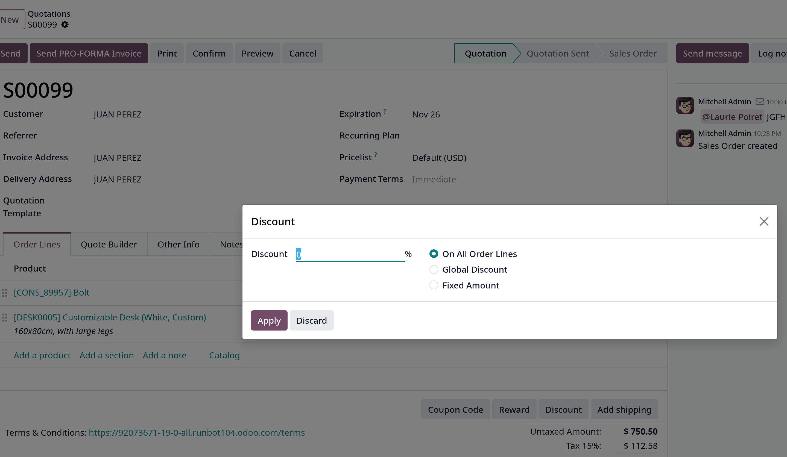

# Discounts

- Tính năng giảm giá cho phép người dùng giảm hoặc tăng giá các dòng sản phẩm trong báo giá hoặc đơn hàng. Giá trị này được tính bằng % giá trị sản phẩm

- Vào `Sales -> Configuration -> Setting`, ở **Pricing** chọn **Discount** checkbox và lưu lại

- Sau khi active, vào `Sales -> Orders -> Quotations`, sau đó chọn một quotation

## Discounts on product lines

- Trong **Order Lines** tab, sẽ có cột **Disc.%** xuất hiện

- **Lưu ý**: giá trị dương cho **Disc.%** sẽ áp dụng chiết khấu, giúp giảm giá thành sản phẩm, còn giá trị âm sẽ tăng giá sản phẩm sau cùng.

## Discount button

- Trong quotation/sales order cũng xuất hiện _Discount_ button tại bên dưới quotation/sales order.

- Click **Discount** button sẽ xuất hiện popup window
  

  Có 3 options:
  - _On All Order Lines_: thêm % chiết khấu được chỉ định trên tất cả các dòng sản phẩm của đơn hàng hiện tại
  - _Global Discount_: thêm dòng sản phẩm giảm giá vào đơn hàng, có giá trị tích lũy tương đương với % chiết khấu chỉ định.
  - _Fixed Amount_: thêm một số tiền cố định vào **Discount** field, một khi chọn, một product line được thêm vào Order Lines, với giá trị bằng tiền được trừ vào tổng đơn hàng.
