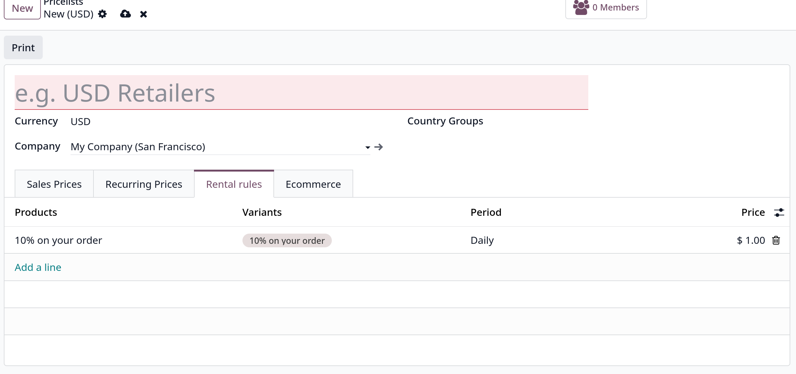

# Pricelists

- Là một phương pháp định giá linh hoạt áp dụng danh sách giá để điều chỉnh giá bán. Sự điều chỉnh này có thể áp dụng cho các khách hàng, nhóm khách hàng, đơn đặt hàng
  khoảng thời gian cụ thể,.. Rất hữu ích trong việc tạo chiến lược định giá tối ưu hóa tỷ suất lợi nhuận bán hàng

## Configuration

- Vào `Sales -> Configuration -> Settings` tại **Pricing** section, chọn vào **Pricelists** để enable.

- Sau khi active, vào `Sales -> Products -> Pricelists` để tạo mới bảng giá
  

- **Quan trọng**: nếu không có bảng giá đặc biệt được set cho quotations, **Default** pricelist sẽ được áp dụng.

- Cột **Selectable** chỉ áp dụng cho `eCommerce`. Tùy chọn này cho phép khách truy cập qua website chọn bảng giá khi mua sắm trên trang `eCommerce`

## Creating and editing pricelists

- Chọn **New** để tạo mới một bảng giá
  

- Sau khi nhập tên, nhớ chọn đơn vị tiền tệ ở field **Currency**. Nếu làm việc ở môi trường nhiều công ty, chọn công ty mà bảng giá này sẽ áp dụng.
  ở field **Company**, nếu để trống sẽ tự đọng được áp dụng cho tất cả công ty

- Nếu làm việc trong công ty đa quốc gia, chọn quốc gia ở **Country Groups** sẽ áp dụng bảng giá này.

- Ở tab **Sales price** của form, chọn **Add a line** để thêm một **Create Pricelist Rules**
  

  các fields:
  - _Product_: Nếu **Apply to** field chọn option này - sẽ áp dụng bảng giá này cho sản phẩm cụ thể
  - _Category_: Nếu **Apply to** field chọn option này - sẽ áp dụng bảng giá này cho danh mục hàng cụ thể
  - _Price Type_: Có thể chọn **Discount** - nhập % giảm giá, **Formula** - tính giá dựa trên rule cụ thể hoặc **Fixed Price** - giá cố định
    - _Discount_: nhập số % vào field này nếu _Price Type_ chọn _Discount_
    - _Formula_: nhập **Based price** (Sales Price, Cost hoặc Other Pricelist); **Discount** % chiết khấu; **Round off to** giá trị số dùng làm bột số làm tròn sau chiết khấu; **Extra fee** số tiền cố định được cộng/trừ sau chiết khấu và làm tròn; **Margins**

  - _Min Qty_: số lượng nhỏ nhất của sản phẩm được chọn để áp dụng bảng giá này
  - _Validity Period_: chỉ định ngày bắt đầu/kết thúc mà bảng giá này được áp dụng cho quotations
  - _Tip_: để có giá kết thúc bằng 9,99, đặt _Rounding Method_ là 10 và _Extra fee_ là -0,01

## Recurring prices tab

- Time-based rules được sử dụng với các sản phẩm đăng ký định kỳ (Subscriptions). Cần phải cài module `Subscriptions` - enterprise

- Trong **Recurring Prices** tab, chọn **Add a line** để thêm một **Recurring Pricing**
  
  Ở **Recurring Plan** field, chọn kỳ hạn, hoặc tạo mới
  

## Rental rules tab

- Quy tắc tính giá cũng có thể được cấu hình cho _rental products_ ở dưới **Rental rules** tab
  

- Chọn **Add a line** để chọn product mong muốn ở cột **Products** column, sau đó chọn **Variants**, chọn **Period** để chỉ định khoảng thời gian cho thuê
  chọn **Price** để định cấu hình giá cho thuê.

## Customer pricelist application

- Odoo cung cấp cách áp dụng trực tiếp pricelists cho khách hàng từ contact form của họ ở tab **Sales & Purchase**, tại mục **Sales**, field **Pricelist**.
