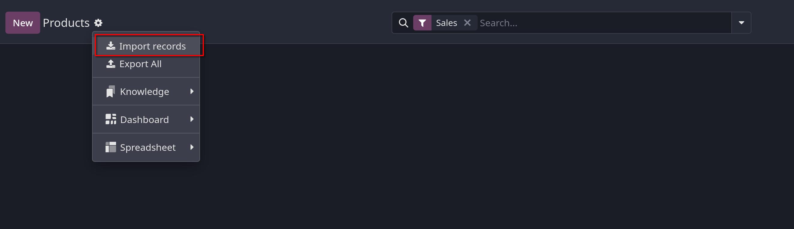

# Import products

- Odoo `Sales` cung cấp một mẫu để nhập products với các biến thể khác nhau và có thể mở, chỉnh sửa bằng bất kỳ phần mềm
  bảng tính nào (Microsoft Excel, Google Sheets, LibreOffice,..)

- Khi template này được điền đúng nó có thể nhanh chóng được import lên database của Odoo, khi được upload lên, các products này
  có thể ngay lập tức truy cập và chỉnh sửa trên giao diện quản lý của Odoo

## Import template

- Để import products với categories và variants, **Import Template for Products** phải được download trước, để download bạn
  vào `Sales -> Products -> Products`, tại page này, click vào `Import records` để lấy file về.
  

- Click vào `Import Template for Products` để lấy file mẫu.
  

- File sẽ có cấu trúc như sau:
  

- Khi upload file lên sẽ có thể tùy chỉnh được mapping giữa các cột trong file và field trong database của odoo như hình
  

- Tại giao diện upload click vào `Test` button sẽ kiểm tra tính validate của dữ liệu. Sau khi hệ thống kiểm tra, sẽ xuất hiện `Everything seems valid.`
  Sau đó `Import` để đẩy data vào database.
  

## Import relation fields, attributes, and variants

- Điều quan trọng cần lưu ý trong Odoo là một object có liên hệ tới nhiều object khác. Ví dụ, một sản phẩm có liên kết với các sản phẩm,
  thuộc tính, nhà cung cấp và những thứ thuộc loại này.

### Relation fields

- Trong Product form của Odoo, có các fields mà ta có thể thay đổi giá trị bất cứ lúc nào. Ta cũng có thể chỉnh sửa các fields này thông qua product import.
- Nếu user muốn import các fields thì phải đảm bảo rằng các fields này đã tồn tại trong database, ví dụ muốn import lên product type thì phải đảm bảo field này có trên database hoặc được cấu hình trước.
  Muốn import các fields liên quan tới product thì chỉ cần thêm tên field đó vào trong file template để import.

- Sau khi import xong, Odoo sẽ chuyển về trang `Products`

### Attributes and values

- Odoo cũng cho phép import product attributes và values, để có thể sử dụng cho các sản phẩm đã tồn tại trong cơ sở dữ liệu.
- Để import attributes và values, một spreadsheet riêng biệt hoặc CSV file cho attributes và values phải được imported và upload
  lên trước khi có thể sử dụng cho các products khác.

- Tên cột/titles của attributes, values theo các tên sau: `Attribute`, `Display Type`, `Variant Create Mode`, và `Values/Value`
  

  Theo đó:
  - `Attribute`: Tên của thuộc tính
  - `Display Type`: loại hiển thị được sử dụng trong product configuration (hoặc tạo), gồm:
    - `Radio`: hiển thị là radio button.
    - `Select`: hiển thị là một danh sách chọn.
    - `Color`: hiển thị như danh sách chọn màu sắc
    - `Pills`:
    - `Multi-checkbox`:
    - `Image`:
  - `Variant Create Mode`: cách variant được tạo và được áp dụng cho product
    - `Instantly`: variant được tạo ngay khi attributes và values được thêm vào product.
    - `Dynamically`: mỗi variant được tạo chỉ khi attributes và values của nó được thêm vào sales order
    - 'Never': variant không được tạo cho attribute.

  - `Values/Value`: các values liên quan đến attributes tương ứng, nếu có nhiều values cho một attribute, value đó phải nằm ở dòng riêng lẻ của spreadsheet.

- Sau khi lưu các giá trị cần thiết vào spreadsheet, vào `Sales -> Configuration -> Attributes`, click vào `gear icon`, chọn `Upload file`

- Một khi upload thành công, Odoo sẽ điều hướng về trang `Attributes`.

## Product Variant

- Để import products với product attributes và values, product import template spreadsheet với các fields:
  - `Product Attributes/Attribute`
  - `Product Attributes/Value`
  - `Name`
    
