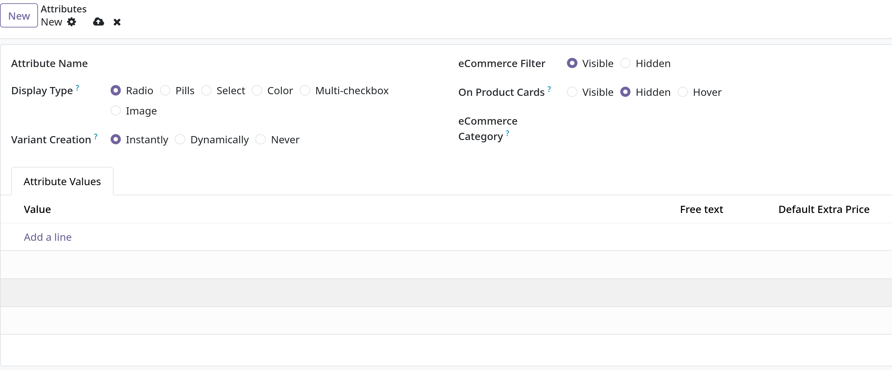

# Product variants

- Product variants cho phép một sản phẩm có thể có nhiều phiên bản khác nhau dựa trên đặc tính riêng ví dụ size, style, màu sắc,..
- Product variants có thể được quản lý thông qua product template riêng biệt hoặc thông qua `Sales -> Product -> Product Variants` hoặc `Sales -> Configuration -> Attributes`

## Configuration

- Để có thể sử dụng `Product Variants` phải vào `Sales -> Configuration -> Settings`, di chuyển xuống `Product Catalog` và click chọn `Variants`

## Attributes

- Trước khi `Product Variants` được setup, phải đảm bảo `Attributes` được tạo. Để tạo, sửa và quản lý attributes, vào `Sales -> Configuration -> Attributes`
- **Lưu ý**: Thứ tự của `Attributes` quyết định cách chúng xuất hiện trong `Product Configuration`, `Point of Sale` dashboard và `eCommerce` pages.

- Để tạo một attribute, vào giao diện chính của `Attributes` chọn `New`
  
  - `Display Type`:
    - `Pills`: Các nút có thể chọn trên trang product của cửa hàng
    - `Color`: Các tùy chọn biểu thị màu sắc tương ứng của sản phẩm
    - `Radio`: Các tùy chọn xuất hiện ở dạng danh sách, cho phép chỉ chọn 1
    - `Select`: Một danh sách các tùy chọn ở dạng dropdown
    - `Multi-checkbox`: Tùy chọn các checkbox trên trang sản phẩm

  - `Variant Creation Mode`:
    - `Instantly`: Ngay lập tức tạo các ngay khi attributes và values được thêm vào sản phẩm.
    - `Dynamically`: Chỉ tạo các variants chỉ khi các attributes và values được thêm vào sales order
    - `Never`: Không tạo variants.

  - `eCommerce Filter`:
    - `Visible`: Các giá trị thuộc tính hiển thị cho khách hàng ở front-end
    - `Hidden`: Các giá trị thuộc tính bị ẩn khỏi khách hàng ở front-end

  - `On Product Cards`:
    - `Visible`
    - `Hidden`
    - `Hover`

### Attribute values

- Ở _Attribute values_ tab, chọn _Add a line_ để thêm _Value_ vào

### Product Variants

- Để thêm variants cho products phải vào `Sales -> Products -> Products` chọn 1 product rồi chọn tab **Attribute & Variants**
