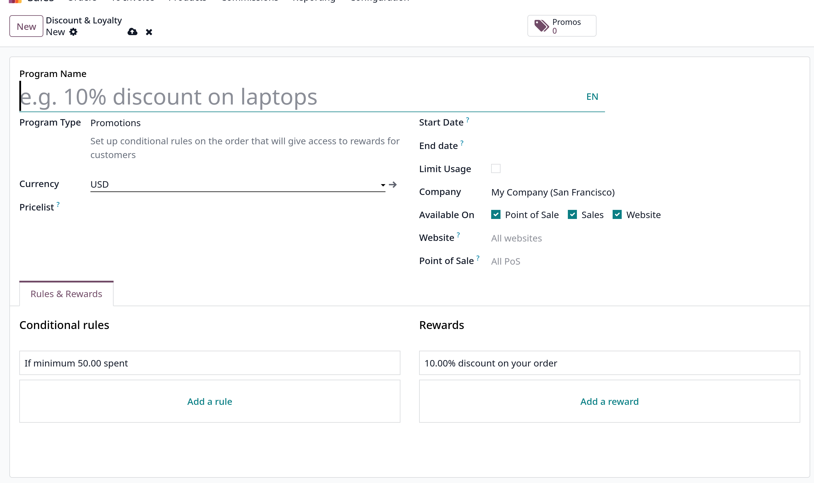

# Discount and loyalty programs

### I. Cấu hình và Phạm vi áp dụng

- **Kích hoạt Tính năng:** Để sử dụng, cần kích hoạt cài đặt **Discounts, Loyalty & Gift Card** trong `Sales ‣ Configuration ‣ Settings`.
- **Vị trí Quản lý:** Các chương trình được tạo hoặc chỉnh sửa tại `Sales ‣ Products ‣ Discount & Loyalty`.
- **Phạm vi Ứng dụng:** Các chương trình này có sẵn trên ứng dụng **Sales**, **eCommerce**, và **Point of Sale** (PoS).
- **Mẫu (Templates):** Các mẫu chương trình chỉ hiển thị **duy nhất** khi chưa có chương trình nào được tạo, và sẽ biến mất sau khi chương trình đầu tiên được thiết lập.

### II. Thiết lập Chương trình cơ bản

Các trường quan trọng khi thiết lập một chương trình bao gồm:

| Trường                               | Nội dung Quan trọng                                                                                                                            | Nguồn |
| :----------------------------------- | :--------------------------------------------------------------------------------------------------------------------------------------------- | :---- |
| **Program Name** (Tên Chương trình)  | **Không** hiển thị cho khách hàng.                                                                                                             |       |
| **Program Type** (Loại Chương trình) | Xác định hành vi của chương trình.                                                                                                             |       |
| **Pricelist** (Bảng giá)             | Nếu được chọn, chương trình chỉ áp dụng cho bảng giá đó; có thể chọn nhiều hơn một. Nếu để trống, chương trình áp dụng cho **mọi khách hàng**. |       |
| **Points Unit** (Đơn vị Điểm)        | **Chỉ** có sẵn khi Loại Chương trình là _Loyalty Cards_. Tên đơn vị điểm **có** hiển thị cho khách hàng (ví dụ: _Loyalty Points_).             |       |
| **Start Date / End Date**            | Thiết lập hiệu lực. Để trống nếu chương trình luôn hợp lệ và không hết hạn.                                                                    |       |
| **Limit Usage**                      | Có thể giới hạn số lần chương trình được sử dụng trong thời gian hiệu lực.                                                                     |       |
| **Available On**                     | Có thể giới hạn chương trình cho các ứng dụng, website hoặc điểm bán hàng (PoS) cụ thể.                                                        |       |

### III. Các Loại Chương trình (Program Types)

Odoo cung cấp nhiều loại chương trình khác nhau:

- **Coupons:** Tạo và chia sẻ mã phiếu giảm giá **sử dụng một lần** để cấp quyền truy cập phần thưởng ngay lập tức.
- **Loyalty Cards:** Khách hàng tích lũy điểm khi mua hàng để đổi lấy phần thưởng cho đơn hàng hiện tại hoặc tương lai.
- **Promotions:** Đặt các quy tắc điều kiện cho việc đặt hàng sản phẩm, khi được đáp ứng, sẽ cấp quyền truy cập phần thưởng.
- **Discount Code:** Đặt mã giảm giá, khi được nhập lúc thanh toán, sẽ cấp giảm giá cho khách hàng.
- **Buy X Get Y:** Khách hàng kiếm được một tín dụng cho mỗi mặt hàng (X) đã mua. Sau khi tích lũy đủ số tín dụng quy định, họ có thể đổi lấy mặt hàng (Y).
- **Next Order Coupons:** Tạo và chia sẻ mã phiếu giảm giá sử dụng một lần để cấp quyền truy cập phần thưởng cho **đơn hàng tiếp theo** của khách hàng.

### IV. Quy tắc Điều kiện (Conditional Rules)

Quy tắc điều kiện xác định khi nào chương trình được áp dụng cho đơn hàng của khách hàng.

| Quy tắc Điều kiện                         | Yêu cầu                                                                                                                                                            | Nguồn |
| :---------------------------------------- | :----------------------------------------------------------------------------------------------------------------------------------------------------------------- | :---- |
| **Minimum Quantity** (Số lượng Tối thiểu) | Phải đặt ít nhất **1** để đảm bảo khách hàng phải thực hiện mua hàng.                                                                                              |       |
| **Minimum Purchase** (Mua hàng Tối thiểu) | Nhập số tiền tối thiểu (có hoặc không bao gồm thuế) phải chi tiêu. Nếu cả số lượng và số tiền tối thiểu đều được nhập, đơn hàng phải đáp ứng **cả hai** điều kiện. |       |
| **Products / Categories / Product Tag**   | Lựa chọn sản phẩm cụ thể, danh mục sản phẩm, hoặc thẻ sản phẩm mà chương trình áp dụng. Để trống hoặc chọn _All_ nếu áp dụng cho tất cả.                           |       |
| **Grant** (Tích lũy Điểm)                 | Đặt số điểm khách hàng kiếm được (áp dụng cho _Loyalty Cards_ và _Buy X Get Y_) có thể là _per order_, _per currency spent_, hoặc _per unit paid_.                 |       |

### V. Phần thưởng (Rewards)

Phần thưởng xác định những gì khách hàng nhận được khi quy tắc điều kiện được đáp ứng.

- **Reward Type** (Loại Phần thưởng): Gồm **Free Product** (Sản phẩm Miễn phí), **Discount** (Giảm giá), và **Free Shipping** (Miễn phí Vận chuyển).
- **Discount (Giảm giá):** Có thể được nhập dưới dạng **percentage** (phần trăm), **currency per point** (tiền tệ trên mỗi điểm), hoặc **currency per order** (tiền tệ trên mỗi đơn hàng).
  - Giảm giá có thể áp dụng cho toàn bộ **Order** (Đơn hàng), **Cheapest Product** (Sản phẩm Rẻ nhất), hoặc **Specific Products** (Sản phẩm Cụ thể).
  - Có thể đặt **Max Discount** (Giảm giá Tối đa) (nhập `0` nếu không giới hạn).
- **Free Shipping (Miễn phí Vận chuyển):** Cũng có thể đặt **Max Discount** (nhập `0` nếu không giới hạn).
- **In exchange of (Đổi lấy):** Đặt số điểm cần thiết để đổi lấy phần thưởng (áp dụng cho _Loyalty Cards_ và _Buy X Get Y_).
