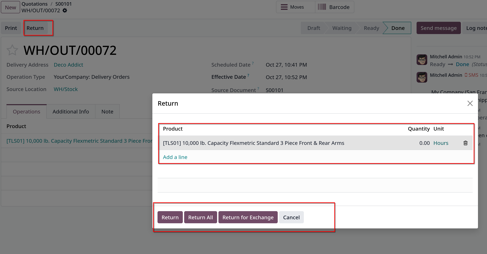
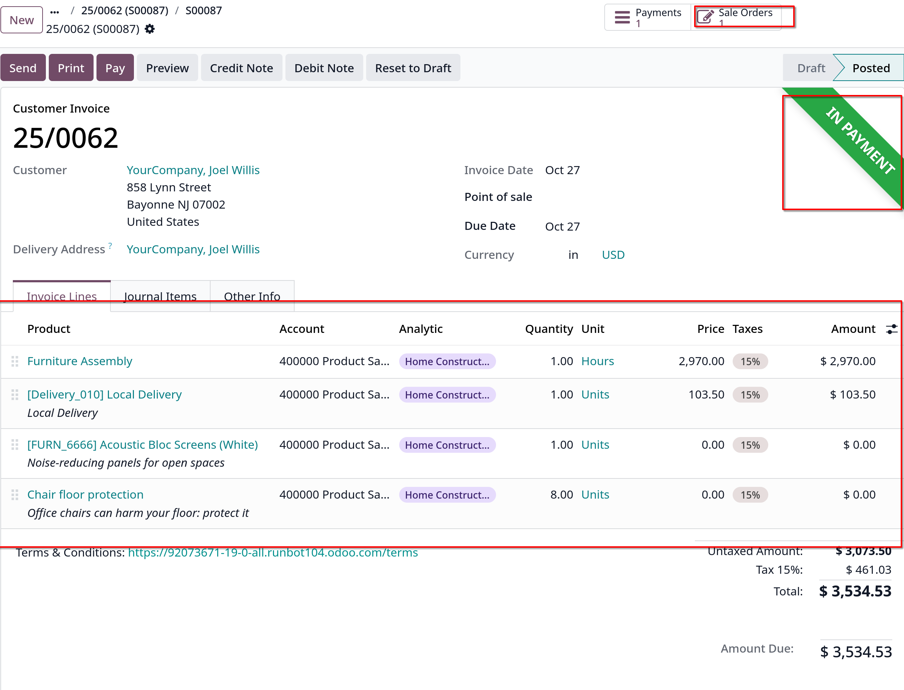
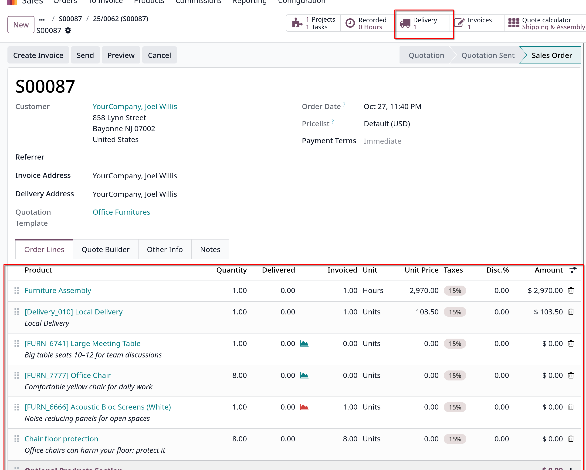
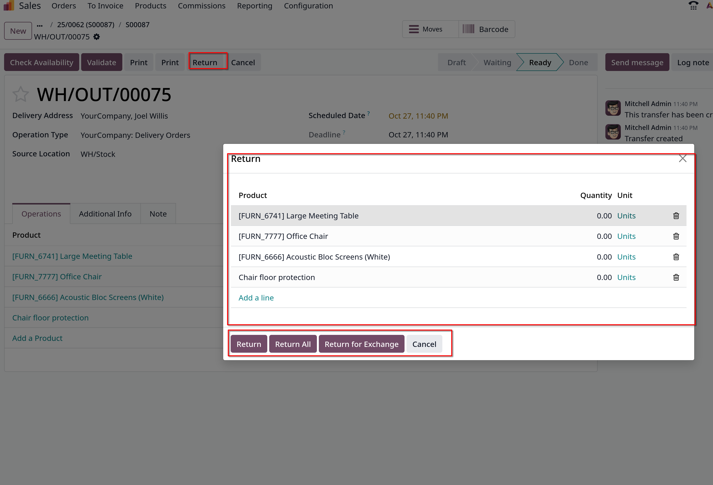

# Returns and refunds

- `Sales` app cung cấp vài cách để xử lý hoàn trả. Phương pháp được sử dụng tùy thuộc vào việc hóa đơn đã được gửi đi chưa

## Before invoicing

- Việc hoàn trả được hoàn tất bằng việc dùng _Reverse Transfers_ khi một khách hàng quyết định trả lại sản phẩm trước khi hóa đơn được gửi hoặc xác nhận.

- **Ghi chú**: để xử lý hoàn trả, `Inventory` app phải dược cài.

- Để bắt đầu hoàn trả trước khi lập hóa đơn, vào `Sales`, chọn sales order, click vào **Delivery** smart button để mở đơn giao hàng tương ứng.

- Click **Return** để kích hoạt return
  
  - Click vào icon thùng rác để xóa sản phẩm
  - Click **Return** để xác nhận trả hàng. Điều này sẽ sinh ra một quy trình kho mới cho các sản phẩm được trả lại

  - `Warehouse` cần **Validate** để xác nhận, sau đó về sales order ban đầu sẽ giảm số lượng sản phẩm đã được return.

  - Lúc này, sau khi tạo hóa đơn, khách hàng sẽ nhận được chỉ các sản phẩm họ giữ lại

## After invoicing

- Thỉnh thoảng, khách hàng trả hàng sau khi họ nhận hàng hoặc thanh toán hóa đơn. Trong trường hợp này, việc trả lại chỉ bằng việc chuyển khoản ngược
  _Reverse Transfer_ là không đủ

- Tuy nhiên _Reverse Transfer_ có thể được sử dụng cùng với **Credit Notes** để hoàn tất việc hoàn trả của khách.

- Vào `Sales` app, chọn sales order tương ứng sau khi đơn hàng ở trạng thái **IN PAYMENT**. Ở **Delivery** smart button, click **Return** để mở **Reverse Transfer** popup
  

  

  

- Sau khi thực hiện quy trình trả hàng như trên, ở sales order, click vào button **Credit Notes**, chon **Reason displayed on Credit Note** và nhập nhật ký vào field **Journal** để xử lý credit.
  Sau đó chọn ngày **Reversal Date**

- Cuối cùng chọn **Reverse** hoặc **Reverse and Create Invoice** để tạo hóa đơn nháp, **Confirm** để xác nhận credit note

- Khi hoàn thành, sẽ có 1 banner xanh dương: **You have outstanding credits for this customer. You can allocate them to mark this invoice as paid**
