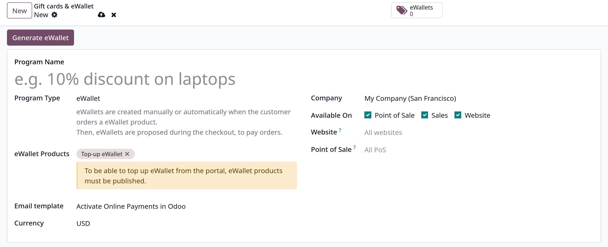
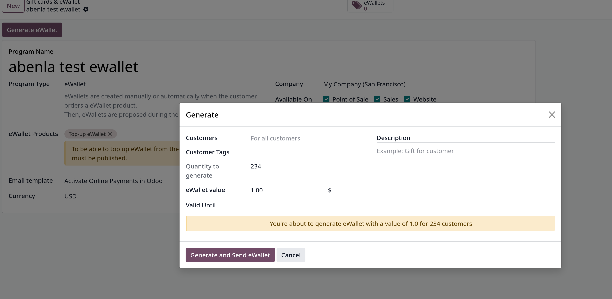
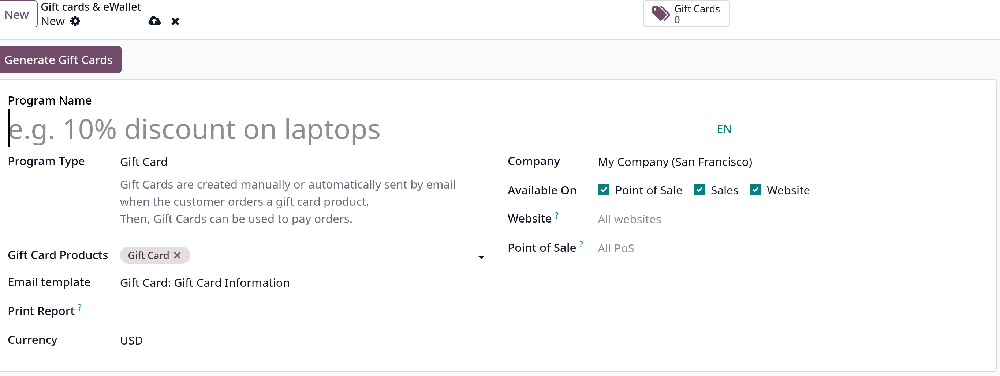

# Use eWallets and gift cards

- Trong Odoo, khách hàng có thể sử dụng _eWallets_ và _Gift cards_ để mua sắm trực tuyến.
- Vào `Sales -> Configuration -> Settings`, ở **Pricing** section, enable **Discount, Loyalty & Gift Card**

- Vào `Sales -> Products -> Gift cards & eWallets` và tạo mới eWallet hoặc chương trình gift card

## eWallets

- eWallets cho phép khách hàng lưu credits trên tài khoản trực tuyến của họ và sử dụng các credits này làm phương thức thanh toán khi mua hàng. eWallets cũng có thể được dùng
  để lưu trữ các gift cards

- Trước khi tạo một chương trình eWallet mới, cần tạo product với các thông số:
  - Product Name
  - Product Type: Service
  - Invoice Policy: Prepaid/Fixed Price
  - Create on Order: Nothing
  - Sales Price

- Tiếp theo cần tạo một eWallet top-up product. Top-up là các giá trị tín dụng được xác định trước được thêm vào eWallet để đổi
  lấy số tiền tương đương số tiền thật. Sau đó khoản credits này được sử dụng để thanh toán trong cửa hàng eCommerce hoặc POS
  

  Sau đó click button **Generate eWallet**, điền các fields, lưu ý **eWallet value** và **Valid Until** sau đó click **Generate and Send eWallet**
  

- eWallets được sinh ra sẽ được truy cập thông qua **eWallets** smart button, từ đây có thể **Send** hoặc **Share**
- Click vào eWallets để thay đổi **Expiration Date**, **Partner**, **Balance**

## Gift cards

- Khách hàng có thể mua gift cards để sử dụng làm phương thức thanh toán ở eCommerce shop hoặc POS

- Trước khi tạo một chương trình gift cards mới, cần tạo product với các thông số:
  - Product Name
  - Product Type: Service
  - Invoice Policy: Prepaid/Fixed Price
  - Create on Order: Nothing
  - Sales Price

- Vào `Sales -> Products -> Gift cards & eWallets`, tạo **New**
  

- click vào **Generate Gift cards** button và thao tac tương tự như eWallet ở trên.
