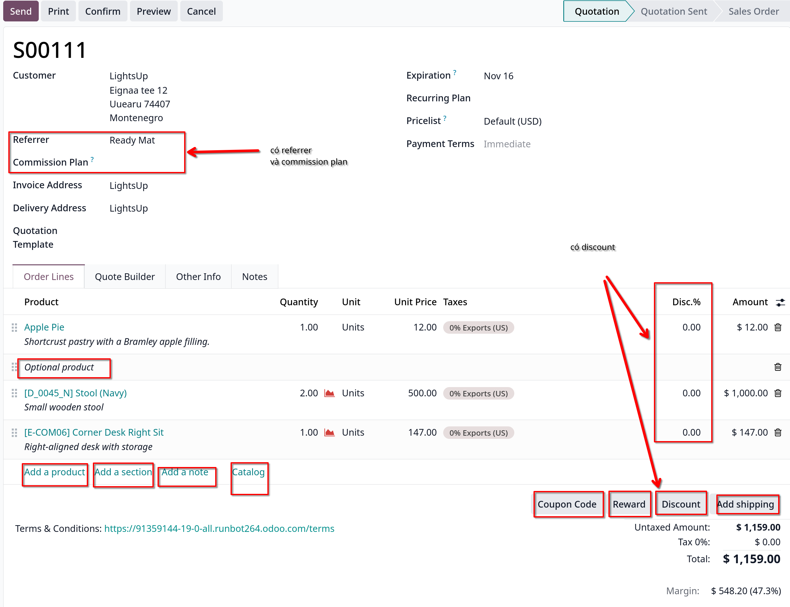
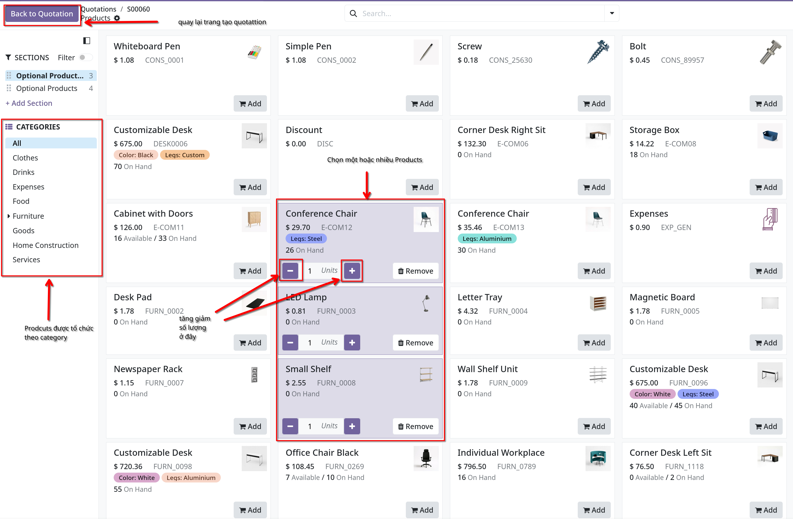
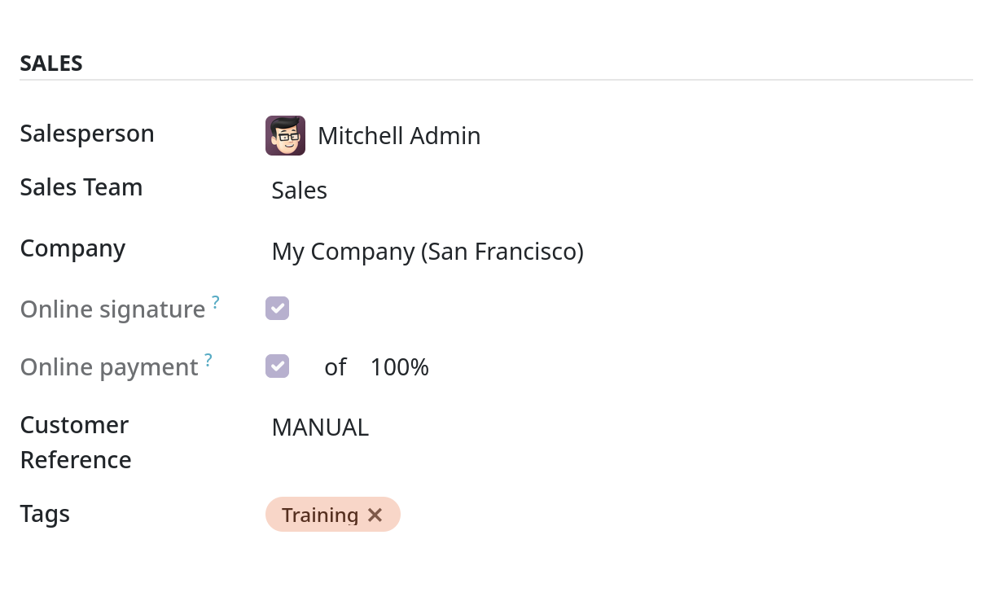
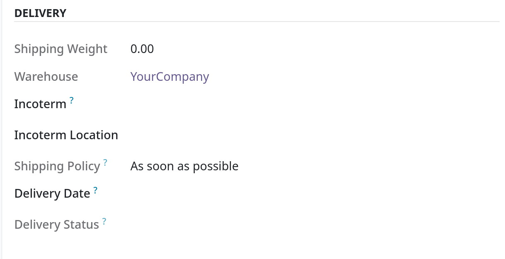
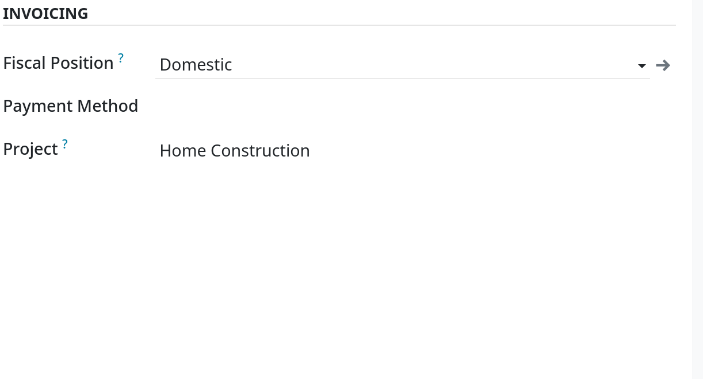
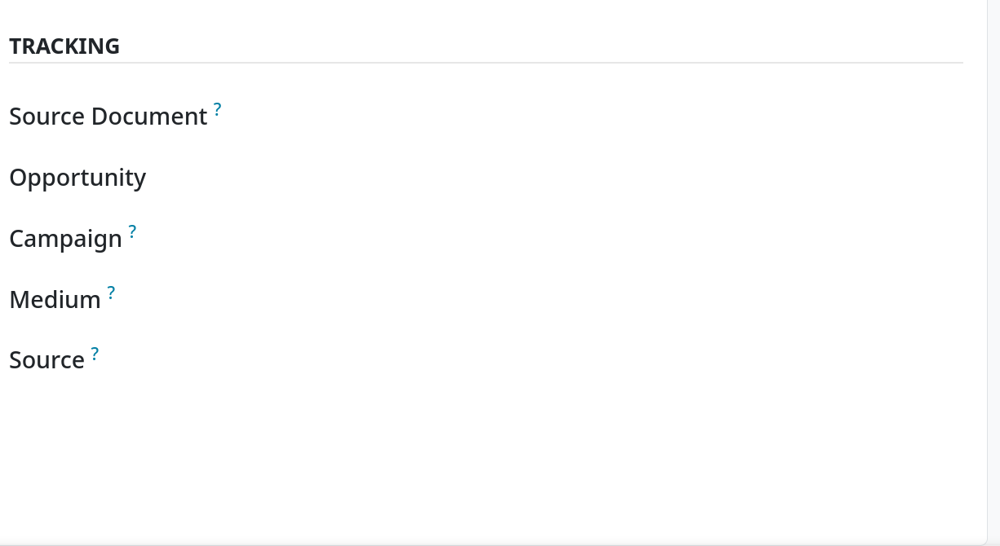
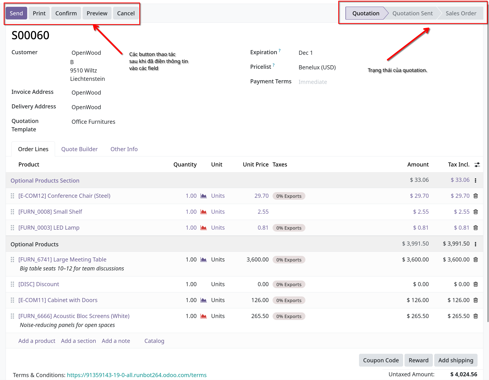
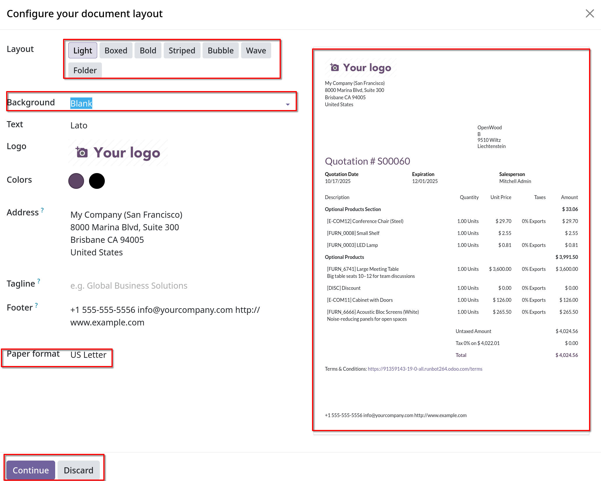
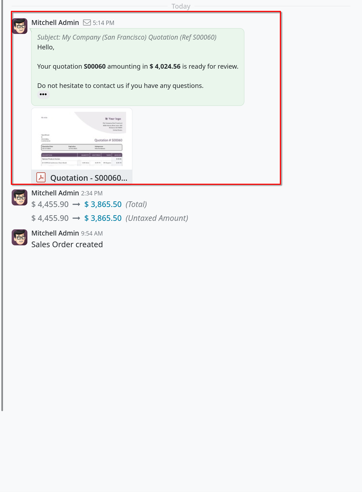
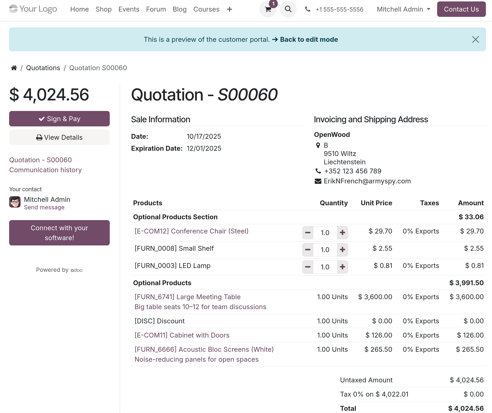

# Tạo quotation

## Quotation settings

- Truy cập vào `Sales -> Configuration -> Settings`, kéo xuống mục `Quotations & Orders` sẽ có các mục sau:
  - **Quotation templates**: Tùy chọn này cho phép tạo các mẫu báo giá có các ưu đãi sản phẩm tiêu chuẩn. Khi chọn option này
    **Default templates** sẽ xuất hiện cùng với liên kết đến trang **Quotation templates**.
  - **Online signature**: Yêu cầu một chữ ký online để xác nhận orders.
  - **Online payment**: Yêu cầu khách thanh toán trực tuyến trước để xác nhận đơn hàng. Yêu cầu thanh toán toàn bộ hoặc 1 phần
    (thông qua thanh toán trả trước). Khi tùy chọn này được đánh dấu, số tiền yêu cầu trả trước (%) sẽ xuất hiện. Ngoài ra còn có
    phần liên kết với nhà cung cấp dịch vụ thanh toán.
  - **Default Quotation Validity**: Xác định số tiền (tính thay ngày) mà báo giá vẫn có thẻ hợp lệ.
  - **Default Recurrence**: Chọn khoảng thời gian (period) mặc định từ menu dropdown để sử dụng làm kỳ hạn tạo báo giá mới.
  - **Sale warnings**: Nhận cảnh báo về các đơn hàng bao gồm các sản phẩm hoặc khách hàng cụ thể.
  - **PDF Quote builder**: Tùy chỉnh giao diện của quote với title, product description, footer pages và vv.
  - **Lock Confirmed Sales**: Đảm bảo không thể thực hiện chỉnh sửa nào đối với các đơn hàng đã xác nhận.
  - **Pro-Forma Invoice**: Gửi hóa đơn pro-forma cho khách hàng

## Quotations dashboard

- Quotations dashboard là trang xuất hiện đầu tiên khi `Sales` app được mở. Mặc định sẽ hiển thị toàn bộ Quotations liên quan tới
  user hiện tại trong database.
- Views có thể xem ở dạng kaban, graph, list, calendar, pivot và activity view.

## Tạo Quotation

- Vào `Sales -> New` để tạo mới một quotation.
- Điền thông tin `Customer` tại top của form. `Customer` đã tồn tại sẵn trong database.
- Nếu `Referrer` được chọn, sẽ xuất hiện `Commission Plan`, sau đó hãy chọn plan trong danh sách dropdown. Dựa vào từng plan
  hoa hồng mà `Referrer` tương ứng sẽ được nhận phần hoa hồng đó.
- Nếu muốn hãy chọn `Quotation template` để chọn mẫu mong muốn. Lưu ý một số field bổ sung sẽ xuất hiện dựa theo template được chọn.
- Default date xuất hiện ở `Expiration` field dựa trên con số được config trong `Default Quotation Validity` settings trong `Sales -> Configuration -> Settings`

- **Tip**: KHi sử dụng quotation template, ngày trong field `Expiration` sẽ dựa trên số liệu của `Quotation Validity` trên template.

- Nếu quotation dùng cho một sản phẩm gia hạn theo kỳ hoặc gói đăng ký, chọn `Recurring plan` mong muốn từ menu dropdown
- Nếu muốn hãy đặt một `Pricelist` cho quotation.
- Cuối cùng là `Payment term` là điều khoản thanh toán cụ thể cho quotation.
- **Lưu ý**: `Referrer` -> `Commission Plan` là tính năng chỉ có ở bản enterprise.
- Dưới đây là form thao tác tạo mới của bản community và enterprise.

- Có thể thấy các thao tác tạo quotation ở bản community và enterprise về cơ bản là giống nhau, chỉ khác nhau 1 vài field
  như `Referrer`, `Commission Plan` và `Discount`.

## Order Lines tab

- Tab đầu tiên của quotation form là Order Lines tab.
- Tab này cho phép chọn products, số lượng products rồi thêm vào quotation.
- Có hai cách để thêm products vào quotation. `Add a product` rồi chọn item mong muốn từ dropdown list của `Product`, điều chỉnh số lượng nếu cần.
  Hoặc có thể click vào `Catalog` show ra 1 trang riêng biệt, trình bày từng sản phẩm, được tổ chức vào từng category riêng theo `Product Category` và `Attributes`
  

- `Add section` sẽ cần nếu muốn trình bày nhiều items theo cách có tổ chức hơn trên báo giá. Sau khi nhập tên section xong,
  có thể kéo thả section đó vào vị trí mong muốn giữa các dòng products.

- Nếu cần, có thể ghi chú thêm cho products bằng cách `Add a note` ở `Order Lines`
- Bên dưới các các dòng products, có các nút khác mà bạn có thể áp dụng bất kỳ tính năng nào sau đây: `Coupon code`, `Promotions`,
  `Discount` (với bản enterprise) và `Add shipping`

## Other info tab

- Chứa các thông tin liên quan đến quotation được chia làm 4 phần: `Sales`, `Delivery`, `Invoicing` và `Tracking`
- **Ghi chú**: một số trường chỉ xuất hiện nếu cài đặt và tùy chọn cụ thể được chọn trong `Configuration`.

### Sales section

- Trong sales section có các field như hình sau:
  

  Chú ý các mục:
  - `Online signature`: Tick chọn sẽ yêu cầu chữ ký online của khách hàng để xác nhận đơn hàng. Field này chỉ có khi mà option `Online Signature` trong setting được enabled.
  - `Online payment`: Nếu tick field này, sẽ phải nhập một số (%) bên cạnh field, số này là yêu cầu thanh toán online trước bao nhiêu % để xác nhận đơn hàng.
  - `Customer Reference`: Tham chiếu tới ID của khách. Nhập ID có thể chứa ký tự, số hoặc mix giữa 2 loại.
  - `Tags`: Một thẻ đặt biệt cho quotation để tổ chức và tìm kiếm nâng cao trong Odoo Sales app, có thể thêm nhiều tags

### Delivery section

- Phần giao hàng sẽ như hình
  

  Giải thích thông số một chút:
  - `Shipping weight`: Hiển thị trọng lượng của hàng hóa được vận chuyển. Field này không thể sửa đổi, trọng lượng sản phẩm được cấu hình riêng trong từng sản phẩm.
  - `Incoterm`: Chọn `Incoterm` (International Comercial Term) để sử dụng điều khoản thương mại được xác định trước cho các giao dịch quốc tế.
  - `Incoterm Location`: Nếu chọn Incoterm thì nhập một vị trí quốc tế vào field này
  - `Shipping policy`: Chọn chính sách vận chuyển mong muốn từ dropdown menu, nếu tất cả sản phẩm được giao cùng một lúc, lệnh
    giao hàng sẽ được lên lịch dựa trên lead time (thời gian giao) tốt nhất. Mặt khác nó dựa vào thời gian giao ngắn nhất. Các tùy
    chọn sẵn có là `As soon as posible` hoặc `When all products are ready`.
  - `Delivery Date`: Click vào và chọn ngày mong muốn. Nếu không tùy chỉnh field này thì tham khảo `Expected date` kế bên.
    **Lưu ý**: tính năng `Expected date` chỉ có ở bản Enterprise.

### Invoicing section

- Chứa các field thông tin về lập hóa đơn của quotation này.
  

  Các thông số của `Invoicing section`
  - `Fiscal Position`: Chọn một vị trí tài chính để điều chỉnh thuế và tài khoản cho các khách hàng cụ thể hoặc đơn đặt hàng/hóa đơn
    Mặc định giá trị này sẽ đến từ Customer. Nếu một lựa chọn được chọn trong field này, một icon `Update Taxes` chứa một liên kết có thể click được
    xuất hiện. Khi được clicked, thuế cho khách hàng và báo giá cụ thể sẽ được cập nhật. Một popup xác nhận cũng xuất hiện
    **Lưu ý**: tính năng `Update Taxes` chỉ có ở bản Enterprise.
    Nói kĩ một chút về `Fiscal Position` (model: account.fiscal.position - kỹ thuật):
    - Đây là chức năng dùng để điều chỉnh thuế và tài khoản kế toán của khách hàng tùy theo: quốc gia, vùng lãnh thổ, quy tắc thuế => Nó là
      là một bộ quy tắc mapping giữa thuế mặc định và thuế thực tế phải áp dụng cho khách hàng cụ thể.
    - Có thể gán tự động hoặc thủ công
    - Ảnh hưởng đến toàn bộ logic tính thuế trong báo giá, đơn đặt hàng và hóa đơn.

  - `Payment Method`: Là phương thức thanh toán cụ thể cho hóa đơn.
  - `Project`: Cho phép gắn quotation với project, phục vụ tracking doanh thu, chi phí hoặc timesheet (module sale_project, project_sale). Cần khi bán dịch vụ hoặc theo dõi timesheet

### Tracking section

- Chi tiết phần này như hình
  

  Các thông số:
  - `Source Document`: Tham chiếu của tài liệu được gán cho quotation.
  - `Opportunity`: Opportunity cụ thể (`CRM`) liên quan tới quotation này.
  - `Campaign`: Chiến dịch marketing liên quan tới quotation này (nếu có)
  - `Medium`: Phương thức mà quotation này được bắt đầu (ví dụ: Email - nếu có)
  - `Source`: Chọn nguồn của liên kết được sử dụng để tạo quotation này (ví dụ: Facebook - nếu có)

## Notes tab

- Nhập ghi chú nội bộ cụ thể vào quotation về chính quotation này hoặc khách hàng nếu cần.

## Sending and confirming quotations

- Khi quotation đã đầy đủ các thông tin cần thiết tại các field thì quotation này có thể được gửi tới khách hàng để khách hàng confirm
  Sau khi được confirmed, quotation sẽ trở thành sales order.

- Tại bên trên quotation có các button cần lưu ý:
  

  Giải thích:
  - `Send`: gửi một email đến khách hàng, trong đó nội dung email là chi tiết quotation như hình. Chú ý các vùng khoanh đỏ.
    

    Sau khi design xong, Odoo sẽ render ra một email. Ta có thể tinh chỉnh lại body email rồi click `Send` button, email kèm quotation trên sẽ được gửi tới khách hàng.
    Sau khi gửi xong chatter của quotation sẽ hiển thị email đã gửi vào lịch sử chatter như hình. Đồng thời thanh trạng thái sẽ chuyển thành `Quotation Sent`
    

  - `Print`: Xuất ra một file pdf có thể in được
  - `Preview`: Quotation sẽ được render ra trang portal và Odoo sẽ chuyển hướng ra trang portal như hình.
    

  - `Cancel`: Hủy quotation.
  - `Confirm`: Xác nhận quotation và trạng thái bên thanh trạng thái sẽ được chuyển thành `Sales order`

- **Lưu ý**: Nếu `Lock Confirmed Sales` được bật trong settings, sales order sẽ bị `Locked`, và sẽ hiển thị là Locked như vậy trên form đơn đặt hàng.

- Tới giai đoạn này, quotation đã được chuyển thành đơn đặt hàng và đã sẵn sàng để lập hóa đơn và thanh toán.
