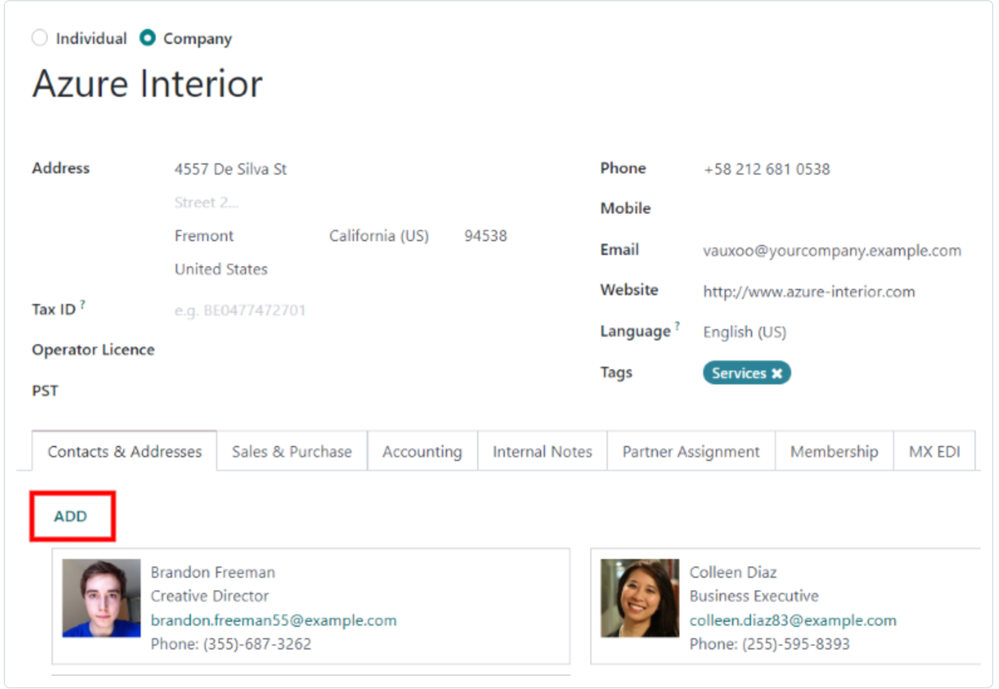
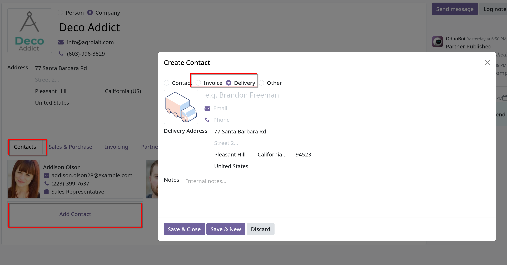
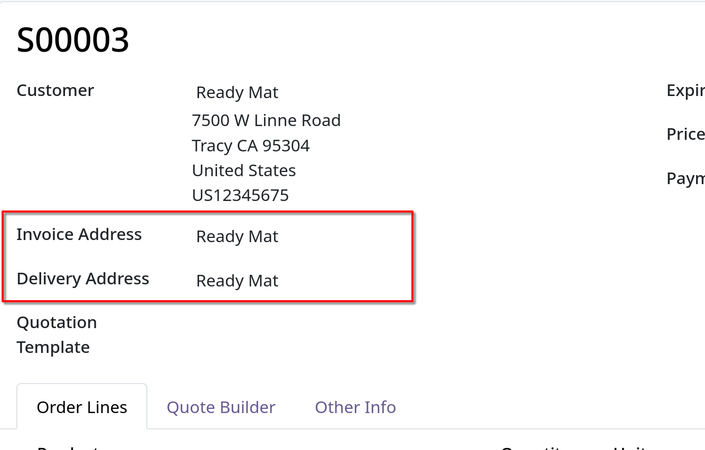

# Deliveries and invoices to different addresses

- Nhằm phục vụ việc giao hàng và lập hóa đơn với các địa chỉ khác nhau của khách hàng.

## Settings

- Vào `Accounting -> Configuration -> Settings` kéo xuống `Customer Invoices`, tick vào checkbox `Customer Addresses`

## Contact form configuration

- Để thêm nhiều địa chỉ vào contact, vào `Sales -> Orders -> Customer`, xóa filter và chọn bất kỳ contact nào bạn muốn
- Cũng có thể thêm nhiều địa chỉ cho contact trong `Contacts` app.
- Từ contact form, click `Edit`, sau đó chọn `Add Contacts` tại dưới cùng của contact form, tab `Contacts`
  

- Sau khi popup hiện lên, nhập thông tin contact và chọn địa chỉ invoice hay delivery như hình, sau đó bấm `Save`
  

## Address added to quotations

- Khi một khách hàng có `Invoice Address` và `Delivery Address`, 2 field này sẽ tự động điền thông tin trong có trong contact vào.
  

- Bạn cũng có thể sửa trực tiếp hai thông tin này cho khách hàng tại giao diện tạo quotation.
