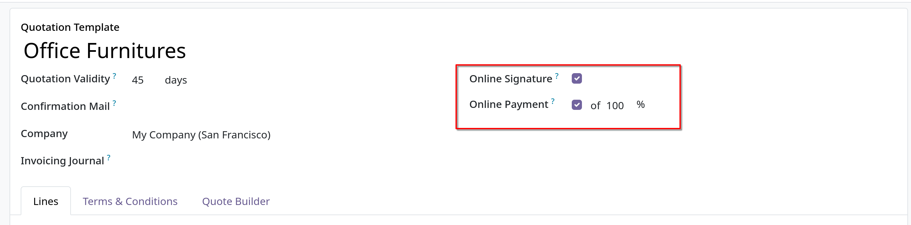
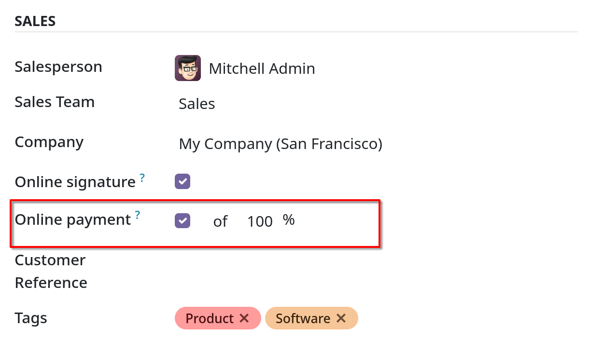
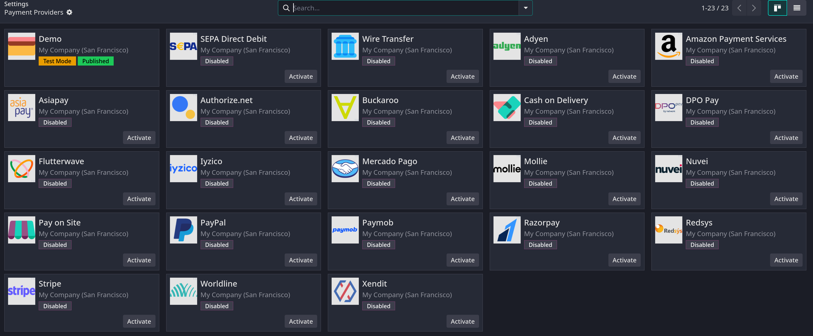
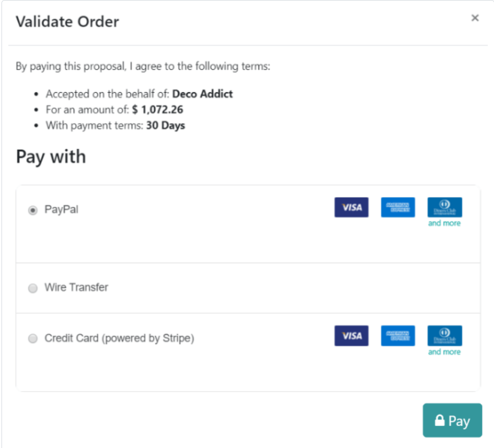
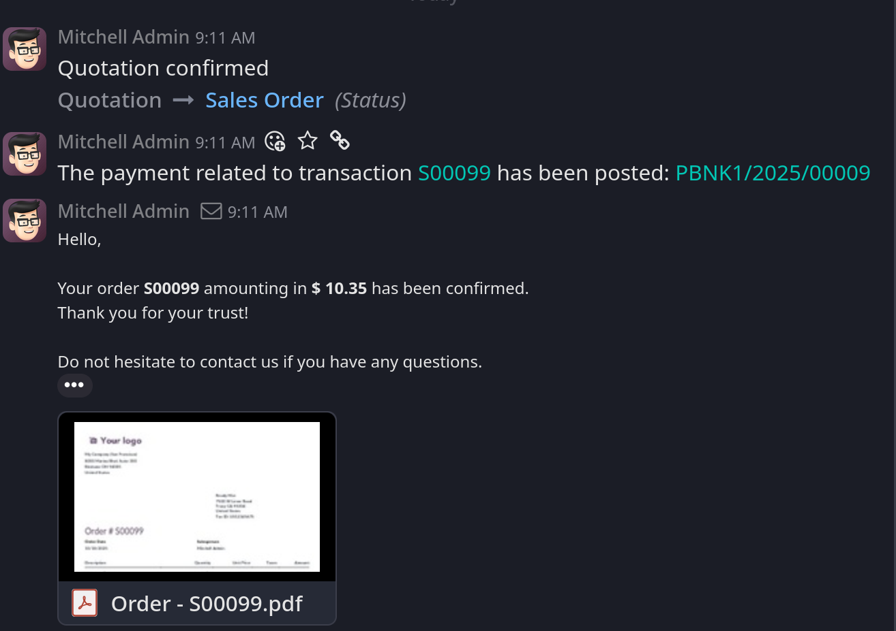

# Online payment order confirmation

- `Sales` app có cung cấp cho khách hàng khả năng xác nhận đơn hàng thông qua phương thức thanh toán online trực tiếp trong sales order
  Một khi sales order được thanh toán điện tử bởi khách hàng, salesperson sẽ được thông báo rằng order được confirm ngay lập tức.

## Activate online payments

- Để khách hàng xác nhận đơn hàng bằng một phương thức thanh toán online, phải active `Online Payment` settings trong `Configuration` tại
  `Quotations & Orders`.
- Bên dưới `Online Payment`, có mục `Default Quotation Validity`, field này xác định số ngày mà quotation còn hợp lệ.

- Sau khi active `Online Payment` sẽ xuất hiện 2 checkbox trong quotation templates
  

  và trong quotation ở tab `Other Info`
  

## Payment providers

- Sau khi active `Online Payment`, một link tới `Payment Providers` sẽ xuất hiện ngay bên dưới.
- Có một vài nhà cung cấp dịch vụ thanh toán trên khắp thế giới như hình
  

## Register a payment

- Sau khi mở một quotation trên trang portal, khách hàng có thể click `Accept & Pay` để xác nhận đơn hàng và thanh toán online.
- Sau khi click sẽ show ra `Validate Order` popup chứa nhiều options khác nhau để khách thanh toán trong mục `Pay with`
  

- **Lưu ý: Odoo chỉ cung cấp các tùy chọn thanh toán trên cửa sổ `Validate Order` popup chỉ khi phương thức đó đã được configured trên
  trang `Payment Providers` và đã được published**

- Một khi khách hàng đã thanh toán thành công, Odoo ngay lập tức thông báo tới salesperson rằng đơn hàng đã được xác nhận
  lịch sử thanh toán và xác nhận sẽ xuất hiện ngay bên chatter.
  
