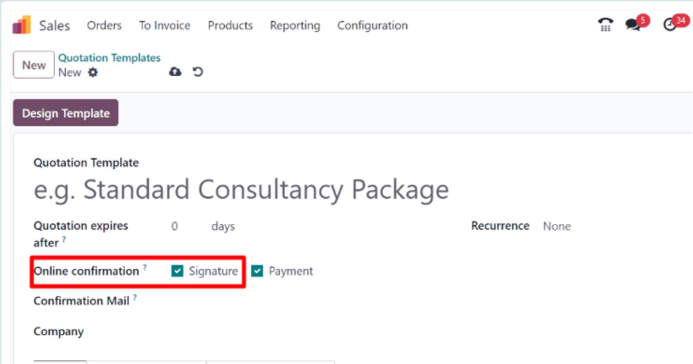
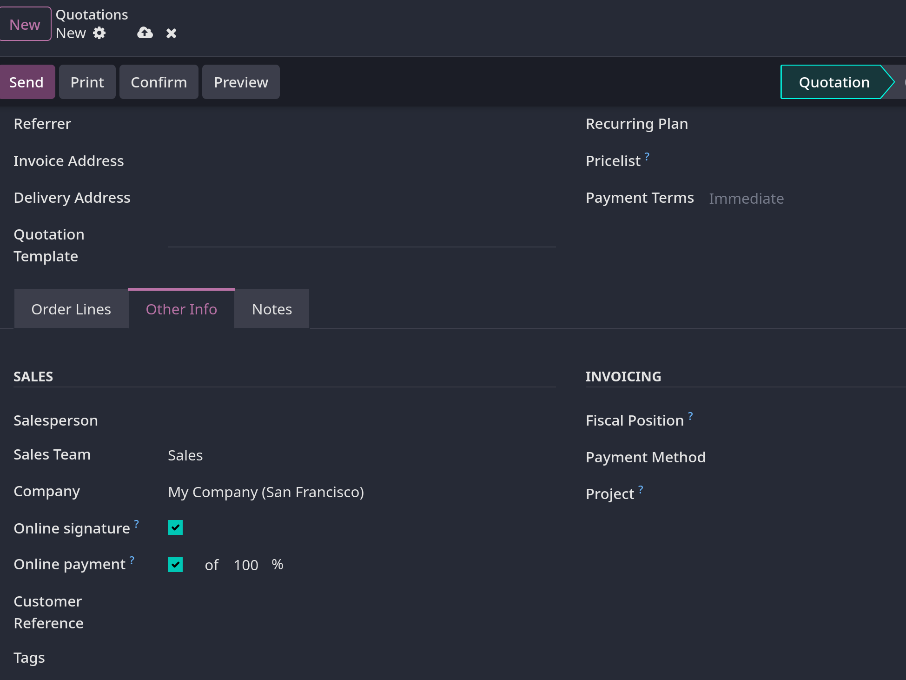
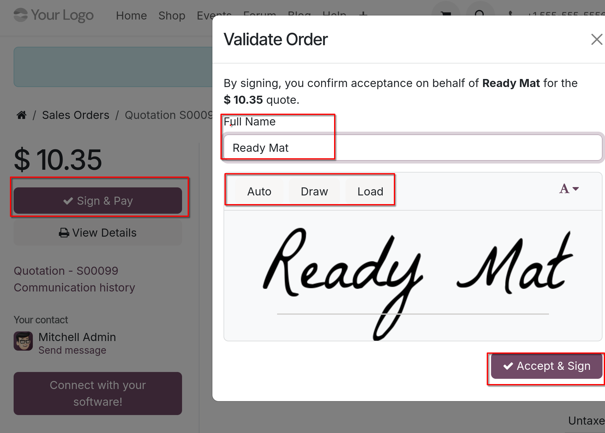
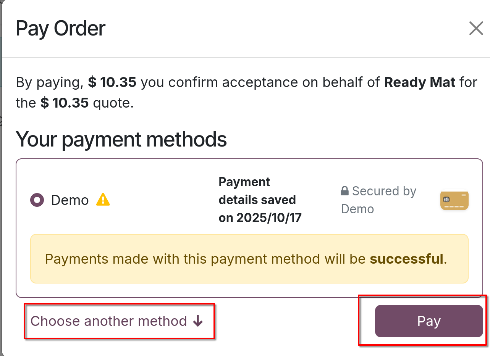
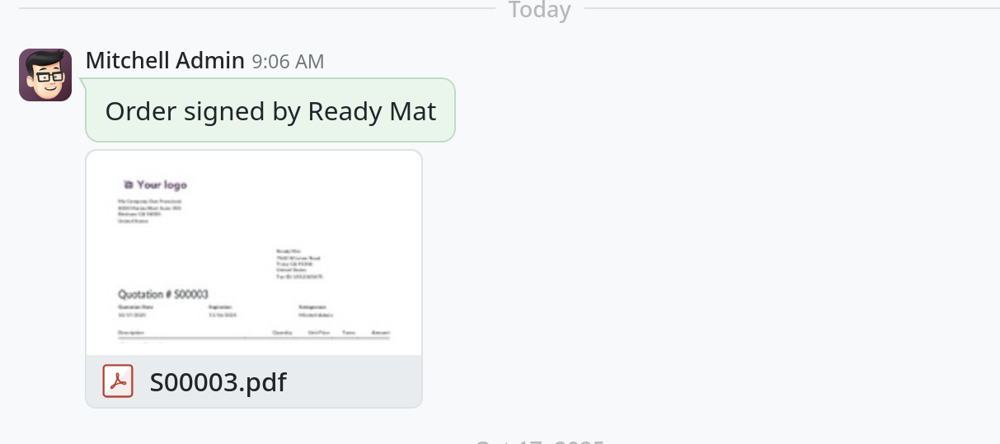

# Online signatures for order confirmations

- Odoo `Sales` module cung cấp cho khách hàng khả năng xác nhận đơn hàng thông qua chữ ký online, trực tiếp trên sales order.
  Một khi đơn đặt hàng được khách hàng ký điện tử, salesperson của sales order đó sẽ lập tức nhận được thông báo xác nhận.

## Activate online signatures

- Active tính năng `Online Signature` bằng cách vào `Sales -> Configuration -> Settings`, di chuyển tới `Quotation & Orders`
  active `Online Signature` lên bằng việc tick vào checkbox.

- Sau khi active tính năng này, sẽ có thêm field `Online Confirmation` trong quotation templates.
  

  giao diện quotation thì nằm ở `Other Info` tab
  

## Order confirmations with online signatures

- Khi khách hàng truy cập quotation online thông qua customer portal, sẽ có mục `Sign & Pay`. Khi click vào sẽ hiện một popup `Validate Order`
  trong popup này `Fullname` sẽ tự động lấy thông tin của khách hàng trong database, sau đó khách hàng có 3 tùy chọn để ký.
  `Auto`, `Draw`, `Load`
- Sau khi click vào `Accept & Sign` thì sẽ tùy vào các phương thức thanh toán được thiết lập trước đó mà khách có thể lựa chọn
- Sau khi báo giá được thanh toán và xác nhận, lệnh giao hàng tự động sẽ được Odoo tạo (Nếu Odoo có cài app `Inventory`)
  

  

- Sau khi khách hàng kí thành công, salesperson sẽ nhận được thông báo, và lịch sử ký và xác nhận sẽ hiển thị ngay bên chatter.
  
