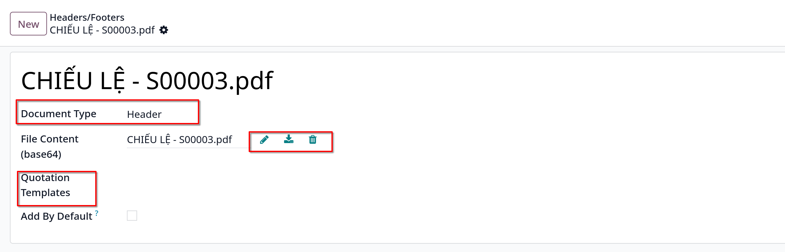
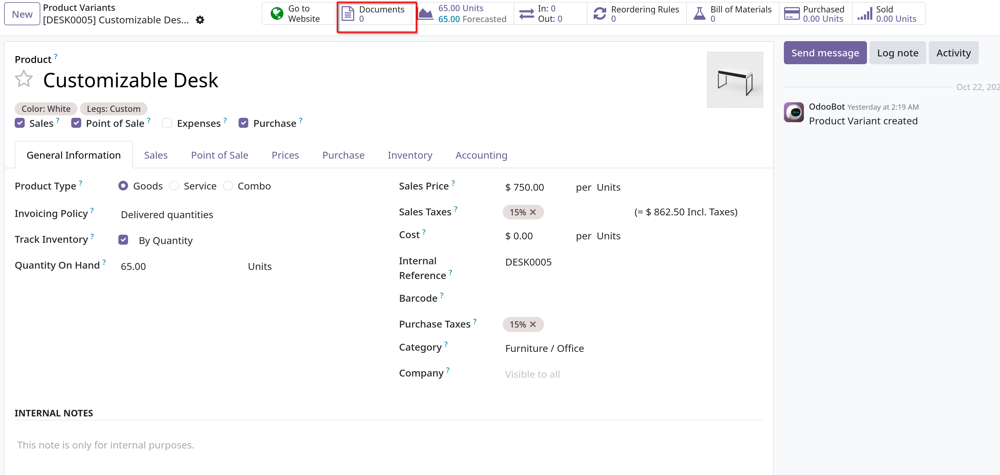
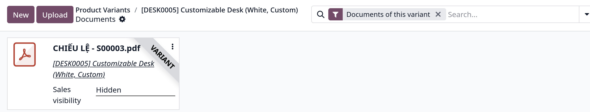
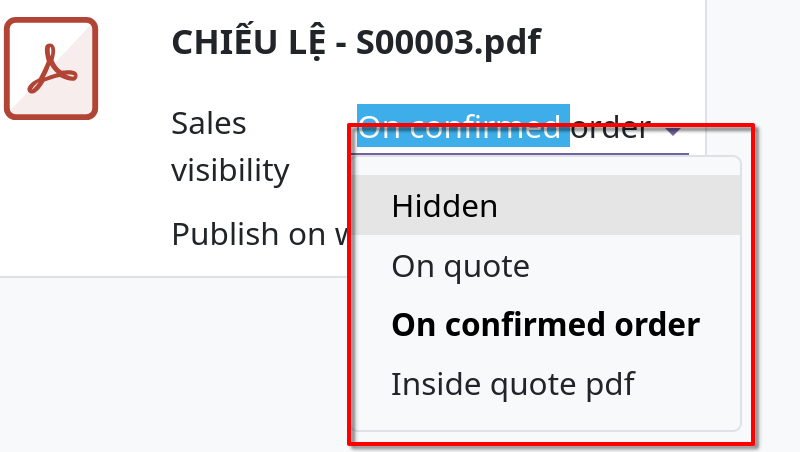
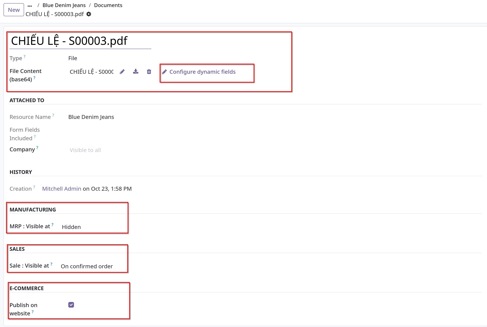
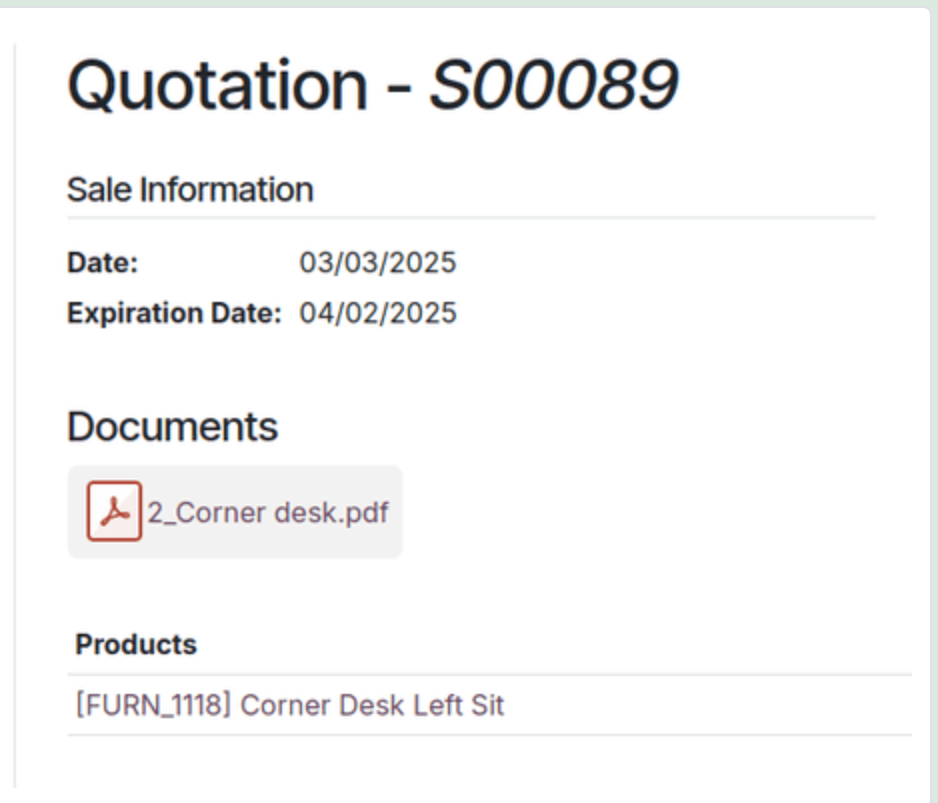

# PDF quote builder

- Giúp gửi tới khách hàng một file PDF tùy chỉnh đầy đủ cho báo giá, giới thiệu về công ty và sản phẩm với đa dạng thông tin và
  các yếu tố thiết kế khác nhau thay vì chỉ hiện giá và tổng số

- _PDF Quote Builder_ nhóm các header pages, product descriptions, giá và footer pages để tạo một báo giá chi tiết. Nó cũng
  có thể nhúng các đoạn văn bản động hoặc ghi chú tùy chỉnh vào file PDF để cá nhân hóa cho khách hàng.

- Có một PDF tùy chỉnh trong báo giá giúp mang lại trải nghiệm mua sắm chuyên nghiệp hơn cho khách hàng, đồng thời cũng tăng mức
  độ trang nhã cho công ty thông qua việc chèn _dynamic text_ hoặc _custom notes_

## Configuration

- Vào `Sales -> Configuration -> Settings` chọn **PDF Quote builder** trong mục **Quotation & Orders**
- **Khuyến nghị**: nên chỉnh sửa PDFs form bằng phần mêm của Adobe

## Add PDF as Header/Footer

- Có thể thêm file PDF tùy chỉnh làm header hay footer

- Để custom PDF header/footer, vào `Sales -> Configuration -> Headers/Footers`, chọn `New` hoặc `Upload`
  - _Upload_ sẽ tải lên tài liệu PDF, sau đó nếu cần thì có thể chỉnh sửa bằng việc click vào vertial ellipsis
  - _New_ sẽ tạo một blank document, ta có thể upload tài liệu PDF tại field **File Content**

- Tại **Document Type** field, chọn _Header/Footer_ trong menu dropdown

- Có thể config cho **Quotation Template** field để chọn áp dụng PDF document này cho quotation template cụ thể nào từ danh sách dropdown

  

## Dynamic Text in PDFs

- Khi tạo custom PDFs cho báo giá, sử dụng _dynamic text_ để Odoo tự động điền PDF content với thông tin liên quan đến quotation từ database, như tên, giá,...

- Giá trị của _dynamic text_ là các thành phần của form có thể được thêm vào file PDF, Odoo tự động điền các giá trị đó bằng thông tin liên quan tới báo giá.

### Dynamic text values

- Đây là danh sách các _dynamic text values_ được sử dụng trong PDFs tùy chỉnh, đã được mapping chính xác tới các fields và thể hiện giá trị của các fields đó

  Cho header/footer:
  - _name_: tham chiếu hóa đơn bán hàng (Sales Order Reference)
  - _partner_id\_\_name_: tên khách hàng
  - _user_id\_\_name_: tên salesperson
  - _amount_untaxed_: số tiền trước thuế
  - _amount_total_: tổng tiền
  - _delivery_date_: ngày giao hàng
  - _validity_date_: ngày hết hạn
  - _client_order_ref_: tham chiếu khách hàng

  Cho sản phẩm:
  - _description_: mô tả sản phẩm
  - _quantity_: số lượng sản phẩm
  - _uom_: Unit of Measure (đơn vị đo)
  - _price_unit_: đơn vị giá
  - _discount_: giảm giá
  - _product_sale_price_: giá danh sách sản phẩm
  - _taxes_: tên thuế, được nối bằng dấu ,
  - _tax_excl_price_: giá chưa bao gồm thuế
  - _tax_incl_price_: giá đã bao gồm thuế

- Sau khi tải lên PDF, có thể _Configure dynamic fiels_, việc này giúp mapping bất kì fields nào bạn muốn hiển thị vào trong field của pdf
  bằng cách viết ra path hiện có.

### Starting models

- Đối với _headers_, _footer_, path bắt đầu từ model `sale_order` hiện tại
- Đối với _product document_ (tài liệu sản phẩm), path tuân theo model `sale_order_line`

### Common dynamic fields

- Đã liệt kê ở mục **Dynamic Text Values** ở trên.
- **Custom Notes** (ghi chú tùy chỉnh): việc để trống path cho phép seller điền bất kỳ ghi chú (custom_note) nào vào trực tiếp từ báo giá cụ thể.

## Add PDF to products

- Trong `Sales` module, khi PDF được thêm vào sản phẩm được dùng trong quotation, file PDF đó cũng được chèn vào file PDF cuối cùng.
- Để thêm một custom PDF vào product, vào `Sales -> Products -> Products`, chọn một sản phẩm muốn tùy chỉnh

- **Ghi chú**: tài liệu pdf cũng có thể được thêm vào product variants thay vì chỉ products. Để thêm tài liệu vào product variants
  vào `Sales -> Products -> Products Variants`, chọn một variant muốn sửa, click vào `Document` smart button và upload tài liệu lên.
  

  Sau khi upload sẽ như sau
  

  Ở đây có thể chỉnh sửa lại một số tùy chỉnh, như _Sales visibility_ cho pdf _document_ bằng việc click vào _Edit_:
  
  
  - **Lưu ý**: bên cạnh **File Content** field là menu **Configure dynamic fields** trong hình trên sẽ dẫn tới trang hiển thị các fields tùy chỉnh theo path
  - Giải thích các options trong phần _Sales_ của menu trên
    - **On quote**: tài liệu được gửi tới và có thể được truy cập bởi khách hàng tại mọi thời điểm
    - **On confirmed order**: tài liệu được gửi tới khách hàng theo sự xác nhận đơn hàng của khách, option này tốt nhất khi gửi hướng dẫn sử dụng
      hay các tài liệu bổ sung khác
    - **Inside quote pdf**: tài liệu bao gồm trong PDF quotation, giữa trang header và phần \*_Pricing_ của báo giá.
    - **Hidden**: ẩn tài liệu đi
  - Ví dụ: Khi chọn _Inside quote_ trong mục _Sale visiblity_. PDF sẽ được nhìn thấy trong quotation trong _customer portal_ dưới **Documents** field.
    

  - Tại _E-Commerce_ trong `Edit` pdf documents, tick vào chọn **Publish on website** để xuất bản tài liệu này trên trang website và ecommerce
    

## PDF quote

- Trong quotation/sales order, tại tab **Quote Builder**, chọn document bổ sung sẽ được gộp vào PDF cuối cùng để gửi tới khách hàng
- Để in PDF quote, vào nút gear button tại mã quotation/sales order. Chọn **Print**, chọn **PDF Quote**
