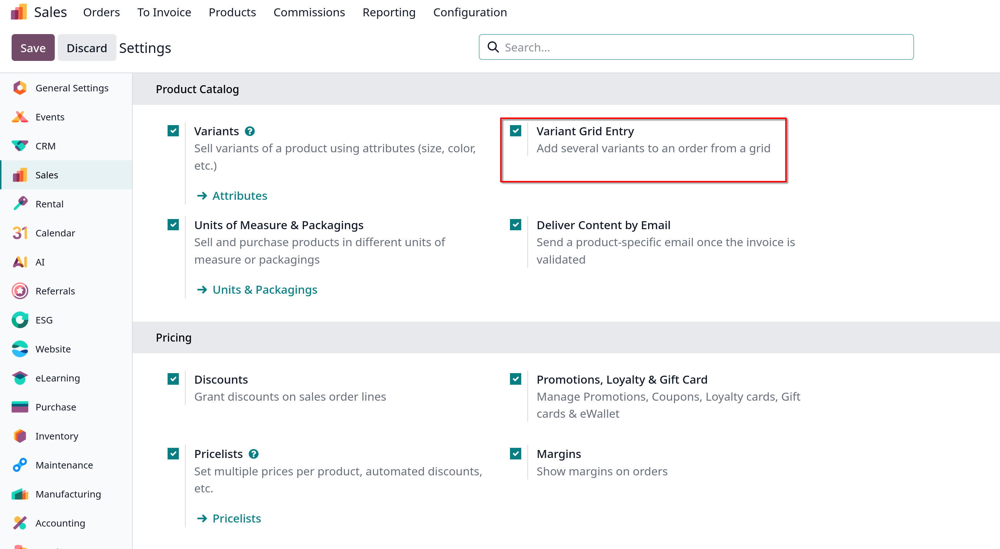
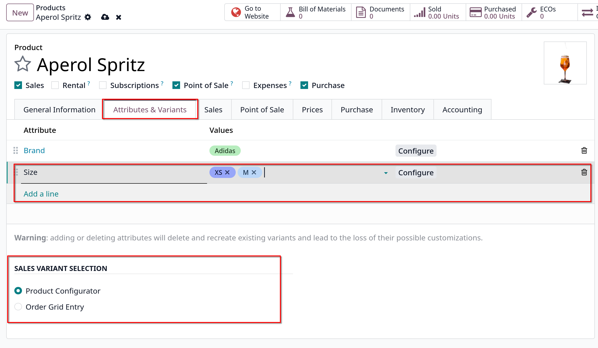
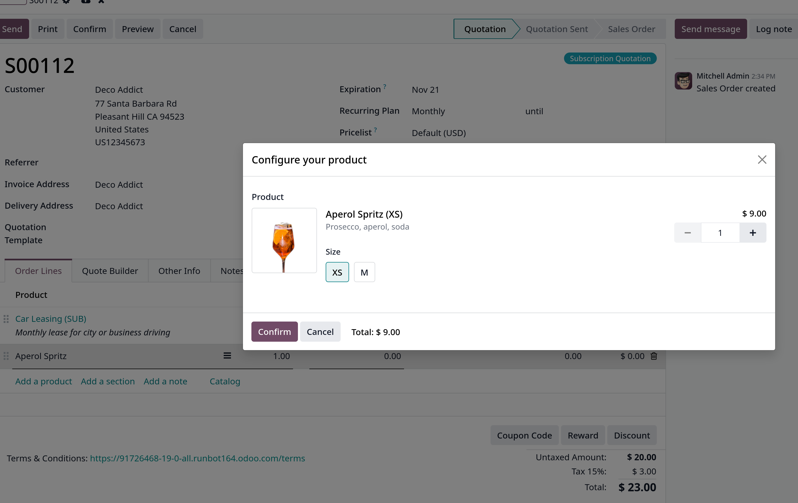
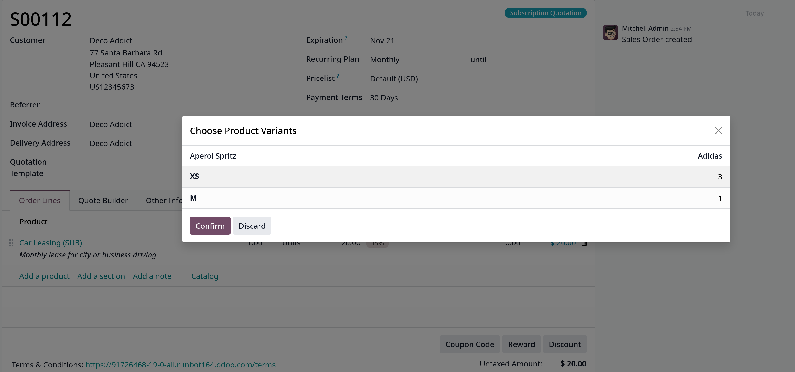

# Product variants on quotations and sales orders

- Trước khi đi chi tiết cách sử dụng products variants trong quotation và sales orders, bạn nên tìm hiểu trước tại
  [Product variants](../Product%20and%20prices/Manage%20your%20products/import-products.md)

- **Ghi chú**: Tính năng **Variant Grid Entry** trên **Sales** app settings tương đương với **Order Grid Entry** product forms.

## Settings

- Mặc định, khi làm việc với Product variants, Odoo sử dụng _product configurator_. Để thêm _variant grid entry_, cần phải active tính năng
  này trong `Sales -> Configuration -> Settings`.
- _variant grid entry_ cung cấp một popup trên quotation/sales order để đơn giản hóa quá trình chọn biến thể của sản phẩm

  

## Product configuration

- Sau khi _Variant Grid Entry_ được enable, cả hai options (_Product Configurator_, _Order Grid Entry_) sẽ có sẵn trên mọi product form

- Vào `Sales -> Products -> Products` để xem tất cả products trong database

- Chọn một product muốn cấu hình variants hoặc có thể tạo mới bằng `New` button

- Trong Product form, tại tab _Attributes & Variants_, click **Add a line** để thêm một Attribute cho sản phẩm

- Bên dưới form sẽ có 2 options trong **Sales Variant Selection** là **Product Configurator** và **Order Grid Entry**

  
  - _Product Configurator_: cung cấp một popup hiển thị tất cả các variants có sẵn của sản phẩm đó khi được thêm vào quotation.
    Mỗi lần chỉ có thể được chọn/thêm 1 variant
    

    Khi salesperson chọn chính xác product variant mong muốn, chọn **Confirm** để thêm vào quotation

  - _Order Grid Entry_: cũng tương tự như option ở trên, tuy nhiên nó ở dạng table layout, cho phép chọn lượng lớn biến thể các sản phẩm và thêm vào quotation.
    

    Khi salesperson chọn xong số lượng kèm biến thể mong muốn, click **Confirm** để thêm các mục đã chọn vào tab **Order Lines** của quotation.
