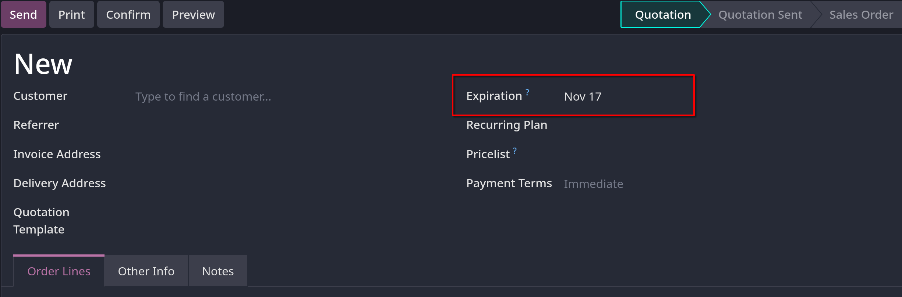
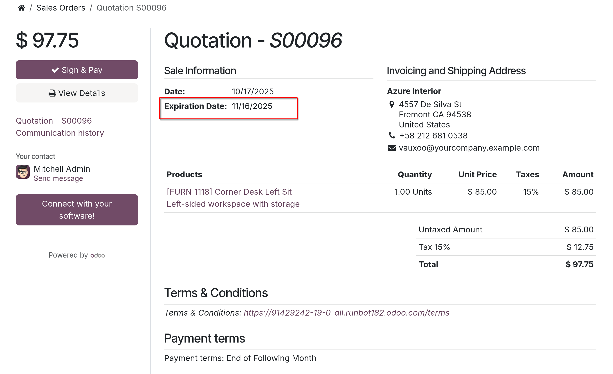
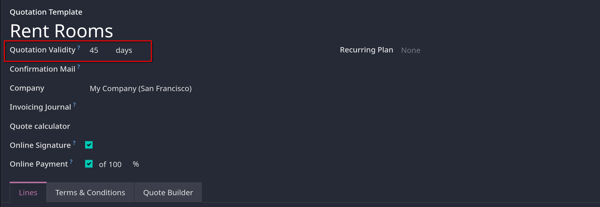

# Quotation deadlines

- `Sales` app có sẵn chức năng đặt thời hạn cho bản báo giá. Làm như vậy sẽ khuyến khích khách hàng hành động nhanh chóng trong quá trình
  đàm phán bán hàng, vì tâm lý sẽ lo sợ bỏ lỡ mất một giao dịch tốt. Ngoài ra, deadlines còn đóng vai trò bảo vệ
  công ty trong trường hợp đơn hàng buộc phải thực hiện ở mức giá không phù hợp với lợi nhuận mang lại cho công ty.

## Quotation expiration

- Để đặt ngày hết hạn ở bảng báo giá, trong khi tạo mới một quotation, tại mục `Expiration` chọn ngày mà bạn muốn làm deadline
  cho quotation này.
  

- Sau khi chọn ở bước tạo báo giá, nếu gửi đến khách hàng, khi ở lên ở trang portal sẽ hiện ngày hết hạn của hóa đơn như hình
  

## Quotation template expiration

- Để thêm ngày hết hạn vào quotation template, trong giao diện tạo quotation template tại mục `Quotation Validity` chọn số ngày
  mà bạn muốn
  
