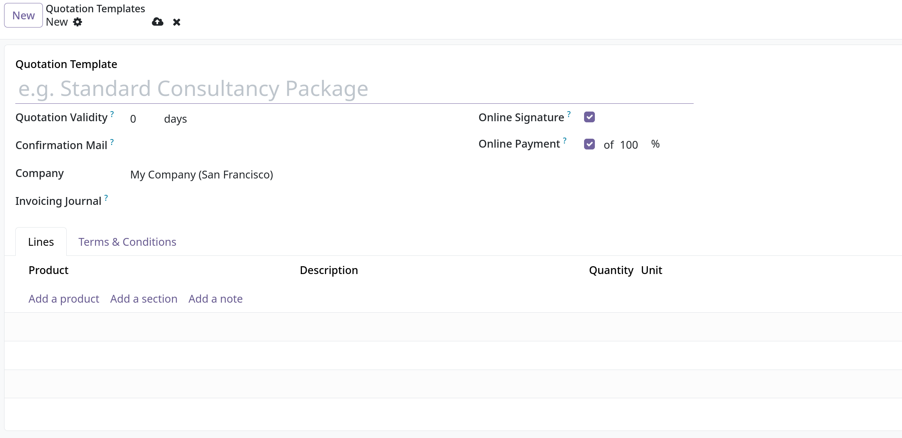
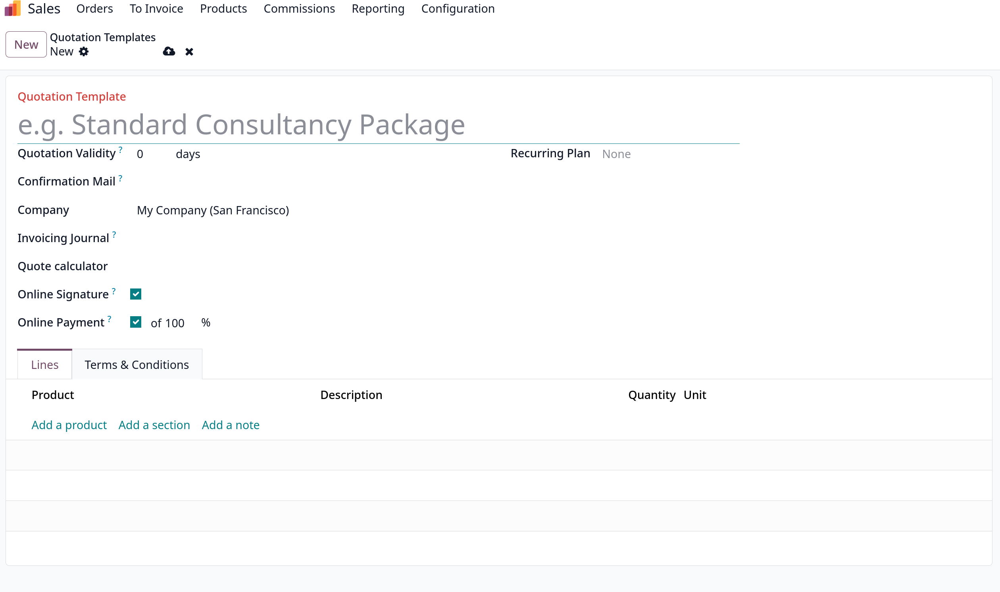
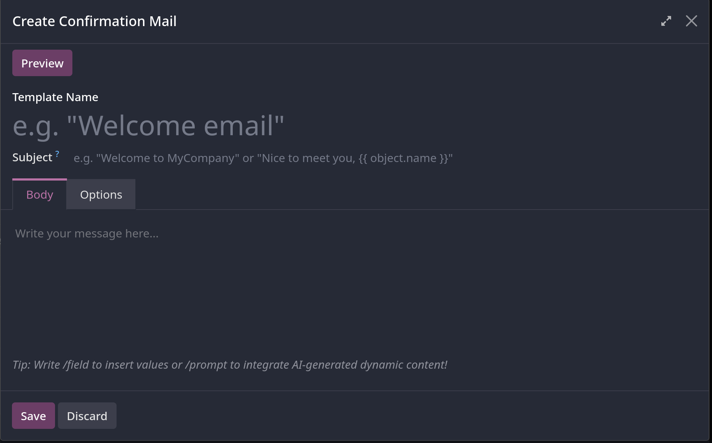
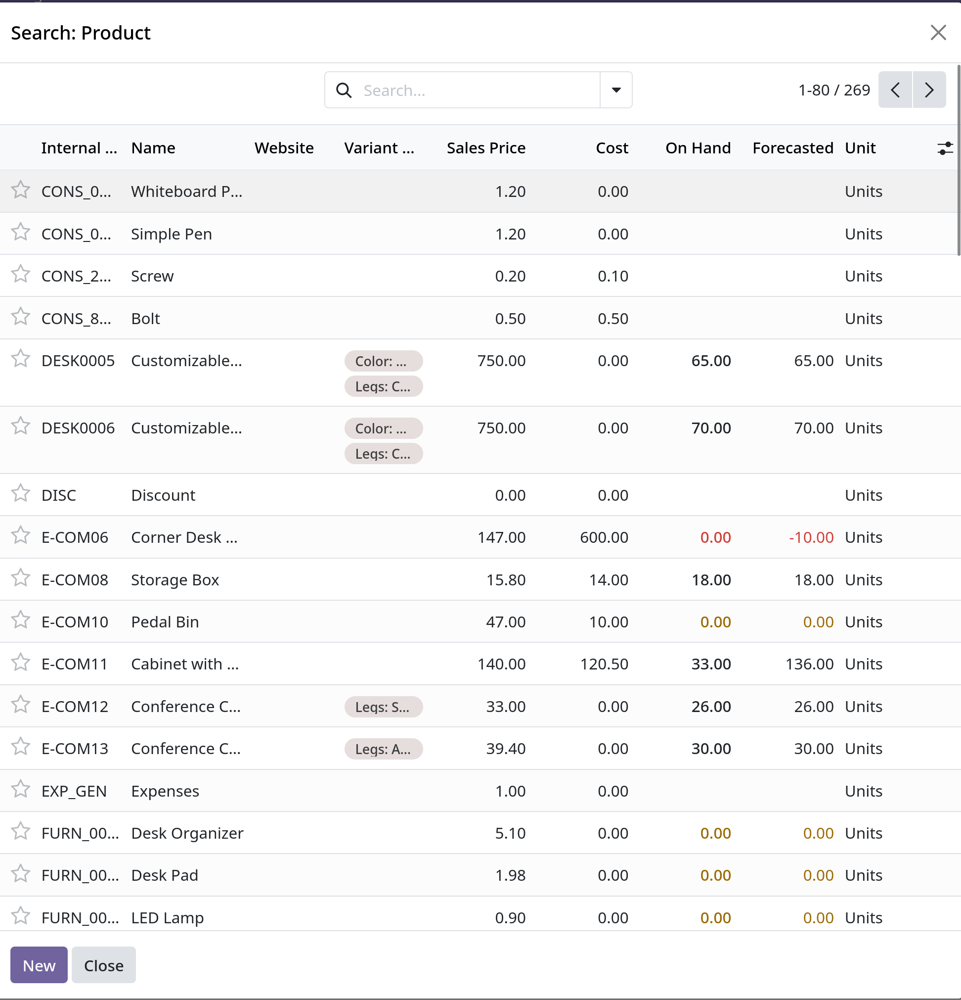
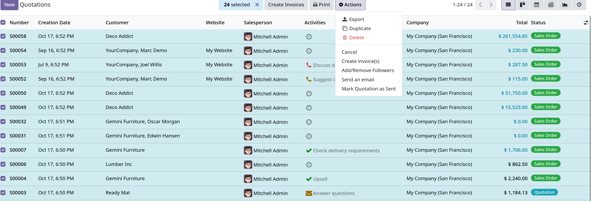

# Quotation templates

- Các mẫu báo giá có thể được tái sử dụng trong `Sales` của Odoo.
- Sử dụng các mẫu này sẽ giúp quá trình tạo báo giá trở nên nhanh hơn mà không cần phải tạo lại từ đầu mỗi khi có đàm phán diễn ra.

### Configuration

- Để sử dụng Quotation templates, phải vào `Sales -> Configuration -> Settings`, kéo xuống `Quotations & Orders` tick chọn vào `Quotation Templates`.
- Vào trong `Quotation Templates` bằng link bên dưới field `Default Template`, nhớ `Save` trước khi rời khỏi trang `Settings`

### Create Quotation Templates

- Để tạo, chọn `New` (nằm trong `Sales -> Configuration -> Quotation Templates`)
  

  Có khác biệt đôi chút với bản enterprise.
  
  - `Quotation Validity`: Như đã giới thiệu qua lúc trước, field này xác định thời gian bao nhiêu ngày mà quotation template này còn hợp lệ.
    Đặt là `0` nếu muốn giữ hiệu lực vô thời hạn.
  - `Comfirmation Mail`: Chứa một danh sách dropdown các email template được cấu hình trước sẽ được gửi cho khách hàng sau khi xác nhận đơn hàng.
    email template này có thể tự tạo mới được bằng cách click vào `New` trong giao diện wizard xuất hiện sau khi chọn **Search More**
    - Giao diện tạo email template sẽ như thế này:
      

    - Lưu ý giao diện bản enterprise và community đều giống nhau, chỉ khác nhau một số tính năng chỉ có ở bản enterprise như hỗ trợ AI agent soạn email body.
    - Tab `Option` chứa các config về `Dynamic report` (PDF Quote, Pro-Forma Invoice, Pickup and Return receipt, Quotation/Order và Timesheet).
      `Owner`, `Attachments`, `Template Description`
    - `Preview` button để xem trước email.

  - `Company` chỉ định công ty nào áp dụng mẫu báo giá này (nếu môi trường nhiều công ty)
  - `Invoice Journal`: Nếu nhật ký được đặt trong field này, tất cả các đơn hàng có báo giá từ mẫu này sẽ lập hóa đơn trong nhật ký được chỉ định
    Nếu không set, nhật ký bán hàng có thứ tự thấp nhất sẽ được sử dụng.
  - `Online Signature` hoặc `Online Payment` được active trong `Settings` thì
    - `Online Signature`: Yêu cầu chữ ký số online từ khách để xác nhận đơn hàng
    - `Online Payment`: Yêu cầu khách hàng thanh toán trước bao nhiêu % để xác nhận đơn hàng.
  - `Recurring Plan`: Chỉ bản enterprise mới có - chỉ kế hoạch thanh toán định kỳ.

#### Lines tab

- `Lines` tab có thể được thêm vào quotation template bằng việc click vào `Add a product`, được tổ chức bằng `Add a section` - sau đó kéo thả tới hàng muốn tổ chức
  Thêm notes bằng `Add a not`
- `Add a product`: hiển thị danh sách products, click vào để chọn nó vào trong template. Nếu muốn thấy đầy đủ thì click vào **Search More**
  Hoặc cũng có thể tạo mới product từ wizard bằng cách click nào `New`
  

#### Terms and Condition tab

- Cung cấp cơ hội thêm các điều khoản và điều kiện vào quotation template. Chỉ cần soạn thảo các điều khoản mong muốn vào
  textbox bên dưới.

### Use quotation templates

- Khi tạo mới quotation từ `Sales -> New`, chọn một quotation template được config trước
- **Lưu ý**: thứ tự của các field trong quotation sẽ theo như đã config trong quotation templates, và thứ tự này không ảnh hưởng tới bất kỳ thứ gì khác.

### Mass cancel quotations/sales orders

- Hủy bỏ nhiều quotations hoặc sales orders cùng lúc bằng việc vào `Sales -> Orders -> Quotations` sau đó chọn như hình
  

  Sau đó chọn vào `Actions` và chọn `Cancel`

- Sau khi chọn `Cancel` sẽ có một popup hiện ra, nếu muốn tiếp tục hủy thì chọn `Cancel quotations`

- **Lưu ý: Sẽ báo lỗi nếu như cố gắng hủy một order cho gói đăng ký đang diễn ra và đã có invoice**
