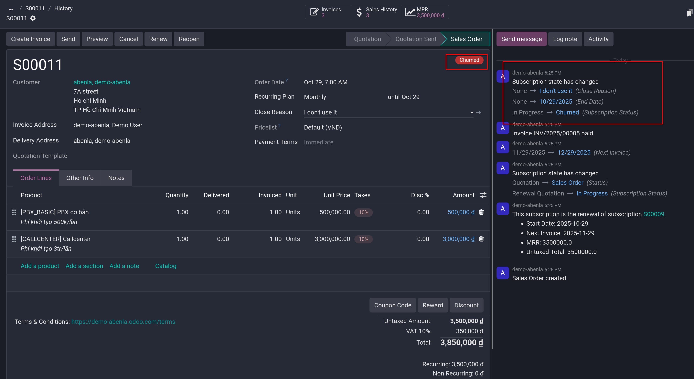
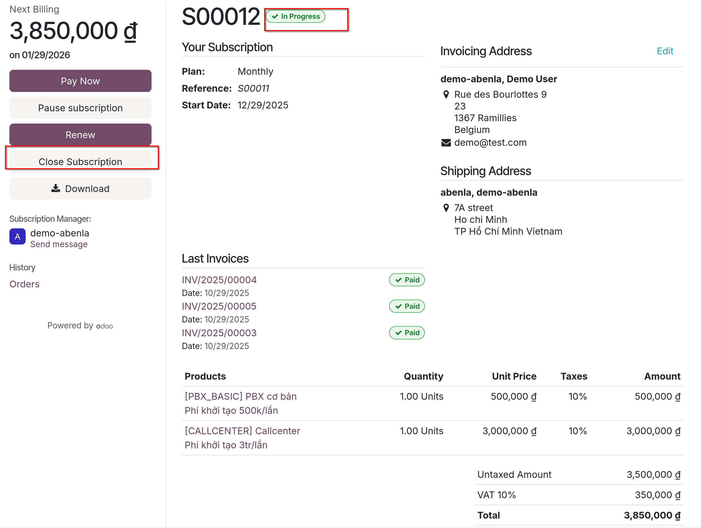

# Close subscriptions

- Odoo cung cấp sự linh hoạt cho doanh nghiệp trong việc quyết định xem khách hàng có thể tự quản lý subscriptions của họ hay hạn chế hoàn toàn khả năng đó.

## Configuration

- Ở trong `Subscriptions -> Configuration -> Recurring Plans` vào chi tiết một plan, hoặc tạo mới, click vào checkbox **Closable**
  để active tính năng này

## Closable

## Administrator view

- Sau khi một quotation cho subscription được confirm, nó thành sales order, subscription status thành **In Progress**

- Có thể close một subscription ở nút **Close**. Sau đó chọn _Close Reason_ ở popup window, chọn từ danh sách dropdown.

- Sau khi click **Submit**, trạng thái của sales order sẽ trở thành **Churned**, chatter của sales order cũng ghi log lại
  

## Customer view

- **Note**: Là administrator, bạn có thể xem trước sales order ở _Preview_ button, giúp bạn giả lập view của khách hàng ở trang portal

- Ở trang portal của khách hàng, khách hàng có thể đóng subscription bằng cách click vào button **Close Subscription** dưới mục ký và thanh toán.

- Khi click close, phải chọn Close reason, tương tự như khi đóng ở phía admin view
  

- Sau khi close, trạng thái của sales order ở trang portal của khách hàng sẽ trở thành **Closed** thay vì **In progress**

- **Tip**: các tùy chọn **Pause** hay **Renew** trong các **Recurring Plans** được active sẽ hiển thị các tùy chọn tương ứng phía portal của khách hàng, giúp khách hàng có thể
  thực hiện chủ động các mong muốn của mình đối với gói subscription.
