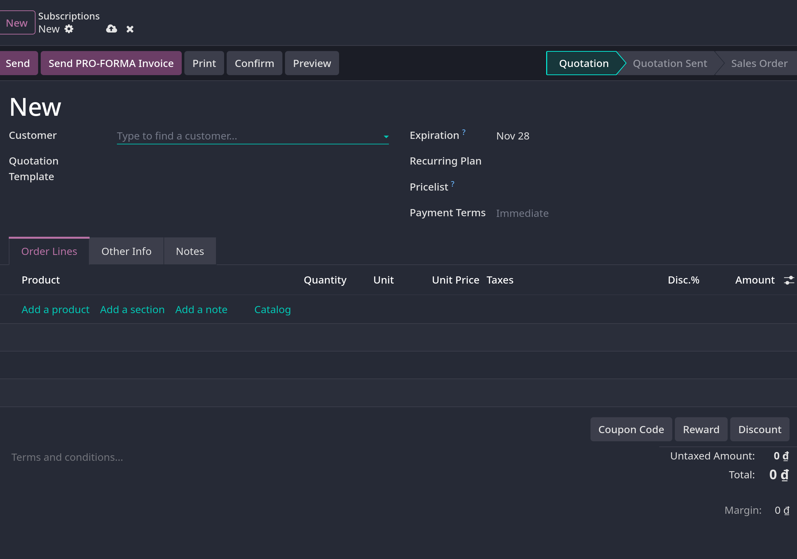

# Subscriptions

- Odoo `Subscription` app được thiết kế để quản lý doanh thu định kỳ thông qua các sản phẩm hoặc dịch vụ dựa trên gói đăng ký.
  Nó hỗ trợ lập hóa đơn tự động, quản lý gia hạn và theo dõi vòng đời khách hàng

- Subscriptions có thể được tạo thủ công hoặc tự động thông qua bán hàng online với các tùy chọn khác nhau để thanh toán định kỳ, tích hợp với các app
  khác như `Sales`, `CRM`, `Helpdesk` giúp hỗ trợ quy trình đăng ký toàn diện

## Setup recurring plans

- Vào `Subscriptions -> Configuration -> Recurring plans`, click **New** tạo mới, lưu ý các fields **Name**, **Details**, **Self-Service** và **Pricing**

- Ở **Detail**:
  - Billing Period: tần suất thanh toán subscription. Đặt đơn vị tuần, tháng,..
  - Automatic Closing: số ngày subscription được tự đóng nếu ko được thanh toán
  - Align to Period Start: đặt gói đăng ký mới định kỳ tính phí vào ngày đầu tiên của kỳ thanh toán tiếp theo. Khi subscription được
    mua ở giữa kỳ thanh toán, hóa đơn sẽ hiển thị chi phí giảm
  - Company
  - Invoice Email Template

- Ở **Self-service**
  - Closable: cho khách hàng khả năng đóng gói subscription của họ
  - Add Products: cho phép khách hàng thêm product mới hoặc sửa products hiện có của đơn đặt hàng định kỳ của họ. Khi được bật, báo giá _Upsell_
    được tạo bất cứ khi nào khách thay đổi số lượng products trong sales order của họ
  - Renew: cho phép khách hàng tạo _Renewal quotation_ cho gói đăng ký của họ
  - Optional plans: cho phép khách hàng đổi gói subscriptions của họ, khi đó, báo giá đăng ký mới hoặc gia hạn sẽ được tạo khi họ đổi.

- Ở **Pricing** tab
  - Điều chỉnh giá theo sản phẩm cụ thể của plan định kỳ bằng cách thêm vào **Add a line** các products hoặc product variants, sau đó gán **Pricelist** và **Recurring Plan**

  - ** Ghi chú**: Price rules được ưu tiên hơn thông tin giá mặc định trên product form, điều này nhằm đáp ứng các ưu đãi, giảm giá, và các chiến lược điều chỉnh giá tương tự nhằm khuyến kích khách hàng mua gói định kỳ.

- **Smart button**
  - Trên mỗi \*_Recurring Plans_ form, có 2 smart buttons để điều hướng đi các tài nguyên doanh thu định kỳ đính với plan:
    - _Subscription_: hiển thị số lượng đơn hàng subscription đang hoạt động nằm trong gói recurring plan
    - _Subscription Items_: liệt kê tất cả các dịch vụ đăng ký định kỳ riêng lẻ đang hoạt động theo kiểu được chia thành từng khoản.
      Giá trị _Subscription_ và _Customer_ sẽ lặp lại nếu khách hàng đặt mua nhiều subscriptions trên cùng một đơn hàng

## Product form configuration

- Khi recurring plans được setup, tạo subscription product trong `Sales -> Products -> Products`, chọn 1 sản phẩm muốn thêm subscription
  hoặc tạo mới, sau đó tick vào **Subscription** ở hàng checkbox dưới tên sản phẩm

- Trong tab **General Information**:
  - _Product type_: chọn _Service_
  - _Invoice policy_: set giá trị này khi khách hàng sẽ bị tính phí cho gói đăng ký. thường là _Prepaid/Fixed Price_
  - _Unit of Measure_: cách tính sản phẩm trong Odoo, hầu hết subscriptions là chọn _Unit_
  - _Sales price_
    Tùy chọn setup các thông tin sau:
  - _Create on Order_: cho phép các hành động phụ trong Odoo như tạo _Task_ mới trong _Project_, _Event Registration_ hoặc _Course Access_. Nếu không cần hành động nào
    có thể chọn _Nothing_ trong menu dropdown
  - **Attributes & Variants** tab: nếu đăng ký có nhiều lựa chọn cho khách hàng
  - **Purchase** tab: nếu sản phẩm có nguồn từ nhà cung cấp (vendor), chẳng hạn như khi bạn đang là đại lý reseller hoặc hoạt động hợp đồng phụ.

- Trong **Recurring Price** tab, cần khai báo rõ các tùy chọn giá. Đối với mỗi tùy chọn sẵn có, thêm **Add a line** để thêm mới một rule mới

- Nếu subscriptions có thể bán trên eCommerce thì click vào **Go to website** smart button, click slide button từ **Unpublished** sang **Published**

## Create a subscriptions quotation

- Tạo mới thủ công một khách hàng đăng ký bằng cách vào `Sales` hoặc `Subscriptions`, sau đó click `New`
- **Ghi chú**: sản phẩm đã được marked là **Subscriptions** trên product form cũng có thể được bán trên eCommerce website sẽ tự động tạo và confirm subscription quotation ở phía backend Odoo
- **Quan trọng**: sales orders với recurring plan xác định sẽ tự động thành subscription

- Trên quotation form, điền các fields bắt buộc _Cusomter_ và _Recurring Plan_, cũng như ở _Order Lines_ tab.

- Optional:
  - Quotation Template
  - Expiration: chỉ định ngày mà subscription hết hiệu lực
  - Pricelist
  - Payment Terms: đặt một khung thời gian nhất định mà subscription phải được thanh toán
    

## Confirmation

- **Send** để gửi email kèm quotation cho khách hàng xác nhận
- Nếu **Online Signature** và **Online Payment** được yêu cầu để xác nhận, khách hàng cần phải thao tác các mục trên ở trang portal
