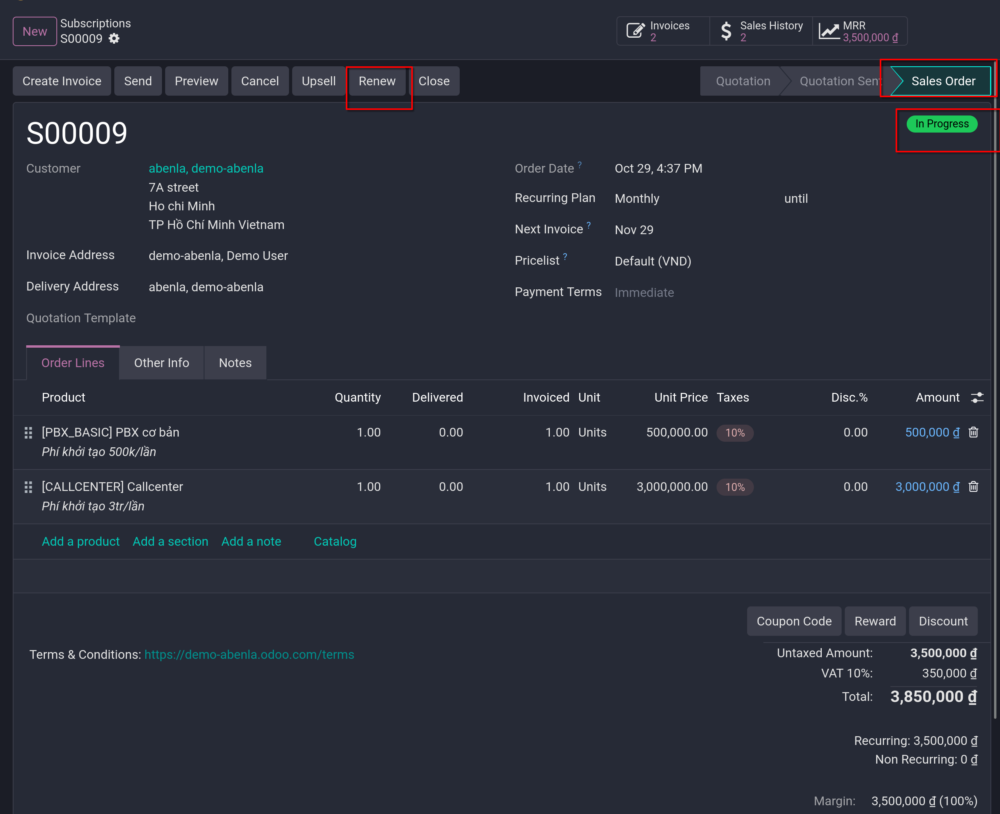
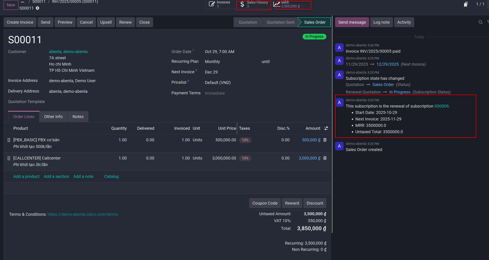
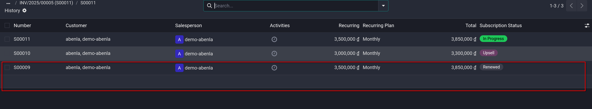

# Renew subscriptions

- Subscription renewal là quá trình khách hàng thực hiện khi họ sẵn lòng chọn tiếp tục sử dụng sản phẩm/dịch vụ đăng ký. Người đăng ký trải qua
  quá trình gia hạn theo các kỳ hạn khác nhau tùy thuộc vào hợp đồng đã thỏa thuận. Hầu hết công ty cung cấp dịch vụ đăng ký đều thích tự động hóa
  quy trình gia hạn. Tuy nhiên việc gia hạn thủ công vẫn được sử dụng

- Odoo `Subscriptions` app quản lý tất cả các subscriptions của mình ở một nơi. Việc gia hạn có thể được xử lý tự động hoặc thủ công, bao gồm các sản phẩm bổ sung
  hoặc sản phẩm upsell trên mỗi đơn đặt hàng gia hạn

## Create a renewal manually

- Để tạo renewal quotation, subscriptions phải thỏa các điều kiện:
  - Một quotation với sản phẩm subscription phải được xác nhận
  - Một _recurring plan_ phải được chọn
  - Thanh toán của khách hàng cho gói đăng ký khởi tạo phải được lập hóa đơn và được ký.

- Vào `Subscriptions -> Subscriptions -> Quotations` để xem các quotation đủ điều kiện gia hạn, chọn quotation mong muốn

- Các subscriptions được cấu hình đúng sẽ ở stage **Sales order**, có thẻ **In Progress** ở góc phải và có **Renew** button ở trong form
  

- Khi **Renew** được chọn, Odoo ngay lập tức sẽ tạo một _renewal quotation_ mới với thẻ **Renewal Quotation**. Thông tin tham chiếu quan trọng
  như ngày bắt đầu lập và ngày lập hóa đơn tiếp theo sẽ tự động được thêm vào chatter của quotation gia hạn đó.

- Thực hiện quy trình sales chuẩn như bình thường: confirm quotation, create invoice, register payment

- Một khi renewal quotation được xác nhận, nó thành sales order và **Sales History** smart button sẽ bao gồm các sales order liên quan tới sales order này
  trong đó sẽ hiển thị sales order với trạng thái **Renewed** cho các đơn gia hạn.

