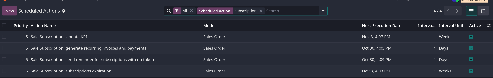
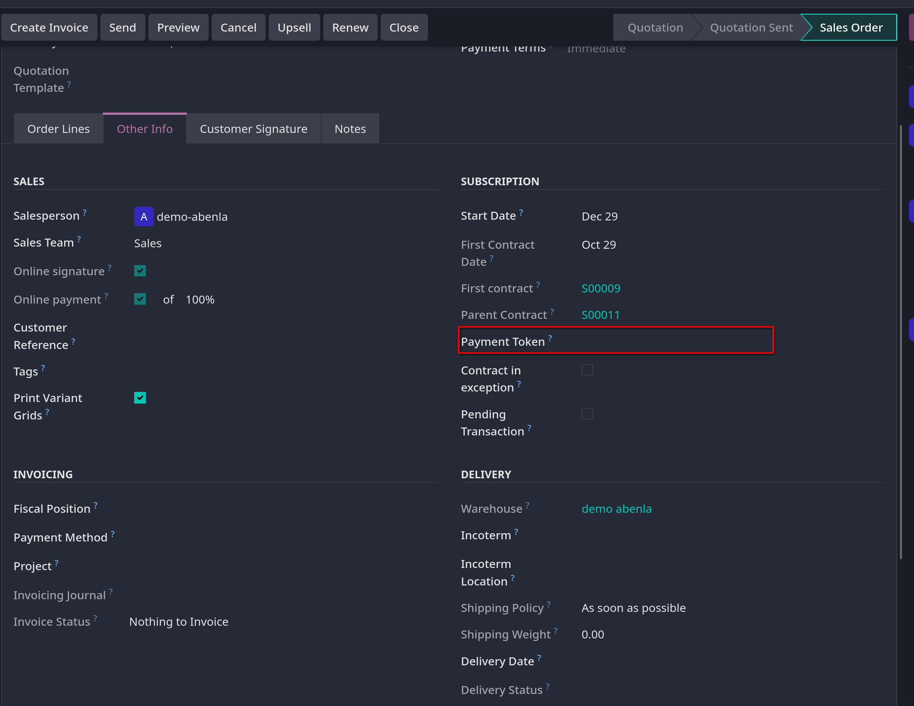

# Scheduled actions

- _Scheduled actions_ là các tiến trình được config trước cho phép users tự động hóa vài tasks quan trọng với database. Dựa trên lịch trình được chỉ định
  hoặc số lần thực thi. Các tasks này bao gồm gửi email, tạo hóa đơn, clean data,...

- Trong Odoo `Subscriptions`, có hai _scheduled actions_ khởi tạo quy trình thanh toán cho các đăng ký định kỳ đang hoạt động và khi nào
  việc thanh toán sẽ dừng do hết hạn subscription

- Mặc định chúng được active, bạn có thể vô hiệu hóa chúng thủ công

## Access scheduled actions

- Phải active **Developer mode** bằng cách gõ `Control + K` (hoặc `Command + K` trên macos) gõ _Debug_ rồi chọn active.

- Vào `Settings -> Technical -> Scheduled Actions`

- Từ dashboard, trên search bar tìm _Subscriptions_ sẽ show ra 4 action:
  - _Sale Subscription: generate recurring invoices and payments_
  - _Sale Subscription: subscription expiration_
  - _Sale Subscription: send reminder for subscriptions with no token_
  - _Sale Subscription: Update KPI_
    

- **Ghi chú**: Scheduled actions đã lên lịch không thực hiện chính xác thời gian nếu thời gian execute ít hơn 5 phút, đây là quy tắc chung cho các scheduled actions

## Generate recurring invoices and payments

- Để cho _Sale Subscription: generating recurring invoices and payments_ action chạy một cách chính xác trong việc tạo hóa đơn định kỳ và thanh toán trên gói đăng ký
  **Deferred Expense** và **Deferred Revenue** account phải được cài đặt để Odoo xử lý các hóa đơn và thanh toán khác nhau liên quan đến gói đăng ký.

- Vào `Accounting -> Configuration -> Settings`, xem ở mục **Default Accounts**, chọn **Deferred Expense** và **Deferrerd Revenue** từ danh sách dropdown

### Create invoice

- Các yếu tố cần thiết để cronjob _Sales Subscription: generate recurring invoices and payments_ chạy được tìm trong form chi tiết của sales order đã được xác nhận.
- Chú ý vào field _Recurring Plan_ và _Date of Next Invoice_ trong form, Odoo dùng 2 fields này để tính ngày lập hóa đơn thanh toán gói đăng ký tiếp theo.

- **Cảnh báo**: nếu sản phẩm có _Invoice Policy_ được set là _Based on Delivered Quantities_ và số lượng giao là 0, Odoo không tạo một hóa đơn và khách hàng không bị tính phí
  Thay vào đó, subscription được xử lý như một sản phẩm định kỳ miễn phí và được phản ảnh như vậy trong log của chatter của subscription sales order
  Khi điều này xảy ra, sẽ có message dạng như sau: _Automatic renewal succeeded. Free subscription. Next invoice: [date]. No email sent._

- Khi hóa đơn được tạo , hóa đơn có thể được view từ sales order bằng click vào **Invoices** smart button
- Một email được gửi tới khách hàng để thông báo cho họ về phí đăng ký gói định kỳ nếu có **Payment Token** trên account.
- **Payment Token** nằm ở tab **Other Info** trong sales order ở **Subscription** section. Nếu không có **Payment Token** được set trên form
  invoice cũng được tạo và gửi tới khách hàng, nhưng thanh toán phải đăng ký thủ công.
  

- **Chú ý**: nếu **Online payment** checkbox được tick trong **Other Info** tab, hóa đơn sẽ không được tạo theo cronjob đã được lên lịch vào ngày lập hóa đơn tiếp theo.
  Thay vào đó, hóa đơn được tạo khi khách hàng hoàn tất thanh toán thủ công cho subscription
  Để sử dụng thanh toán tự động theo _Payment Token_ và tự động tạo hóa đơn, checkbox này phải trống

### Closing invoice

- Cronjob _Sales Subscription: generate recurring invoices and payment_ cũng có khả năng đóng một subscription theo các điều kiện sau:
  - Nếu subscription không có **Payment Token** trong sales order form như trên
  - Nếu subscription có **Payment Token** và cố tính phí:
    - Nếu charge phí thành công, tạo và post hóa đơn
    - Nếu charge phí thất bại, gửi nhắc nhở định kỳ cho khách hàng. Tự đóng subscription nếu nó liên tục thất bại trong nhiều hơn 14 ngày.

## Subscriptions expiration

- Cronjob _Sale Subscription: subscription expiration_ sẽ kiểm tra tất cả các điều kiện khiến subscription tự đóng, nếu đáp ứng một số điều kiện nhất định cronjob này sẽ đóng subscription đó
- Cronjob này sẽ xem trong sales order, field **Recurring Plan** có ngày đến hạn không? (field _until_ bên cạnh **Recurring Plan**)
- Sau đó cronjob sẽ kiểm tra xem đơn hàng đã được thanh toán trong kỳ hạn hay chưa, có thể xem các hóa đơn đính với sales order này bằng cách click vào **Invoices** smart button
  Nhìn vào cột _Invoice Date_
- Các hóa đơn chưa được thanh toán có _Invoice Date_ vượt quá số ngày được xác định trong field **Automatic closing** ở **Recurring Plan** sẽ được tự động đóng
