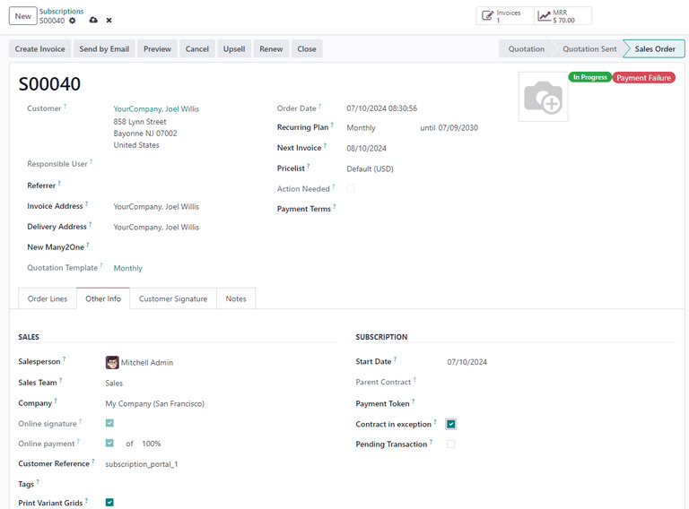

# Subscriptions and automatic payments

- Mặc định `Subscriptions` sẽ tự động tạo quotation và invoice cho khách hàng và cũng có thể hỗ trợ thanh toán tự động. Việc thiết lập thanh toán tự động buộc phải thêm các
  cấu hình bổ sung, bao gồm chọn nhà cung cấp và cổng thanh thông tin khách hàng hoặc một website eCommerce

## Setting up a payment processor that supports automatic payments

- Thiết lập thanh toán định kỳ tự động yêu cầu nhà cung cấp thanh toán hỗ trợ tokenization. Tokenization cho phép khách hàng lưu thông tin chi tiết thanh toán của họ
  chẳng hạn như thông tin thẻ tín dụng, tài khoản ngân hàng để thanh toán tự động

- Các bước để thiết lập thanh toán tự động:
  1. Chọn nhà cung cấp hỗ trợ tokenization
  2. Làm theo hướng dẫn của nhà cung cấp để tạo account và cấu hình xác thực API của họ
  3. Enable payment provider
  4. Cấu hình phương thức thanh toán cho nhà cung cấp đã chọn
  5. Cấu hình tokenization cho nhà cung cấp thanh toán đã chọn.

## How customers can setup automatic payments

- Sau khi các steps trên được hoàn thành, nhà cung cấp sẽ tạo một token cho khách hàng để lưu thông tin thanh toán. Khách hàng có thể đăng nhập
  vào customer portal của họ và nhập thông tin thanh toán của họ vào đó.

- Một số provider sẽ tự động lưu thông tin của khách hàng như một phần của quy trình thanh toán hoặc cũng có thể cho khách hàng tùy chọn lưu thông tin để họ thanh toán trong tương lai

## What happens if an automatic payment fails?

- Khi một automatic payment failed, sales order sẽ update:
  - **Payment Failure** tag ở sales order form
  - **Contract in exception** checkbox được tick ở tab **Other Info** ở sales order

- Để tái kích hoạt gói đăng ký, ỏ tick ở check box **Contract in exception**, Odoo sẽ tự động renewal lại

