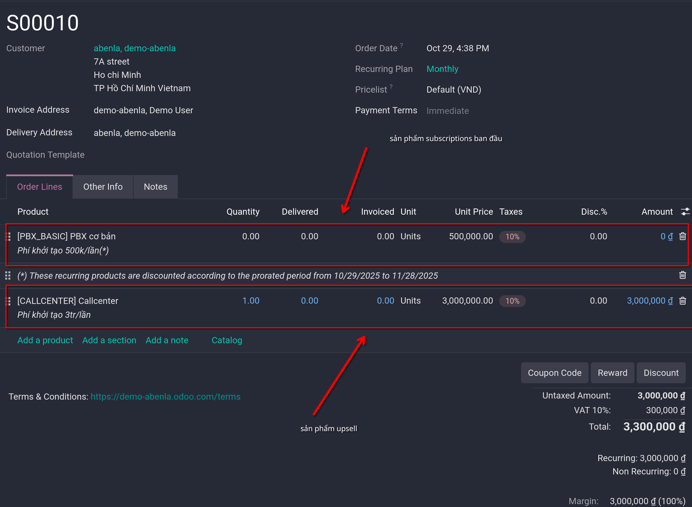
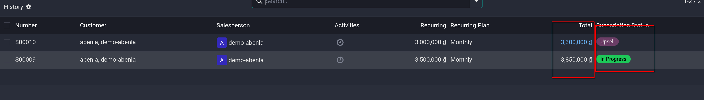
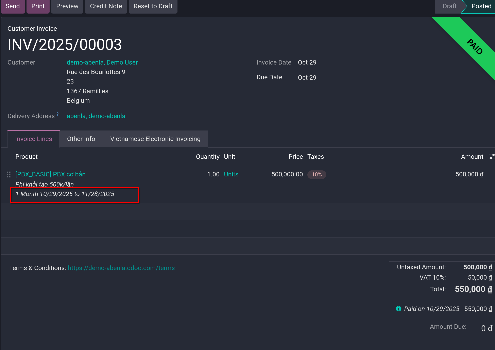

# Upsell subscriptions

- Subscription là định kỳ, và tiếp tục vô số lần, tới khi khách yêu cầu thay đổi/hủy gói đăng ký. Điều này đồng nghĩa với việc subscription phải
  có khả năng điều chỉnh giá hoặc thay đổi số lượng để đáp ứng mọi nhu cầu. Đây là cơ hội để upsell một subscription

- Upsell có thể mang lại lợi ích cho các nhóm khách hàng sau:
  1. _Loyal customers_: là những khách hàng đã tin tưởng vào thương hiệu/công ty, họ đã có thói quen trả tiền cho sản phẩm/dịch vụ của công ty
     nên sẽ tự tin trong việc chi trả hơn khi ta cố gắng upsell các sản phẩm/dịch vụ cao cấp hơn.
  2. _New customers_: với những khách hàng mới, hoàn toàn chưa quen với thương hiệu/công ty, phải sử dụng một chiến lược bán hàng hấp dẫn để lôi kéo
     họ mua sản phẩm/dịch vụ đắt tiền hơn:
     - _Discount_ là một giải pháp hữu ích, thông thường subscription sẽ kết thúc sau 1 khoảng thời gian. Nên giải pháp này giúp khách hàng mới
       dễ tiếp cận hơn, dễ tạo sự tin tưởng từ khách hàng hơn.

## Discount configuration

- Vào `Sales -> Configuration -> Settings` để tick chọn `Discounts` ở mục **Pricing**.

- Lúc này có thể kích hoạt tính năng discount trong sales order lines

## Upsell subscriptions

- Khi subscription quotation được xác nhận, nó thành sales order và một subscription mới sẽ được tạo trong app `Subscriptions`

- Trong sales order, click vào button **Upsell**, một quotation mới sẽ được tạo, **Upsell** banner sẽ xuất hiện ở góc phải, trong **Order Lines** tab
  sản phẩm subscription sẽ xuất hiện.
  

- Các thao tác lập hóa đơn, thanh toán như đơn hàng bình thường

- **Lưu ý quan trọng**: khi quotation được xác nhận, các upsell products sẽ được thêm vào subscription ban đầu. Sau đó báo giá được tính
  theo tỉ lệ thời gian còn lại của kỳ lập hóa đơn hiện tại.

- Lúc này ở sales order form, sẽ có smart button **Sales History**, click vào sẽ show ra các sales order liên quan tới sales order hiện tại, lưu ý sẽ có status **Upsell** với các đơn **Upsell**
  

- **Lưu ý**: với invoice cho subscriptions product, sẽ có dòng kỳ hạn ở dưới product trong tab **Invoice Lines**
  
