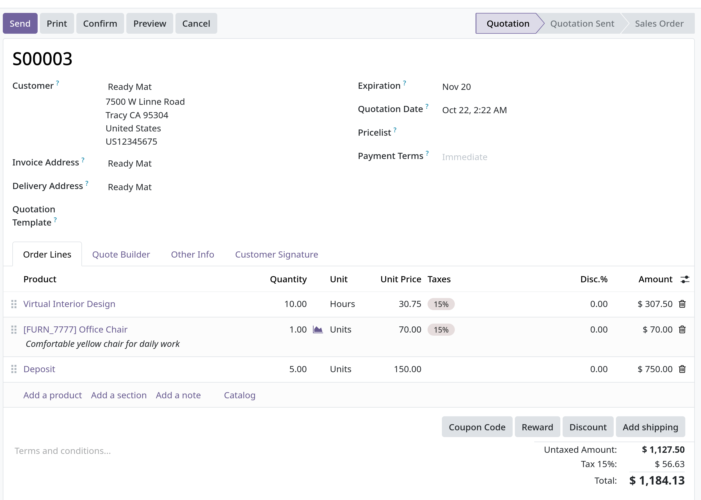

# Sơ đồ mindmap của module

```markmap initialExpandLevel=2
- Abenla Odoo Documentation Modules
  - Point of Sale (POS)
    - Core Functionalities
      - Start/Close Session
      - Sell Products
      - Set Customers/Notes
      - Return and Refunds
      - Manage Cash Register (In/Out)
      - Analytics/Reporting
    - Configuration
      - Access POS Settings
      - Make Products Available
      - PoS Product Categories
        - Assign Categories
        - Restrict Categories
      - IoT System Connection
      - ePOS Printers
        - Directly Supported
        - IoT System Integration
        - Self-signed certificate
      - Secure Connection (HTTPS)
    - Pricing Features
      - Discounts (Manual/Global/Time-limited)
      - Discount Tags (Barcode Scanner)
      - Loyalty Programs
      - Pricelists
        - Flexible Pricelists
        - Create Pricelists
      - Flexible Taxes (Fiscal Position)
      - Cash Rounding
      - Electronic Shelf Labels (ESL)
    - Hardware Integration
      - Customer Display
        - Configuration (USB/HDMI/IoT)
        - Opening Display
      - Scale
        - IoT System Required
        - Product Configuration (per Kg)
      - Barcode Scanner
    - Restaurant Features
      - Floors and Tables
      - Booking (Enterprise)
      - Order Management (Transfer/Merge)
      - Presets (Dine In/Takeout/Delivery)
      - Courses (Kitchen Printing)
      - Bill Splitting
      - Tips (Configuration/Payment)
      - Default Start Screen
    - Orders & Products
      - Product Combos
      - Self-Ordering (QR Menu/Kiosk)
      - Sales Orders (Down Payment/Settle)
      - Barcodes (Assign/Use)
      - Serial Numbers and Lots
      - Ship Later
    - User/Receipts/Payments
      - Multi-employee Management
        - Access Rights (Minimal/Basic/Advanced)
        - Logging In (PIN/Badges)
      - Receipts and Invoices
        - Custom Header/Footer
        - Automatic Printing
        - Invoice a Customer
        - QR Codes to Generate Invoices
      - Payment Methods
        - Customer Account (Deposit/Settle Debt)
        - QR Code Payments (Bank App)
        - Configuration (Journal/Integration)
      - Marketing Features
        - Storing Contact Details
        - Email Marketing
        - WhatsApp Marketing
  - Sales Module
    - Quotation Management
      - Tạo Quotation (Customer/Pricelist/Terms)
      - Quotation Templates
      - Quotation Deadlines/Expiration
      - Optional Products (Cross-selling)
      - Online Signatures for Confirmation
      - Online Payment Order Confirmation
      - PDF Quote Builder (Dynamic Text)
      - Pro-forma Invoices
      - Mass Cancel Quotations/Orders
        - Creation and Editing Rules
        - Recurring Prices (Subscriptions)
    - Pricing and Products
      - Discounts (Product Lines/Global/Fixed)
        - Rental Rules
        - Customer Application
      - Discount & Loyalty Programs (Sales/eCommerce/PoS)
      - Foreign Currencies
      - eWallets and Gift Cards
    - Product Management
      - Product Variants
        - Attributes (Type/Creation Mode)
        - Variant Grid Entry
        - Product Configurator
      - Import Products (Template/Relation Fields)
      - Product Images with Google Images API
    - Order and Delivery
      - General Sale Flow
      - Deliveries & Invoices to Different Addresses
      - Returns and Refunds (Before/After Invoicing)
    - Commissions (Sales Incentives)
      - Purpose and Setup
      - Structure (Based On: Targets/Achievements)
      - Target-based Plans (Levels)
      - Achievement-based Plans (Percentage of Value)
      - Performance Measures (Amount/Quantity/Margin/MRR)
      - Approval and Management
  - Invoicing Methods
    - Down Payment
      - Create Invoices (Percentage/Fixed Amount)
      - Income Account Modification
      - Impact of 100% Down Payment
      - Credit Note Handling
    - Invoicing Policy
      - Invoice What Is Ordered (Default)
      - Invoice What Is Delivered
      - Impact on Sales Flow (Inventory App)
    - Project Billing
      - Invoice Project Milestones (Create Milestones/Tasks)
      - Invoicing Time and Materials
        - Service Product Configuration (Timesheets)
        - Invoice Time Spent
        - Expense Reinvoicing (Add/Invoice Expenses)
        - Purchase Reinvoicing (Add/Invoice Purchase)
      - Reinvoice Expenses to Customers
  - Subscriptions Module
    - Setup and Configuration
      - Recurring Plans (Billing Period/Self-Service Options)
      - Product Form Configuration (Service Type)
      - Create Subscriptions Quotation
      - Subscriptions in eCommerce Shop
    - Lifecycle Management
      - Upsell Subscriptions
      - Renew Subscriptions (Manual Renewal)
      - Close Subscriptions (Closable option/Admin/Customer View)
    - Automated Processes
      - Subscriptions and Automatic Payments (Tokenization)
      - Scheduled Actions
        - Generate Recurring Invoices and Payments
        - Subscriptions Expiration (Automatic Closing)
    - Reporting
      - Subscription Reports (Quantity/Revenue/Status)
      - Retention Analysis
      - MRR Breakdown
      - MRR Timeline
  - Connectors
    - Shopee Connector
      - Synchronize Confirmed Orders (Shopee to Odoo)
      - Synchronize Inventory (Odoo to Shopee - FBM)
      - Multiple Accounts/Marketplaces Supported
      - Configuration (API Endpoint/Credentials)
      - Product Catalog Mapping (SKU to Internal Reference)
      - Order Synchronization (Status Based/Force Sync)
      - Manage Deliveries in FBM (Shipping Label Fetch)
      - Accounting/Reporting (Dedicated Journal/Sales Team)
    - Gelato Connector (Print-on-Demand)
      - Sync Sales Orders for Automated Fulfillment
      - Create/Manage Gelato Products in Odoo
      - Configuration (API Keys/Webhooks)
      - Product Synchronization (Template ID/Variants/Images)
      - Ordering Gelato Products (Shipping Options)
      - Order Limit (Only Gelato products per SO)
```

# Tổng quan Sales

- Bản giá/Báo giá là một tài liệu gửi đến khách hàng, trong đó chứa thông tin về chi phí, điều khoản ước tính cho hàng hóa hoặc dịch vụ.
  Báo giá được chuyển thành đơn đặt hàng (sale orders) là thỏa thuận cuối cùng trước khi giao hàng và lập hóa đơn (invoice).

## Tổng quan về Sale flow.

- Flow điển hình thường theo các steps sau:
  1. Báo giá: Một bản đề xuất được gửi tới khách hàng kèm thông tin chi tiết về sản phẩm và giá cả.
  2. Sale order: Đơn đặt hàng được tạo tự động khi khách hàng chấp nhận bảng báo giá và xác nhận bán hàng.
  3. Giao hàng: Sản phẩm được vận chuyển hoặc dịch vụ được giao tới khách hàng.
  4. Hóa đơn: Hóa đơn cuối cùng đucợ xuất dựa trên hóa đơn bán hàng hoặc sản phẩm/dịch vụ được giao.
  5. Thanh toán: Khách hàng thanh toán hóa đơn, hoàn tất chu trình bán hàng.

- Quotation được config trong Sales app. Chúng có thể được sinh ra từ các apps khác như 1 phần của sale workflow.
  - `CRM`: chuyển đổi opportunities thành báo giá để theo dõi các giao dịch tiềm năng.
  - `Helpdesk`: Sinh ra báo giá từ ticket khi cung cấp dịch vụ/sản phẩm có trả phí.
  - `Subscriptions`: Cung cấp dịch vụ định kỳ khi bắt đầu chu trình thanh toán tự động.

## Sale quotations trong giao dịch kinh doanh

- Sales quotation phục vụ như một bước quan trọng trong tiến trình sales. Kết nối khoảng cách giữa việc thăm dò về hàng hóa và dịch vụ
  của khách hàng với hợp đồng thanh toán và giao hàng sau cùng. Quotation còn cung cấp một sự minh bạch về giá, giúp hai bên đàm phán
  và dễ dàng hoàn thiện các điều khoản trước khi đưa ra cam kết.

## Các thành phần chính của một sales quotation

- Một sales quotation sẽ gồm có các thành phần như sau:
  - _Quotation number and date_: Một định danh duy nhất cho việc tracking và referencing (tham chiếu), cũng như ngày phát hành và ngày hết hạn.
    Trong Odoo, quotation number được gán dưới một quy ước đặt tên tiêu chuẩn sau khi được xác nhận.
  - _Customer information_: Tên và thông tin liên hệ của khách hàng, cũng như hóa đơn và địa chỉ giao hàng.
  - _Products and services_: Danh sách chi tiết các mặt hàng cần mua, bao gồm số lượng, thông số kỹ thuật (nếu cần) và đơn giá.
  - _Payment terms and pricelists_: Các thỏa thuận và quy tắc được cấu hình để định giá và thanh toán cho báo giá bán hàng cụ thể.
  - _Special pricing_: Tùy chọn giảm giá và giá khuyến mại để cập nhật/sửa đổi từng dòng sản phẩm.
  - _Total cost and currency_: Tổng giá sản phẩm hoặc dịch vụ và giá vận chuyển, bao gồm các loại thuế liên quan.
  - **Lưu ý: bản enterprise và community sẽ khác nhau một chút trong giao diện quotation**
    

    
