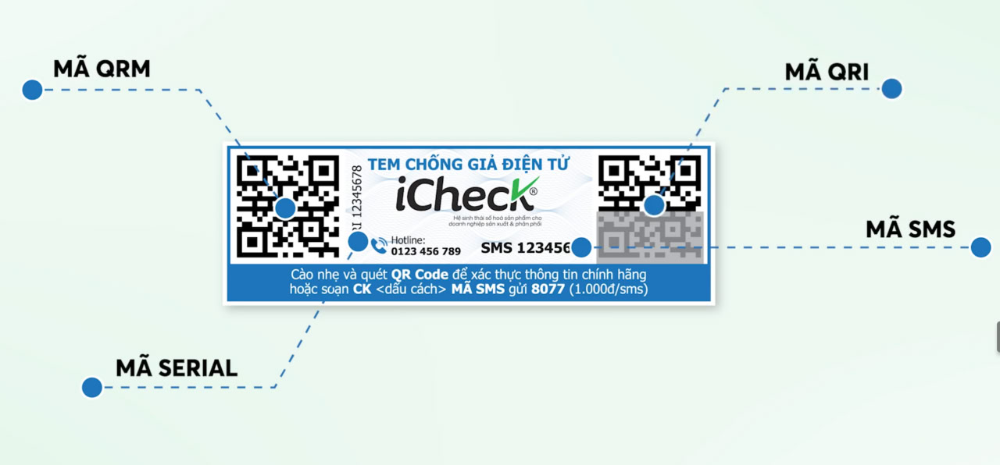
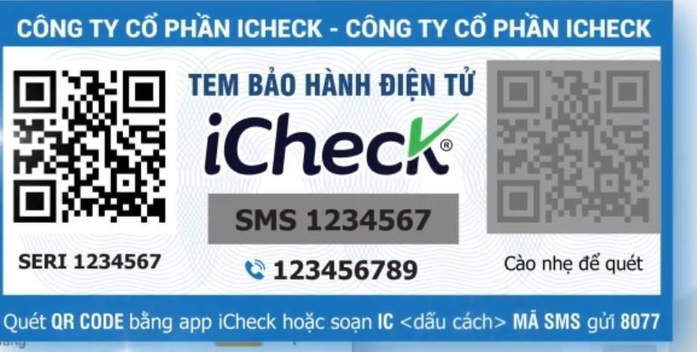

# TÀI LIỆU MÔ TẢ CHỨC NĂNG VÀ WORKFLOW HỆ THỐNG ICHECK

Tài liệu này tổng hợp chi tiết các giải pháp số hóa dựa trên mã QR của iCheck, bao gồm quy trình vận hành (workflow) và các tính năng quản trị chuyên sâu dựa trên tài liệu nguồn.

---

## 1. GIẢI PHÁP QR CODE TÍCH HỢP LOYALTY (CHƯƠNG TRÌNH KHÁCH HÀNG THÂN THIẾT)

Giải pháp này cho phép doanh nghiệp biến mỗi mã QR trên sản phẩm thành một điểm chạm để tương tác, tặng quà và thu thập dữ liệu hành vi khách hàng,.

### Chức năng chính:

- **Gán chương trình linh hoạt:** Cho phép thiết lập chương trình khuyến mãi, tích điểm cho từng sản phẩm, từng lô tem hoặc cho các đại lý cụ thể.
- **Ghi nhận bán ra tự động:** Hệ thống tự động ghi nhận sản phẩm đã được bán khi khách hàng thực hiện quét mã tham gia chương trình Loyalty,.
- **Đa dạng hình thức thưởng:** Hỗ trợ mã quà tặng, điểm thưởng hoặc mã lượt quay số trúng thưởng.

### Workflow vận hành chi tiết:

1.  **Thiết lập liên kết:** Doanh nghiệp liên kết tài khoản hệ thống quản trị QR Check với hệ thống Loyalty.
2.  **Lựa chọn đối tượng gán:**
    - **Theo sản phẩm:** Chọn danh sách sản phẩm cần áp dụng. Khi khách quét mã QR trên bất kỳ sản phẩm nào thuộc danh sách này, chương trình sẽ kích hoạt.
    - **Theo mã tem:** Có thể cấu hình cho từng tem lẻ hoặc cả dải tem (lô tem) nhất định.
    - **Theo đại lý:** Gán chương trình riêng cho từng đại lý để theo dõi hiệu quả phân phối và kích cầu bán hàng.
3.  **Cấu hình phần thưởng:** Nhập thông tin mã quà tặng/điểm thưởng và **xét chế độ ưu tiên** cho dịch vụ Loyalty nếu trên mã tem tích hợp đồng thời nhiều dịch vụ khác.
4.  **Tương tác người dùng:** Khách hàng quét mã QR, thực hiện các yêu cầu của chương trình và nhận thưởng. Hệ thống đồng thời lưu trữ thông tin khách hàng (tên, email, số điện thoại) phục vụ tiếp thị lại (retargeting),.

---

## 2. GIẢI PHÁP QR CODE ĐỊNH DANH VÀ CHỐNG HÀNG GIẢ

Hệ thống sử dụng công nghệ **QR Code biến đổi độc nhất** để tạo ra một mã định danh riêng biệt cho mỗi đơn vị sản phẩm,.

### Cấu tạo hệ thống xác thực 4 lớp:

1.  **Mã QR hở:** Cho phép người mua kiểm tra thông tin sản phẩm, nguồn gốc, giấy tờ pháp lý ngay tại điểm bán,.
2.  **Mã QR kín (Phủ cào):** Là mã định danh duy nhất được bảo vệ bởi lớp phủ bạc. Đây là lõi của giải pháp chống giả, giới hạn số lần xác thực để ngăn chặn việc sao chép mã,,.
3.  **Mã SMS:** Hỗ trợ xác thực chính hãng qua tin nhắn tổng đài dành cho khu vực không có internet hoặc người dùng không dùng smartphone,.
4.  **Số Serial:** Định danh duy nhất gắn cho từng sản phẩm giúp doanh nghiệp theo dõi lộ trình in ấn và quản lý nội bộ,.

### Workflow quản lý và chống giả chi tiết:

1.  **Khởi tạo dữ liệu sản phẩm:** Doanh nghiệp tạo danh mục sản phẩm, tải lên hình ảnh, barcode và các **giấy tờ chống giả** bắt buộc,,.
2.  **Liên kết mã nội bộ & Đóng thùng:**
    - Hệ thống cho phép liên kết mã QR iCheck với các mã sẵn có của doanh nghiệp (Serial, Barcode) bằng cách nhập lẻ hoặc file Excel,.
    - **Tính năng đóng thùng:** Gom nhóm các mã tem lẻ đã kích hoạt vào một mã thùng/pallet/container để quản lý kho và xuất hàng nhanh chóng bằng cách chỉ cần quét một mã thùng mẹ,.
3.  **Xác thực từ người tiêu dùng:**
    - Khách hàng sử dụng ứng dụng iCheck Scan để quét mã phủ cào.
    - **Kết quả xanh:** Sản phẩm chính hãng, hiển thị đầy đủ thông tin xác thực,.
    - **Kết quả đỏ:** Cảnh báo nguy cơ hàng giả khi mã đã bị quét vượt quá số lần cho phép hoặc mã không tồn tại trên hệ thống,,.
4.  **Giám sát và phản ứng:**
    - Doanh nghiệp theo dõi lịch sử quét thực tế bao gồm: vị trí (bản đồ), thời gian, thiết bị và tần suất truy cập,.
    - Khi phát hiện khu vực có nhiều cảnh báo đỏ, doanh nghiệp có thể thực hiện **khóa tem từ xa** ngay lập tức để vô hiệu hóa toàn bộ các mã tem bị sao chép,.

---

## 3. GIẢI PHÁP QR CODE QUẢN LÝ BẢO HÀNH ĐIỆN TỬ

Giải pháp này số hóa toàn bộ quy trình hậu mãi, giúp loại bỏ thẻ bảo hành giấy và tối ưu chi phí vận hành.

### Chức năng chính:

- **Tra cứu tập trung:** Hệ thống lưu trữ thông tin khách hàng, thời hạn bảo hành và lịch sử sửa chữa tập trung trên Mobile App và Website.
- **Phân quyền linh hoạt:** Cho phép đại lý và nhân viên tham gia vào quy trình kích hoạt và tiếp nhận bảo hành.
- **Tích hợp đa nền tảng:** Kết nối với hệ thống ERP, SAP, quản lý kho và các thiết bị ngoại vi,.

### Workflow hoạt động chi tiết:

1.  **Thiết lập cấu hình bảo mật (OTP):** Doanh nghiệp bật tính năng gửi mã OTP qua **SMS Brand Name** hoặc **Zalo (ZNS)** khi khách hàng kích hoạt hoặc cập nhật thông tin để đảm bảo dữ liệu thật.
2.  **Thiết lập Form kích hoạt:** Cấu hình các trường thông tin cần thu thập như: thông tin khách hàng, hình ảnh sản phẩm thực tế, lý do bảo hành.
3.  **Quy trình kích hoạt:**
    - Hỗ trợ nhiều hình thức: Kích hoạt lẻ từng tem, kích hoạt theo thùng hoặc kích hoạt hàng loạt cho cả lô hàng.
    - Người dùng quét mã QR trên sản phẩm, điền thông tin và xác nhận mã OTP để hoàn tất,.
4.  **Tiếp nhận và xử lý bảo hành:**
    - Khi có yêu cầu, nhân viên quét mã sản phẩm để tra cứu nhanh thông tin: ngày kích hoạt, thời hạn còn lại và lịch sử các lần bảo hành trước đó.
    - Hệ thống ghi nhận kết quả xử lý và cập nhật vào lịch sử sản phẩm.
5.  **Chăm sóc sau bán:** Tự động gửi thông báo qua Zalo OA/SMS khi kích hoạt thành công hoặc gửi tin nhắn nhắc lịch bảo trì định kỳ cho khách hàng,.

---

**Tổng kết:** Hệ thống iCheck cung cấp một giải pháp **"Tất cả trong một" (All-in-one)**, nơi một mã QR duy nhất trên sản phẩm có thể đồng thời đóng vai trò chống hàng giả, kích hoạt bảo hành và tham gia tích điểm Loyalty, giúp doanh nghiệp quản lý vòng đời sản phẩm từ khâu sản xuất đến tay người tiêu dùng cuối cùng,.
