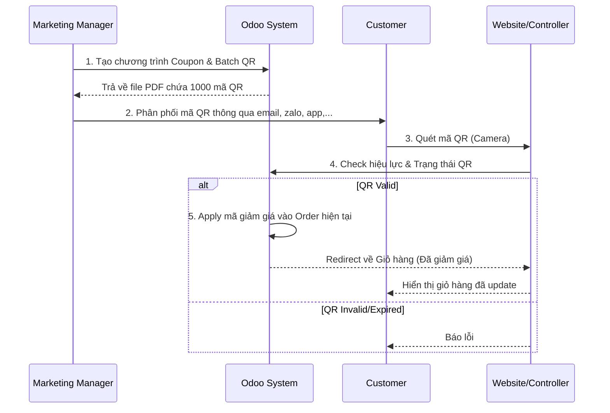
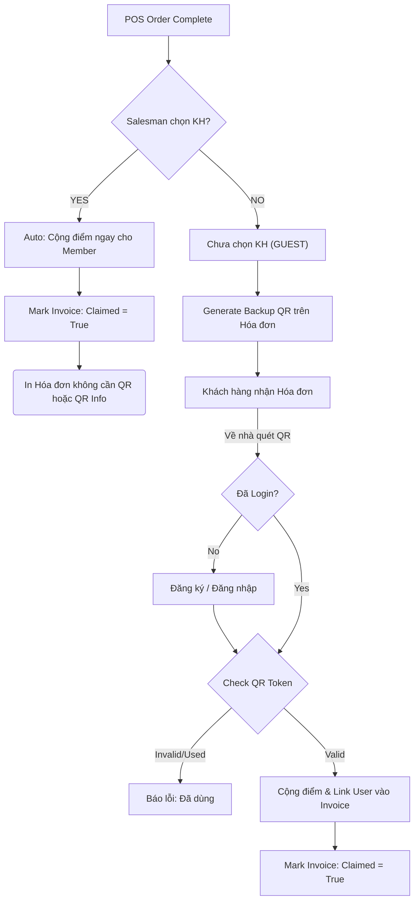

# Thiết kế Chi tiết Hệ thống Quản lý QR Code Tập trung (Kindoo QR Code System)

## 1. Tổng quan Dự án

**Tên module chính:** `kindoo_qrcode`

**Mục tiêu:** Xây dựng một module nền tảng cung cấp dịch vụ QR Code cho toàn bộ hệ thống Odoo. Module này không chỉ sinh mã ảnh đơn thuần mà còn quản lý vòng đời, theo dõi việc sử dụng, và cung cấp các công cụ tích hợp linh hoạt cho các module nghiệp vụ khác (Products, HR, Marketing...).

**Công nghệ lõi:**

- **Thư viện:** `qrcode` (Python Standard) kết hợp `Pillow` và `cairo`.
  - Hỗ trợ tạo QR Code chuẩn.
  - Tùy biến mạnh mẽ: Màu sắc (Gradient), Hình dạng điểm (Module Drawer: Tròn, Bo góc, ...), Chèn Logo (Embed Image).
  - Xuất nhiều định dạng: PNG, SVG, PDF, EPS.
- **Cơ chế:**
  - **QR Tĩnh (Static):** Dữ liệu được mã hóa cứng vào ảnh. Không cần internet để quét (trừ khi dữ liệu là URL). Không thể thay đổi sau khi in.
  - **QR Động (Dynamic):** Ảnh mã hóa một Short URL trỏ về Server Odoo. Server xử lý logic (Log, Validate) rồi mới chuyển hướng người dùng. Dữ liệu đích có thể thay đổi thoải mái.

### 1.1 Khái niệm và Cấu trúc kỹ thuật về QR Code

**1. Khái niệm:**
QR Code (Quick Response Code) là một dạng mã hai chiều (2D Matrix Barcode) có khả năng lưu trữ thông tin lớn hơn nhiều so với mã vạch truyền thống (1D). Nó được thiết kế để máy quét có thể đọc ở tốc độ cao và ở mọi hướng (360 độ).

**2. Cấu trúc Ma trận (Matrix Structure):**

- **Finder Patterns (Mẫu định vị):** Ba hình vuông lớn tại ba góc (trên-trái, trên-phải, dưới-trái). Giúp máy quét xác định vị trí, kích thước và hướng xoay của mã.
- **Alignment Patterns (Mẫu căn chỉnh):** Các hình vuông nhỏ rải rác trong mã (số lượng tùy thuộc vào Version). Giúp máy quét hiệu chỉnh biến dạng hình học khi quét trên bề mặt cong hoặc góc nghiêng.
- **Timing Patterns (Mẫu thời gian):** Hai đường chấm đen trắng xen kẽ kết nối các Finder Patterns. Xác định tọa độ chính xác của từng module dữ liệu.
- **Quiet Zone (Vùng tĩnh):** Viền trắng bao quanh mã (tối thiểu 4 module) giúp tách biệt mã khỏi nhiễu môi trường.
- **Data & Error Correction Area:** Vùng chứa dữ liệu thực tế và các từ mã sửa lỗi (codewords).

**3. Thuật toán:**

- **Encoding (Mã hóa):** Dữ liệu đầu vào (Numeric, Alphanumeric, Byte, Kanji) được chuyển đổi thành chuỗi bit theo các Mode chuẩn hóa (ISO/IEC 18004).
- **Error Correction (Sửa lỗi):** Sử dụng thuật toán **Reed-Solomon** (tương tự CD/DVD). Cho phép khôi phục dữ liệu ngay cả khi mã bị hỏng, bẩn hoặc che khuất (tối đa 30% ở Level H).
- **Masking (Mặt nạ):** Áp dụng một trong 8 mẫu mặt nạ (Mask Patterns) để phá vỡ các vùng có màu giống nhau quá lớn hoặc các pattern gây nhầm lẫn cho máy quét, giúp cân bằng tỷ lệ đen/trắng.

**4. Khả năng chịu lỗi (Error Correction Levels):**
Một trong những tính năng mạnh mẽ nhất của QR Code là khả năng khôi phục dữ liệu nhờ thuật toán Reed-Solomon. Có 4 cấp độ chịu lỗi có thể cấu hình:

- **Level L (Low):**
  - Khả năng phục hồi: ~7%.
  - Mật độ: Thấp nhất (ít module đen nhất, trông "thưa" nhất).
  - Sử dụng: Khi muốn in mã QR ở kích thước rất nhỏ hoặc cần mật độ dữ liệu cao nhất có thể trong không gian hạn chế.
- **Level M (Medium):**
  - Khả năng phục hồi: ~15%.
  - Mật độ: Trung bình.
  - Sử dụng: **Tiêu chuẩn phổ biến nhất**. Dùng cho in bao bì, marketing, nơi ít có nguy cơ bị bẩn hoặc rách.
- **Level Q (Quartile):**
  - Khả năng phục hồi: ~25%.
  - Mật độ: Cao.
  - Sử dụng: Khi cần độ tin cậy cao hơn hoặc khi muốn chèn một logo nhỏ vào giữa mã QR mà không gây lỗi.
- **Level H (High):**
  - Khả năng phục hồi: ~30%.
  - Mật độ: Cao nhất (trông mã rất dày đặc).
  - Sử dụng: Cho môi trường khắc nghiệt (công nghiệp, ngoài trời) nơi mã dễ bị trầy xước, bẩn; hoặc khi muốn chèn Logo/Hình ảnh nghệ thuật lớn vào mã (Art QR).

**5. Các định dạng xuất bản (File Formats):**
Module hỗ trợ xuất QR Code ra nhiều định dạng để phù hợp các mục đích sử dụng khác nhau:

- **PNG (Portable Network Graphics):**
  - **Loại:** Raster Image (Điểm ảnh).
  - **Đặc điểm:** Hỗ trợ màu sắc phong phú, tương thích 100% mọi trình duyệt và công cụ xem ảnh.
  - **Sử dụng:** Hiển thị trên màn hình Web/App, In ấn văn phòng đơn giản.
- **SVG (Scalable Vector Graphics):**
  - **Loại:** Vector Image (Toán học).
  - **Đặc điểm:** Zoom vô tận không vỡ hạt, dung lượng siêu nhẹ. Có thể dùng CSS/JS để đổi màu trực tiếp trên Web.
  - **Sử dụng:** In ấn Offset chất lượng cao, Thiết kế Web Responsive.
- **PDF (Portable Document Format):**
  - **Loại:** Document (Vector + Raster).
  - **Đặc điểm:** Chuẩn in ấn công nghiệp, giữ nguyên kích thước quy định (VD: in chính xác tem 5x5cm).
  - **Sử dụng:** Gửi file in cho nhà in chuyên nghiệp, In tem nhãn hàng loạt.
- **EPS (Encapsulated PostScript):**
  - **Loại:** Vector Image (Chuyên in ấn).
  - **Đặc điểm:** Định dạng gốc của Adobe Illustrator.
  - **Sử dụng:** Dùng cho Designer chèn vào bao bì sản phẩm.

**6. Các cấu hình cho phép người dùng tùy chỉnh (User Configurations):**
Để tăng tính linh hoạt, hệ thống cho phép người dùng (Marketing/Sales/Admin) tùy chỉnh 2 nhóm cấu hình chính:

- **Nhóm 1: Cấu hình Vận hành & Giới hạn (Usage & Lifecycle Configs):**

  - **Hiệu lực (Validity):** Khoảng thời gian hiệu lực (`start_date` đến `end_date`).
  - **Giới hạn lượt quét (Scan Limits):** Tổng số lần quét tối đa cho phép (VD: Coupon 1 lần).
  - **Trạng thái (State/Active):**
    - `active`: Dùng để Xóa mềm/Lưu trữ (Archive) theo chuẩn Odoo.
    - `state`: Trạng thái vận hành (Nháp, Đang chạy, Tạm dừng).
  - **Hành động sau quét (Post-scan Action):** Đích đến là URL nào (Target URL).

- **Nhóm 2: Cấu hình Giao diện & Định dạng (Design & Format Configs):**
  - **Định dạng xuất (Output Format):** Chọn định dạng file mong muốn (PNG cho web, SVG/PDF cho in ấn).
  - **Màu sắc (Colors):** Tùy chỉnh màu chính (Dark) và màu nền (Light) theo Brand Identity.
  - **Sửa lỗi (Error Correction):** Chọn cấp độ (L/M/Q/H) phù hợp với kích thước in và môi trường.
  - **Style (Module Drawer):** Chọn hình dáng điểm data (Vuông, Tròn, Bo góc...).

---

## 2. Kiến trúc Cơ sở dữ liệu (Database Architecture)

### 2.1. Bảng `qr.code` (Master Data)

Lưu trữ định nghĩa của mọi mã QR trong hệ thống.

| Field Name            | Type      | Attributes                      | Description                                                                                                                                                                                                                    |
| :-------------------- | :-------- | :------------------------------ | :----------------------------------------------------------------------------------------------------------------------------------------------------------------------------------------------------------------------------- |
| **Identity**          |           |                                 |                                                                                                                                                                                                                                |
| `name`                | Char      | Required, Translate             | Tên định danh (VD: "Tem bảo hành SP001").                                                                                                                                                                                      |
| `uuid`                | Char      | Index, Readonly                 | **Core Key**. Sử dụng **UUIDv7** (Time-ordered UUID). <br />- Tốt cho Indexing DB hơn UUIDv4 ngẫu nhiên.<br />- Bao gồm Timestamp -> Có thể sort theo thời gian tạo.                                                           |
| `type`                | Selection | Default='dynamic'               | `static` (Dữ liệu cứng) hoặc `dynamic` (Qua trung gian Server).                                                                                                                                                                |
| `active`              | Boolean   | Default=True                    | **Archive Status**. Nếu False, mã được coi là đã xóa/lưu trữ (không hiện trên View mặc định).                                                                                                                                  |
| `state`               | Selection | `draft`, `running`, `stopped`   | **Operational Status**.<br />- `draft`: Mới tạo, chưa kích hoạt.<br />- `running`: Đang hoạt động bình thường.<br />- `stopped`: Tạm dừng thủ công (nhưng chưa xóa).                                                           |
| `access_token`        | Char      | Unique, Readonly                | **API Security**. Token bí mật dùng để xác thực quyền chỉnh sửa từ bên thứ 3 (nếu cần).                                                                                                                                        |
| **Logic & Target**    |           |                                 |                                                                                                                                                                                                                                |
| `model_id`            | Many2one  | `ir.model`                      | Model nguồn tạo ra mã này (VD: `product.product`).                                                                                                                                                                             |
| `res_id`              | Integer   | Index                           | ID của bản ghi nguồn.                                                                                                                                                                                                          |
| `batch_id`            | Many2one  | `qr.batch`                      | **Batch Tracking**. Thuộc về đợt sinh mã nào (nếu có).                                                                                                                                                                         |
| `action_type`         | Selection | `url`, `server_action`          | Loại hành động khi quét (Chỉ áp dụng Dynamic).                                                                                                                                                                                 |
| `target_url`          | Char      |                                 | **Đích đến cuối cùng** (Chỉ dùng cho Dynamic). Là URL mà người dùng sẽ được chuyển hướng tới sau khi quét. <br />Ex: `https://kindoo.vn/sp/iphone-15`                                                                          |
| `content`             | Text      | Required                        | **Dữ liệu thô trong ảnh QR**.<br />- Với **Dynamic**: Là Short URL trỏ về Server Odoo (VD: `https://erp.com/qr/a1b2c3`).<br />- Với **Static**: Là dữ liệu thực tế (VD: `WIFI:S:MyHome;P:1234;;` hoặc vCard String).           |
| **Design & Format**   |           |                                 |                                                                                                                                                                                                                                |
| `output_format`       | Selection | `png`, `svg`, `pdf`, `eps`      | (Optional) Override Template. Định dạng mặc định khi render ảnh.                                                                                                                                                               |
| `error_correction`    | Selection | `L`, `M`, `Q`, `H`              | (Optional) Override Template. Mức độ sửa lỗi.                                                                                                                                                                                  |
| `scale`               | Integer   | Default=10                      | (Optional) Override Template. Kích thước của mỗi module (pixel).                                                                                                                                                               |
| `dark_color`          | Char      | Default=Null                    | (Optional) Override Template. Màu của các điểm dữ liệu. Nếu Null -> Lấy từ Template (hoặc Default Black).                                                                                                                      |
| `light_color`         | Char      | Default=Null                    | (Optional) Override Template. Màu nền (None = Transparent). Nếu Null -> Lấy từ Template.                                                                                                                                       |
| `template_id`         | Many2one  | `qr.template`                   | **Centralized Design**. Chọn mẫu thiết kế có sẵn thay vì config từng màu thủ công. Nếu set, các field màu sắc trên sẽ bị override bởi Template.                                                                                |
| `qr_image`            | Binary    | Attachment=True, Compute, Store | **Image Cache**. Ảnh QR được sinh tự động khi có thay đổi config. Lưu dưới dạng Attachment để giảm tải DB size.                                                                                                                |
| **Lifecycle Control** |           |                                 |                                                                                                                                                                                                                                |
| `start_date`          | Datetime  |                                 | Thời điểm bắt đầu hiệu lực. Trước thời gian này -> Redirect trang "Chương trình chưa bắt đầu".                                                                                                                                 |
| `end_date`            | Datetime  | Index=True                      | Thời điểm hết hạn. Sau thời gian này -> Redirect tới trang "Chương trình đã kết thúc".                                                                                                                                         |
| `max_scans`           | Integer   | Default=0                       | Giới hạn số lần quét (0 = Unlimited).                                                                                                                                                                                          |
| `current_scans`       | Integer   | Readonly                        | **Bộ đếm nhanh (Counter Cache)**. <br />Lưu tổng số lần quét để kiểm tra giới hạn (`max_scans`) tức thì mà không cần `count(*)` bảng Log (vốn rất chậm khi dữ liệu lớn). Được tăng bằng SQL Action song song với việc ghi Log. |
| `latest_scan_date`    | Datetime  | Readonly                        | Thời điểm quét gần nhất. Cập nhật song song với `current_scans`. Dùng để lọc các mã "Chết" hoặc "Ít dùng".                                                                                                                     |

**Constraints & Indexes:**

- **Indexes Optimization:**
  - `(model_id, res_id)`: Composite Index -> Tìm nhanh QR của một sản phẩm.
  - `(start_date, end_date)`: Tìm nhanh các mã đang hiệu lực hoặc hết hạn.
  - `batch_id`: Tìm tất cả mã thuộc 1 batch.
- `access_token` (New): Field bí mật dùng để xác thực quyền chỉnh sửa (nếu cần public API edit).

> [!NOTE] > **Tại sao cần field `current_scans` trong khi đã có bảng Log?**
> Nếu mỗi lần quét mã, hệ thống phải chạy lệnh "Đếm tất cả các dòng trong bảng Log của mã này" (`SELECT count(*) FROM qr_scan_log WHERE qr_id = ...`) thì sẽ **rất chậm** khi dữ liệu lớn (triệu dòng).
> Giải pháp tối ưu: Dùng field `current_scans` như một **bộ nhớ đệm (Cache)**. Mỗi lần có lượt quét mới, hệ thống chỉ việc `+1` vào số này. Việc đọc giá trị này là tức thì, giúp kiểm tra giới hạn (`max_scans`) trong mili-giây.

### 2.2. Bảng `qr.scan.log` (Tracking)

Lưu vết mọi lượt truy cập vào Dynamic QR Code.

| Field Name   | Type      | Description                                                                                                                                                                        |
| :----------- | :-------- | :--------------------------------------------------------------------------------------------------------------------------------------------------------------------------------- |
| `qr_code_id` | Many2one  | Link tới `qr.code`.                                                                                                                                                                |
| `scan_time`  | Datetime  | Default=Now. **Lưu ý:** Khác `create_date`. Dùng để ghi nhận thời gian quét _thực tế_ (VD: Client scan offline lúc 10h, sync về server lúc 12h -> scan_time=10h, create_date=12h). |
| `ip`         | Char      | IP Address của client.                                                                                                                                                             |
| `user_agent` | Char      | Thông tin trình duyệt/OS thiết bị quét.                                                                                                                                            |
| `user_id`    | Many2one  | User Odoo thực hiện quét (nếu họ đang login trên trình duyệt Mobile).                                                                                                              |
| `result`     | Selection | `success` (Redirect OK), `expired` (Hết hạn), `limit_reached` (Hết lượt), `inactive` (Bị khóa).                                                                                    |

### 2.2.1. Technical Implementation (Partitioning)

Để thực hiện Partitioning, model này cần override hàm `init` và có method maintenance riêng:

```python
from odoo.tools import SQL

class QrScanLog(models.Model):
    _name = 'qr.scan.log'
    _description = 'QR Scan Log (Partitioned)'

    qr_code_id = fields.Many2one('qr.code', required=True, index=True)
    # ... other fields ...

    def init(self):
        """ Override init to Setup Partition Table logic """
        # Check if table exists and is partitioned
        self.env.cr.execute(SQL("SELECT relkind FROM pg_class WHERE relname = 'qr_scan_log'"))
        res = self.env.cr.fetchone()

        # If not partitioned (normal table or new), convert it
        if not res or res[0] != 'p':
            self._setup_partition_table()

    def _setup_partition_table(self):
        """ Convert standard Odoo table to Partitioned Table """
        # Rename original table to backup if exists
        self.env.cr.execute(SQL("ALTER TABLE IF EXISTS qr_scan_log RENAME TO qr_scan_log_backup"))

        # Create Parent Partition Table
        self.env.cr.execute(SQL("""
            CREATE TABLE qr_scan_log (
                id serial,
                scan_time timestamp without time zone,
                qr_code_id integer,
                ip varchar,
                user_agent varchar,
                user_id integer,
                result varchar,
                create_uid integer,
                create_date timestamp without time zone,
                write_uid integer,
                write_date timestamp without time zone,
                PRIMARY KEY (scan_time, id)
            ) PARTITION BY RANGE (scan_time)
        """))

        # Create Initial Partition (Current Month)
        self._maintain_partition()

    @api.model
    def _maintain_partition(self):
        """ Cron Job: Create partition for Next Month """
        # Logic to calculate next month range
        # Execute: CREATE TABLE ... PARTITION OF ...
        pass
```

**Performance Note (High Volume):**

- Bảng này sẽ phình to rất nhanh. Nên cân nhắc **Table Partitioning** theo tháng (`scan_time`) nếu dự kiến > 1 triệu log/tháng.
- Index bắt buộc: `(qr_id, scan_time)` để vẽ biểu đồ thống kê nhanh.

### 2.3. Bảng `qr.template` (Design Templates)

Quản lý các mẫu thiết kế có sẵn để tái sử dụng.

| Field Name    | Type      | Description                                                                             |
| :------------ | :-------- | :-------------------------------------------------------------------------------------- |
| `name`        | Char      | Tên mẫu (VD: "Bộ nhận diện Brand X").                                                   |
| `is_default`  | Boolean   | Default=False. Nếu True, mẫu này sẽ được dùng mặc định cho các mã tạo đơn lẻ.           |
| `config_json` | Text      | Chứa cấu hình chi tiết cho việc Render ảnh (Style, Color, Logo). Xem cấu trúc bên dưới. |
| `usage`       | Selection | Gợi ý sử dụng (`product`, `badge`, `coupon`).                                           |

**Cấu trúc chi tiết `config_json`:**

```json
{
  "module_drawer": "rounded", // Hình dạng điểm: "square", "circle", "rounded", "vertical_bars", "horizontal_bars", "gapped_square"
  "color_mask": "radial_gradient", // Kiểu tô màu: "solid", "radial_gradient", "square_gradient", "horizontal_gradient", "vertical_gradient"

  "colors": {
    "dark": "#000000", // Màu chính (Modules)
    "light": "#FFFFFF", // Màu nền (Background)
    "eye_frame": "#FF0000", // (Optional) Màu khung mắt định vị
    "eye_center": "#00FF00" // (Optional) Màu tâm mắt định vị
  },

  "logo": {
    "enabled": true,
    "image_path": "/kindoo_qrcode/static/logos/brand.png", // Đường dẫn tương đối hoặc Base64
    "scale": 0.25, // Tỷ lệ kích thước logo so với QR (0.1 - 0.3)
    "position": "center" // Vị trí logo
  },

  "eyes": {
    "shape": "circle" // Hình dạng mắt: "square", "circle", "rounded"
  },

  "background": {
    "image": null, // Ảnh nền nghệ thuật (Art QR)
    "embed_mode": "overlay" // Cách chèn: "overlay" hoặc "blend"
  }
}
```

### 2.4. Bảng `qr.batch` (Batch Generation)

Quản lý các đợt sinh mã hàng loạt (VD: Marketing Campaign in 10.000 tờ rơi).

| Field Name      | Type      | Description                                                                 |
| :-------------- | :-------- | :-------------------------------------------------------------------------- |
| `name`          | Char      | Tên đợt (VD: "Batch 01 - Tết 2025").                                        |
| `quantity`      | Integer   | Số lượng mã cần sinh.                                                       |
| `prefix`        | Char      | Tiền tố cho tên mã con (VD: "TET25-").                                      |
| `qr_ids`        | One2many  | Link tới `qr.code`.                                                         |
| `config_fields` | ...       | Các field cấu hình chung (Type, Action, Template...) apply cho toàn bộ con. |
| `status`        | Selection | `draft` (Chưa sinh), `generating` (Đang chạy background), `done`.           |

**Logic Batch Create:** Dùng `create_multi` (List of Dictionaries) để insert 10.000 bản ghi trong 1 transaction, giúp tốc độ nhanh gấp 50-100 lần so với loop create từng record.

---

## 3. Backend API & Cách gọi từ Module vệ tinh

Module `kindoo_qrcode` cung cấp các phương thức Python (Public method) để các module khác gọi.

### 3.1. REST API (External Integration)

Dành cho Mobile App hoặc Hệ thống thứ 3 muốn tạo/lấy QR.

- **Endpoint:** `/api/qr/generate` (POST)
- **Auth:** API Key hoặc Odoo Session.
- **Body:**
  ```json
  {
    "model": "product.product",
    "res_id": 123,
    "type": "dynamic",
    "target_url": "https://mysite.com"
  }
  ```
- **Response:**
  ```json
  {
    "success": true,
    "uuid": "a1b2c3d4",
    "image_url": "https://odoo.com/qr/image/a1b2c3d4.png"
  }
  ```

### 3.2. Platform API (Internal Python)

Dành cho các module Odoo khác gọi trực tiếp.

#### 3.2.1. API Tạo mã: `generate_qr`

```python
# Tại model: kindoo_qrcode/models/qr_code.py

@api.model
def generate_qr(self, name, model, res_id, type='dynamic', target_url=None, static_content=None, batch_id=None, **options):
    """
    Hàm chuẩn để tạo 1 bản ghi QR Code.

    Arguments:
    - name (str): Tên gợi nhớ.
    - model (str), res_id (int): Bản ghi nguồn.
    - type (str): 'dynamic' | 'static'.
    - target_url (str): Đích đến (Required if Dynamic).
    - static_content (str): Nội dung thô (Required if Static).
    - batch_id (int): ID của đợt sinh mã (Optional).
    - **options:
        - start_date (datetime): Ngày bắt đầu.
        - end_date (datetime): Ngày kết thúc.
        - max_scans (int): Số lượt quét tối đa.
        - design_template_id (int): ID của mẫu thiết kế.

    Returns:
    - RecordSet `qr.code`.

    Raises:
    - ValidationError: Nếu thiếu target_url cho Dynamic QR.
    """
    # 1. Validation basics
    if type == 'dynamic' and not target_url:
        raise ValidationError("Dynamic QR requires a Target URL.")

    # 2. Get Template (Priority: Option > Default)
    template_id = options.get('design_template_id')
    if not template_id:
        default_template = self.env['qr.template'].search([('is_default', '=', True)], limit=1)
        if default_template:
            template_id = default_template.id

    # 2. Generate UUID
    uuid = self._generate_unique_uuid()

    # 3. Create Record
    vals = {
        'name': name,
        'model_id': self.env['ir.model']._get(model).id,
        'res_id': res_id,
        'uuid': uuid,
        'type': type,
        'target_url': target_url,
        'content': static_content if type == 'static' else f"/qr/{uuid}",
        'batch_id': batch_id  # Explicit Link
    }
    # Merge options (start_date, design...)
    vals.update(options)

    return self.create(vals)
```

**Cách gọi từ Module Vệ tinh (Ví dụ: Module Product):**

```python
# Trong file product_product.py
def action_generate_product_qr(self):
    qr_model = self.env['qr.code']
    for product in self:
        # Tạo QR Động trỏ về Website Shop
        qr = qr_model.generate_qr(
            name=f"QR cho {product.name}",
            model='product.product',
            res_id=product.id,
            type='dynamic',
            target_url=f"/shop/product/{product.id}",
            start_date=None,
            end_date=None # Vĩnh viễn (hoặc set theo chính sách BH)
        )
        product.qr_code_id = qr.id
```

#### 3.2.2. API Lấy ảnh: `get_image`

```python
def get_image(self, format=None, **override_config):
    """
    Trả về dữ liệu Binary của ảnh QR.
    Dùng để hiển thị lên Form View (image widget) hoặc in ra Report (QWeb).
    """
```

---

## 4. Frontend Controller & Luồng xử lý khi Quét mã

Đây là phần quan trọng xử lý logic khi người dùng đưa Camera vào quét mã.

### 4.1. Luồng QR Tĩnh (Static)

- **Cấu trúc:** Ảnh QR chứa trực tiếp dữ liệu thô (VD: Text "SP001", vCard string, hoặc Wifi Config).
- **Khi quét:**
  - Camera điện thoại giải mã ảnh -> Nhận được chuỗi text.
  - Điện thoại tự xử lý (Hiển thị text, Hỏi lưu danh bạ, Kết nối Wifi...).
  - **Server Odoo KHÔNG tham gia** vào quá trình quét này. Không log được.

### 4.2. Luồng QR Động (Dynamic) - Controller `/qr/<uuid>`

- **Cấu trúc:** Ảnh QR chứa URL ngắn: `https://your-odoo.com/qr/a1b2c3d4`.
- **Khi quét:**
  1.  Trình duyệt điện thoại mở URL trên.
  2.  Request đến Odoo Controller: `KindooQrController` method `route_qr_scan`.
- **Logic xử lý tại Controller:**

  ```python
  @http.route('/qr/<string:uuid>', type='http', auth='public', website=True)
  def route_qr_scan(self, uuid, **kw):
      """
      Flow xử lý sự kiện Scan:
      1. Lookup: Tìm QR theo UUID.
      2. Check Exists: Nếu không thấy -> 404.
      3. Check Active: Field active=False -> 404.
      4. Check State: Field state != 'running' -> Báo lỗi "Chương trình chưa kích hoạt hoặc đang tạm dừng".
      5. Check Time:
         - Now < start_date -> "Chương trình chưa bắt đầu".
         - Now > end_date -> "Chương trình đã kết thúc".
      5. Check Limits: current_scans >= max_scans -> Báo lỗi "Hết lượt dùng".
      6. Logging: Tạo record `qr.scan.log` (IP, UserAgent, Location).
      7. Routing:
         - Nếu Action là URL -> Redirect 301.
         - Nếu Action là Server Action -> Gọi hàm execute().
      """
      qr = request.env['qr.code'].sudo().search([('uuid', '=', uuid)], limit=1)

      # ... logic validation ...

      # Logging bất đồng bộ (Optional: Dùng Queue Job để không chậm request)
      request.env['qr.scan.log'].sudo().create({
          'qr_code_id': qr.id,
          'ip': request.httprequest.remote_addr,
          'user_agent': request.httprequest.user_agent.string,
      })

      # Tăng bộ đếm Cache (Atomic SQL -> Fast & Safe)
      request.env.cr.execute("UPDATE qr_code SET current_scans = current_scans + 1 WHERE id = %s", (qr.id,))

      return request.redirect(qr.target_url)

  @http.route(['/qr/image/<string:uuid>', '/qr/image/<string:uuid>.<string:format>'], type='http', auth='public', website=True)
  def route_qr_image(self, uuid, format='png', **kw):
      """
      API để Render ảnh QR trực tiếp ra trình duyệt.

      Use case:
      - Nhúng vào thẻ  trong Email Marketing: 
      - Hiển thị trên website bên thứ 3.

      Args:
      - uuid: Mã định danh.
      - format: png, svg.
      """
      qr = request.env['qr.code'].sudo().search([('uuid', '=', uuid)], limit=1)
      if not qr:
          return request.not_found()

      image_stream = qr.get_image(format=format, **kw)
      headers = [('Content-Type', f'image/{format}')]
      return request.make_response(image_stream, headers)
  ```

---

## 5. Chi tiết Kỹ thuật Tích hợp các Module Vệ tinh (Technical Integration Specs)

Phần này mô tả đặc tả kỹ thuật để Dev có thể code trực tiếp.

### 5.1. Sales & Loyalty (`kindoo_sales_qrcode`) - Ưu tiên

- **Mục đích:** Tăng cường trải nghiệm khách hàng thông qua việc tích hợp mã QR vào quy trình bán hàng (Coupon) và chăm sóc khách hàng (Loyalty Points).

#### A. Coupon Voucher (Offline to Online)

Kịch bản: Khách hàng nhận được tờ rơi/voucher giấy có in mã QR. Khi quét, voucher tự động được áp dụng vào giỏ hàng trên Website Thương mại điện tử.

**Quy trình nghiệp vụ (Workflow):**



**Cấu trúc dữ liệu (Data Structure):**

| Model            | Field               | Type     | Description                                                         |
| :--------------- | :------------------ | :------- | :------------------------------------------------------------------ |
| `coupon.program` | `qr_code_config_id` | Many2one | Cấu hình giao diện QR (Màu sắc, Logo) áp dụng cho chương trình này. |
| `coupon.coupon`  | `qr_code_id`        | Many2one | Link tới bảng `qr.code` quản lý lượt quét và thống kê.              |
| `qr.code`        | `coupon_id`         | Many2one | Link ngược lại Coupon để truy xuất thông tin giảm giá.              |

**Chi tiết kỹ thuật:**

1.  **Generate:** Campaign Manager tạo Coupon -> Hệ thống sinh QR Dynamic theo Batch.
2.  **Target:** `target_url` trỏ về: `/sales/coupon/scan?code=VIP2025`.
3.  **Controller:**

    ```python
    @http.route('/sales/coupon/scan', type='http', auth='public', website=True)
    def scan_coupon(self, code, **kw):
        # 1. Lấy Sale Order hiện tại (từ session)
        order = request.website.sale_get_order(force_create=True)

        # 2. Gọi logic Apply Coupon của module sale_coupon
        status = request.env['sale.coupon.apply.code'].sudo().apply_coupon(order, code)

        if status.get('error'):
             return request.render('website_sale.cart', {'error_msg': status['error']})

        # 3. Thành công -> Redirect về Giỏ hàng
        return request.redirect('/shop/cart')
    ```

#### B. Loyalty Claim (Tích điểm từ Hóa đơn)

Kịch bản: Tối ưu hóa trải nghiệm khách hàng tại quầy (POS).

- **Ưu tiên 1 (Auto):** Nếu Salesman đã chọn khách hàng trên POS -> Tích điểm NGAY LẬP TỨC khi thanh toán.
- **Ưu tiên 2 (Self-Service):** Nếu khách hàng vội hoặc chưa cung cấp thông tin -> In mã QR trên hóa đơn. Khách về nhà tự quét để claim điểm.

**Quy trình nghiệp vụ (Workflow):**



**Cấu trúc dữ liệu (Data Structure):**

| Model          | Field             | Type     | Description                                          |
| :------------- | :---------------- | :------- | :--------------------------------------------------- |
| `account.move` | `loyalty_qr_id`   | Many2one | Link tới `qr.code` để generate ảnh QR.               |
| `account.move` | `loyalty_claimed` | Boolean  | `True` nếu đã tích điểm thành công (Auto hoặc Scan). |
| `account.move` | `loyalty_points`  | Integer  | Số điểm dự kiến nhận được từ hóa đơn này.            |
| `pos.order`    | `loyalty_points`  | Integer  | Số điểm đã tích lũy ngay tại quầy (Sync về Invoice). |

**Chi tiết kỹ thuật:**

1.  **POS Integration (`point_of_sale`)**:

    - **Logic tại POS JavaScript:** Khi Cashier click "Validate" (Thanh toán):
      - Nếu `order.get_client()` != null:
        - Gọi RPC `action_pos_claim_points(order_uid, partner_id)`.
        - Hệ thống tính điểm và cộng ngay lập tức.
    - **Backend (`pos.order`):**
      - Khi Order sync về Server -> Tạo Invoice.
      - Set `invoice.loyalty_claimed = True` (vì đã cộng ở POS rồi).

2.  **Invoice Generation (`account.move`)**:

    - **Logic Report (QWeb PDF):**
      ```xml
      <t t-if="o.loyalty_claimed">
          <div>Điểm tích lũy: <t t-esc="o.loyalty_points"/> (Đã cộng vào tài khoản)</div>
      </t>
      <t t-else="">
          <div>Quét mã để tích điểm:</div>
          
      </t>
      ```
    - **Logic Generate QR:**
      - Chỉ sinh QR Code nếu `loyalty_claimed == False`.

3.  **Self-Service Controller (Fallback)**:

    - Xử lý trường hợp khách vãng lai về nhà mới quét.

    ```python
    @http.route('/loyalty/claim/<int:invoice_id>', type='http', auth='user')
    def claim_loyalty_points(self, invoice_id, token, **kw):
        # 1. Validate Invoice & Token
        # Sử dụng 'access_token' có sẵn của account.move để xác thực
        invoice = request.env['account.move'].sudo().browse(invoice_id)

        # Check token hợp lệ (giống cơ chế Portal)
        if not invoice.exists() or not invoice._check_access_token(token):
             return "Mã QR không hợp lệ hoặc bạn không có quyền truy cập."

        # 2. Check đã claim chưa (Double check)
        # TH: Vợ ở nhà quét, Chồng ở quầy cũng vừa đọc số điện thoại xong
        if invoice.loyalty_claimed:
             return "Điểm của hóa đơn này đã được cộng."

        # 3. Cộng điểm & Link User
        # Nếu invoice chưa có partner_id (Guest), cần update partner_id = current_user
        if not invoice.partner_id:
             invoice.sudo().write({'partner_id': request.env.user.partner_id.id})

        # ... (Logic cộng điểm) ...

        return "Chúc mừng! Bạn đã nhận được điểm."
    ```

#### C. Member Identification (Thẻ thành viên)

- **Mục đích:** Nhận diện khách hàng tại quầy POS để tích điểm/trừ điểm mà không cần đọc số điện thoại.
- **Loại QR:**
  1.  **Static:** Lưu mã định danh (VD: `MEMBER:0901234567`). Dễ triển khai nhưng dễ bị chụp trộm.
  2.  **Dynamic Rotation (Recommended):** Tương tự HR Check-in. App khách hàng sinh mã thay đổi 60s/lần.
- **Integration (POS Module):**
  - Extend POS Interface để nhận input từ máy quét.
  - API Backend: `/pos/member/identify`.
  - Logic: Input -> Parse -> Tìm `res.partner` -> Set Client cho Order hiện tại.

### 5.2. Anti-Counterferiting & Warranty (`kindoo_product_qrcode`) - Chưa ưu tiên

- **Vấn đề:** QR trên `product.product` chỉ trỏ về trang thông tin chung, không phân biệt được hàng thật/giả.
- **Giải pháp:** Gắn QR Code và2 **`stock.lot` (Serial Number/Lô hàng)**. tiênsản phẩm vật lý có 1 mã QR duy nhất.

#### A. Logic Check Hàng Giả (Anti-Counterfeit Flow)

Thực tế các hãng lớn (như tem SMS, tem Bộ Công An) dùng logic **"Kích hoạt lần đầu"**:

1.  **Lần scan thứ 1:**
    - Hệ thống kiểm tra `scan_count == 0` (hoặc chưa kích hoạt).
    - Hiển thị: **"CHÚC MỪNG! SẢN PHẨM CHÍNH HÃNG"** (Màu Xanh).
    - Action: Ghi nhận kích hoạt bảo hành, cập nhật `activate_date`.
2.  **Lần scan thứ 2 trở đi:**
    - Hệ thống thấy `scan_count > 0`.
    - Hiển thị: **"CẢNH BÁO! MÃ NÀY ĐÃ ĐƯỢC QUÉT TRƯỚC ĐÓ"** (Màu Cam/Đỏ).
    - Chi tiết: "Được quét lần đầu vào ngày 10/01/2025 tại Hà Nội". -> Giúp người dùng nhận biết nếu họ mua hàng mới mà code đã bị quét.

#### B. Implementation (`stock.lot`)

```python
class StockLot(models.Model):
    _inherit = 'stock.lot'

    qr_code_id = fields.Many2one('qr.code', string="Auth QR")

    def action_generate_serial_qr(self):
        qr_env = self.env['qr.code']
        for lot in self:
            # QR trỏ về trang Xác thực
            lot.qr_code_id = qr_env.generate_qr(
                name=f"Serial: {lot.name}",
                model='stock.lot',
                res_id=lot.id,
                type='dynamic',
                target_url=f"/product/verify/{lot.id}", # Controller Verify
                batch_id=self.env.context.get('active_batch_id') # Support Batch Generate
            )
```

#### C. Controller `/product/verify/<id>`

```python
@http.route('/product/verify/<int:lot_id>', type='http', auth='public', website=True)
def verify_product(self, lot_id, **kw):
    lot = request.env['stock.lot'].sudo().browse(lot_id)
    qr = lot.qr_code_id

    # Lấy thông tin lần quét đầu tiên (nếu có) từ Log
    first_scan = request.env['qr.scan.log'].sudo().search(
        [('qr_code_id', '=', qr.id)], order='scan_time asc', limit=1
    )

    if not first_scan:
        # Case 1: Hàng mới cứng
        status = 'genuine'
        msg = "Sản phẩm chính hãng. Được kích hoạt bảo hành từ bây giờ."
    else:
        # Case 2: Đã bị quét
        status = 'warning'
        msg = f"Cảnh báo: Mã này đã được kích hoạt ngày {first_scan.scan_time}."

    return request.render('kindoo_product_qrcode.verify_page', {
        'lot': lot,
        'status': status,
        'message': msg
    })
```

### 5.3. HR Check-in (`kindoo_hr_qrcode`) - Chưa ưu tiên

- **Mục đích:** Điểm danh (Timekeeping) nhanh, chống gian lận (fake chấm công).
- **Cơ chế:** **Dynamic QR Code (TOTP-based)**. Mã thay đổi mỗi 15s.

#### A. Cách đảm bảo "Định danh duy nhất" (Identity Guarantee)

Quy trình xác thực dựa trên **"Bí mật không chia sẻ" (Zero-Knowledge Proof)**:

1.  **Chìa khóa (Secret Key):** Chỉ có DB Odoo và Session User (đang login) biết. Người ngoài không có chìa khóa này -> Không thể tự sinh mã.
2.  **Khớp Chữ ký (Signature Match):**
    - QR chứa: `ID=5` và `Signature=ABC`.
    - Hệ thống lấy `Secret` của `User=5` tính lại: `HMAC(Secret, ID) = ABC`.
    - -> **Kết luận:** Người tạo ra mã này chắc chắn 100% là User 5.
3.  **Chống Chụp Ảnh (Anti-Replay & Time):**
    - **Giảm Time Window:** Xuống còn **15 giây**. (Đủ để giơ điện thoại lên, nhưng không đủ để chụp, gửi qua Zalo và người kia mở lên).
    - **Cơ chế "Dùng 1 lần" (One-Time Use):** Đây là chốt chặn quan trọng nhất. Ngay khi Máy chấm công quét mã thành công, mã đó bị **HỦY NGAY LẬP TỨC**. Dù còn hạn 14 giây, người thứ 2 quét lại cũng sẽ bị chặn.

#### B. Frontend Generation (Mobile App/Portal)

- **Cập nhật:** Client tự động refresh mã mỗi **15 giây**.

#### D. Option B: Reverse Check-in (Nhân viên dùng ĐT quét mã văn phòng)

Nếu không trang bị máy chấm công chuyên dụng, nhân viên dùng Camera điện thoại để quét mã dán trên tường/màn hình công ty.

1.  **QR Type:**

    - **Level 1 (Cơ bản):** QR Tĩnh dán tường. (Dễ bị chụp trộm mang về nhà quét).
    - **Level 2 (Nâng cao):** QR Động hiển thị trên màn hình Lễ tân (TV/iPad), tự đổi mã mỗi 60s.

2.  **Quy trình:**

    - Nhân viên mở Camera -> Quét mã -> Mở Link: `https://odoo.com/hr/scan?loc=OFFICE_01`.
    - Yêu cầu bắt buộc: **Phải Login Odoo trên trình duyệt điện thoại**.

3.  **Cơ chế chống gian lận (QUAN TRỌNG):**
    Vì nhân viên đang cầm điện thoại riêng, họ có thể ở nhà để quét (nếu có ảnh chụp QR). Phải dùng các lớp bảo vệ sau:
    - **IP Whitelist:** Cấu hình chỉ cho phép check-in từ IP mạng Wifi công ty. Nếu dùng 4G -> Chặn.
    - **GPS Geolocation (HTML5):** Khi mở link, trình duyệt hỏi "Cho phép truy cập vị trí?". Nếu tọa độ GPS lệch quá 100m so với Văn phòng -> Chặn.

```python
# Controller cho Option B
@http.route('/hr/scan', type='http', auth='user')
def employee_scan_office_qr(self, loc_token, **kw):
    # 1. Check IP
    client_ip = request.httprequest.remote_addr
    if client_ip not in ['113.190.x.x', ...]:
        return "Vui lòng kết nối Wifi công ty!"

    # 2. Return UI with JS Geolocation request
    return request.render('kindoo_hr.geocheck_template', {'token': loc_token})
    # JS sẽ gửi tọa độ về API /hr/confirm_checkin để chốt.
```

Khi Máy chấm công (Scanner) đọc được mã, nó gửi lên Server. Quy trình xử lý:

```python
@http.route('/hr/attendance/scan', type='json', auth='user') # Scanner phải login account "HR Kiosk"
def scan_attendance(self, qr_content):
    # 1. Parsing
    try:
        prefix, user_id, timestamp, incoming_sig = qr_content.split(':')
        if prefix != 'EMP_QR': raise ValueError()
    except:
        return {'status': 'error', 'msg': 'Mã QR không đúng định dạng'}

    # 2. Check Time Logic (15s Window)
    now = int(time.time())
    qr_time = int(timestamp)
    if abs(now - qr_time) > 20: # Cho sai số mạng 5s
        return {'status': 'error', 'msg': 'Mã QR đã hết hạn (Quá 15s).'}

    # 3. Verify Identity (Chống người lạ tự sinh mã)
    employee = request.env['hr.employee'].sudo().search([('user_id', '=', int(user_id))], limit=1)
    if not employee:
        return {'status': 'error', 'msg': 'Không tìm thấy nhân viên.'}

    # Tái tạo chữ ký từ Secret trong DB
    expected_msg = f"{user_id}:{timestamp}"
    expected_sig = hmac.new(employee.checkin_secret.encode(), expected_msg.encode(), hashlib.sha256).hexdigest()

    if not hmac.compare_digest(incoming_sig, expected_sig): # So khớp an toàn
        return {'status': 'error', 'msg': 'Mã QR giả mạo! Chữ ký không khớp.'}

    # 4. Anti-Replay (Chống dùng lại mã cũ/ảnh chụp)
    # Nếu QR này (Timestamp này) đã được dùng cho User này -> REJECT
    if qr_time <= employee.last_qr_scan_ts:
         return {'status': 'error', 'msg': 'Mã này đã được sử dụng! Vui lòng chờ mã mới.'}

    # UPDATE NGAY LẬP TỨC để chặn người thứ 2
    employee.sudo().write({'last_qr_scan_ts': qr_time})

    # 5. Execute Attendance
    # Logic chuẩn Odoo: Nếu đang Out -> Check In. Nếu đang In -> Check Out.
    last_attn = request.env['hr.attendance'].sudo().search(
        [('employee_id', '=', employee.id)], order='check_in desc', limit=1
    )

    action = 'check_in'
    if last_attn and not last_attn.check_out:
        last_attn.write({'check_out': fields.Datetime.now()})
        action = 'check_out'
    else:
        request.env['hr.attendance'].sudo().create({'employee_id': employee.id, 'check_in': fields.Datetime.now()})

    # 6. Return Feedback
    return {
        'status': 'success',
        'action': action,
        'employee_name': employee.name,
        'avatar_url': f"/web/image/hr.employee/{employee.id}/avatar_128",
        'msg': f"Xin chào {employee.name}" if action == 'check_in' else f"Tạm biệt {employee.name}"
    }
```

### 5.4. Contacts (`kindoo_contact_qrcode`) - Chưa ưu tiên

- **Mục đích:** Chia sẻ thông tin liên hệ (Danh thiếp/vCard) một cách chuyên nghiệp. Người nhận chỉ cần quét mã để lưu ngay vào danh bạ điện thoại mà không cần gõ phím.
- **Model:** `res.partner`
- **Feature:** Nút "Generate vCard QR".
- **Logic vCard Format:**
  ```python
  def _get_vcard_content(self, partner):
      return (
          "BEGIN:VCARD\n"
          "VERSION:3.0\n"
          f"N:{partner.name}\n"
          f"FN:{partner.name}\n"
          f"ORG:{partner.parent_id.name or ''}\n"
          f"TEL;TYPE=WORK,VOICE:{partner.phone or ''}\n"
          f"TEL;TYPE=CELL,VOICE:{partner.mobile or ''}\n"
          f"EMAIL:{partner.email or ''}\n"
          f"URL:{partner.website or ''}\n"
          f"ADR;TYPE=WORK:;;{partner.street};{partner.city};;{partner.zip};{partner.country_id.code}\n"
          "END:VCARD"
      )
  ```
- Hàm `generate_qr` được gọi với `type='static', content=_get_vcard_content(...)`.

---

## 6. Phân quyền & Bảo mật (Security & Access Rights)

### 6.1. Access Control Lists (ACL)

- **Group User (`group_kindoo_qrcode_user`):**
  - Read `qr.code`, `qr.template`.
  - Create/Write `qr.code` (cho các record do mình tạo hoặc liên quan model mình quản lý).
  - No Access `qr.scan.log` (Chỉ xem thống kê tổng hợp).
- **Group Manager (`group_kindoo_qrcode_manager`):**
  - Full Access mọi bảng.
  - Cấu hình `qr.template`.
  - Xem Full Log.

### 6.2. Security Rules

- **Scan Log:** Chỉ Manager mới thấy IP và User Agent chi tiết (GDPR/Privacy).
- **Api Key:** Các request từ External System (Mobile App) phải có Header `X-Kindoo-Token` được validate với System Parameter.

---

## 7. Báo cáo & Phân tích (Analytics)

Cung cấp Pivot View và Graph View trên `qr.scan.log` để Marketing phân tích hiệu quả:

- **Số lượt quét theo Thời gian:** (Ngày/Tuần/Tháng).
- **Top QR được quét:** Group by `qr_code_id`.
- **Vị trí địa lý:** Group by `location` (nếu có GeoIP).
- **Thiết bị:** Group by `user_agent` (Mobile vs Desktop).

---

## 8. Bảo trì & Hiệu năng (Maintenance)

- **Log Retention & Archiving:**
  - Tạo Scheduled Action: `Auto-archive old scan logs`.
  - Chu kỳ: Hàng tháng.
  - Logic:
    1.  (Optional) Export logs cũ hơn 1 năm ra file CSV/Excel lưu trữ ngoài (Cold Storage).
    2.  Xóa bản ghi trong DB (`DELETE`) hoặc Detach Partition để giải phóng dung lượng.
- **Counter Cache Synchronization (Re-sync):**

  - **Vấn đề:** Dù dùng Atomic Update cho field `current_scans`, sai số vẫn có thể xảy ra do tranh chấp DB (Race Condition) hoặc xóa nhầm bảng Log thủ công.
  - **Giải pháp:** Cron job chạy hàng tuần (Weekly) để tính lại `current_scans` và `latest_scan_date` chuẩn từ bảng `qr.scan.log`.

- **Partition Management (Advanced & Detailed Implementation):**

  - **Tại sao phải Partitioning?**
    - Với bảng Log > 10 triệu dòng, B-Tree Index bắt đầu giảm hiệu quả (do index tree quá sâu).
    - Partitioning giúp "chia để trị": Query tháng nào chỉ scan index của tháng đó.
    - **Drop Partition = Instant Delete:** Xóa 1 triệu dòng cũ bằng `DELETE` dẽ gây lock bảng và bloat DB ("phình" dung lượng ảo). Dùng `DROP TABLE partition_old` chỉ mất 1ms và giải phóng dung lượng thật ngay lập tức.
  - **Strategy: List Partitioning by Range (Scan Date)**

    1.  **Initialization:** (Xem chi tiết code tại mục **2.2.1**).
    2.  **Naming Convention:** `qr_scan_log_YYYY_MM` (e.g., `qr_scan_log_2025_01`).
    3.  **Automation (Cron Job):**
        - Tạo Scheduled Action chạy ngày **20** hàng tháng.
        - Logic Python: Tính toán tháng sau và chạy SQL `CREATE TABLE ... PARTITION OF ...`.

- **Index Maintenance:**

  - Periodic `VACUUM ANALYZE` trên bảng `qr.scan.log` để đảm bảo Query Planner hoạt động hiệu quả trên lượng dữ liệu lớn.

- **Optimized Searching (Partition Pruning):**
  - **Cơ chế:** PostgreSQL tự động điều hướng Query vào đúng partition (tháng) cần tìm nếu điều kiện `WHERE` có chứa Partition Key (`scan_time`). Odoo ORM không cần can thiệp logic này.
  - **Yêu cầu UI:** Trên giao diện Search View của `qr.scan.log`, bắt buộc phải có **Default Filter: This Month**.
  - **Tại sao?** Nếu user vào màn hình Log mà không có filter ngày -> Odoo sẽ `SELECT * FROM qr_scan_log` -> Postgres phải scan toàn bộ 100 partitions (cũ) -> **Treo DB**.
  - **Code implementation:**
    ```xml
    <filter name="filter_this_month" string="This Month"
            domain="[('scan_time', '&gt;=', (context_today()).strftime('%Y-%m-01'))]"/>
    ```
    Và set filter này làm mặc định trong `search_default`.

---

## 9. Thư viện & Phụ thuộc Kỹ thuật (Technical Libraries & Dependencies)

Để đảm bảo hiệu năng và tính năng vẽ nâng cao, Module sử dụng các thư viện sau (cần khai báo trong `manifest` và `requirements.txt`):

### 9.1. `qrcode` (Standard Library)

- **Version:** `qrcode[pil]>=7.0`
- **Vai trò:** Core engine sinh ma trận QR (Boolean Matrix).
- **Classes quan trọng:**
  - `qrcode.QRCode(version, error_correction, box_size, border)`: Class chính để khởi tạo, add data và make() ma trận.
  - `qrcode.image.styled.pil.StyledPilImage`: Factory dùng để render ảnh có style (màu gradient, bo góc module).
  - `qrcode.image.svg.SvgPathImage`: Factory để sinh file SVG vector.

### 9.2. `Pillow` (Python Imaging Library)

- **Vai trò:** Xử lý ảnh Raster (PNG), Overlay Logo, Color Masking.
- **Kỹ thuật:**
  - `Image.open()`: Load file Logo.
  - `Image.alpha_composite()`: Trộn layer Logo lên trên layer QR Code (Giữ transparency).
  - `ImageDraw`: Vẽ thêm border hoặc text chú thích nếu cần.

### 9.3. `pycairo` & `cairosvg` (Vector Engine - Optional but Recommended)

- **Vai trò:** Xử lý đồ họa Vector nâng cao.
- **Tại sao cần?**
  - Mặc dù `qrcode` có thể xuất SVG text, nhưng để convert SVG sang PDF hoặc PNG độ phân giải cực cao (High-DPI) cho in ấn Offset mà không vỡ hạt, `cairosvg` là lựa chọn tốt nhất.
  - Hỗ trợ Odoo Report (wkhtmltopdf) render các file SVG mượt hơn.

### 9.4. `reportlab` (PDF Generation)

- **Vai trò:** Sinh file vector EPS/PDF chuẩn in ấn.
- **Usage:**
  - Khi User chọn định dạng output là `PDF` hoặc `EPS`, chúng ta dùng `qrcode.image.pure.PyPNGImage` hoặc các factory custom kết hợp ReportLab drawing để vẽ vector path chính xác tọa độ.
